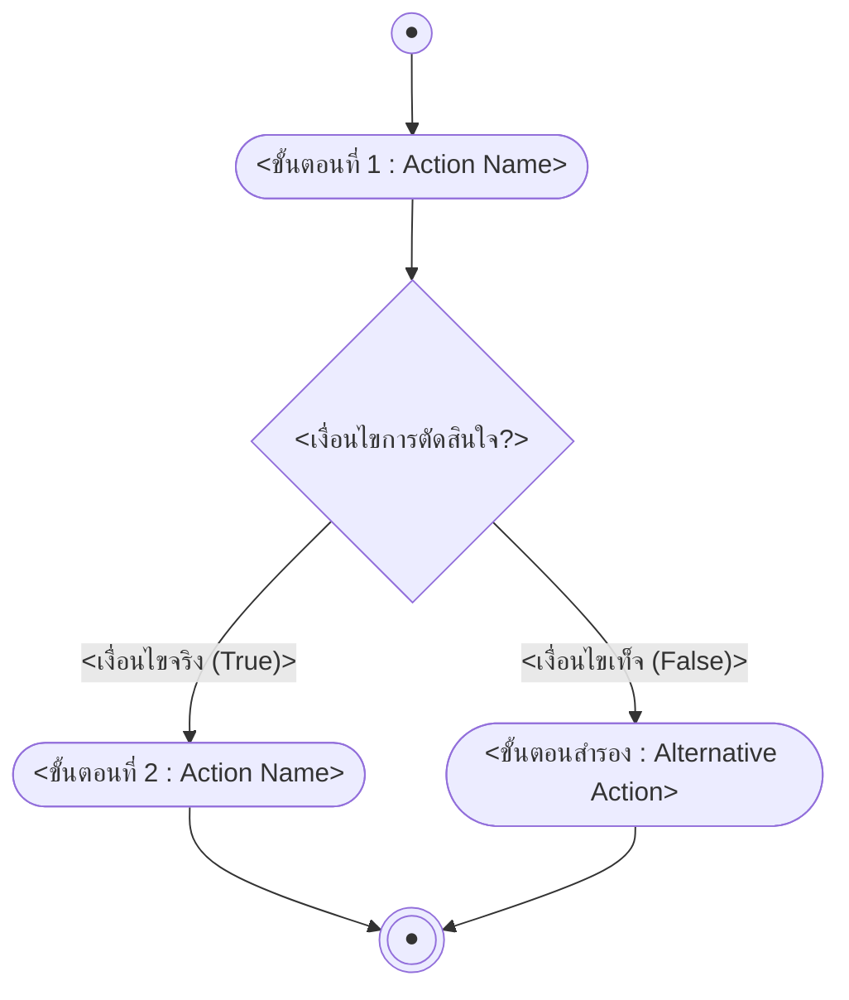

# {{title}}

arrow_back กลับไปที่ [[Week<N>-MOC|MOC สัปดาห์ <N>]] | ก่อนหน้า: [[<ชื่อโน้ตก่อนหน้า>]]

## key Keyword

- **<คำศัพท์/แนวคิดหลัก (English Term)>** — <คำอธิบายสั้น ๆ บรรทัดเดียว>
- **<คำศัพท์/แนวคิดหลัก (English Term)>** — <คำอธิบายสั้น ๆ บรรทัดเดียว>

## menu_book Theory (เข้าใจง่าย)

<อธิบายเนื้อหาหลักด้วยภาษาที่เข้าใจง่าย ใช้ตาราง/สูตร ($...$)/ตัวอย่างประกอบได้ตามความเหมาะสม แบ่งเป็นหัวข้อย่อยด้วย ### ได้ถ้าเนื้อหายาว>

> [!tip] เคล็ดลับ
> <เทคนิคช่วยจำ หรือวิธีเช็คคำตอบ>

## schema Diagram

<!--
เกณฑ์มาตรฐาน UML Diagram (เลือกประเภทให้ตรงกับบริบทของเนื้อหา):
1. UML Activity Diagram (กระบวนการไปป์ไลน์ข้อความ/Tokenization/Encoding-Decoding) -> ใช้ flowchart TD/LR พร้อมโหนด Start ((●)), Action ([...]), Decision {...}, End (((●)))
2. UML Sequence Diagram (ลำดับการทำงาน RAG/การคุยโต้ตอบกับ LLM/Agent Tool Calling) -> ใช้ sequenceDiagram
3. UML State Machine Diagram (สถานะการประมวลผลประโยค/Lifecycle ของ Model) -> ใช้ stateDiagram-v2
4. UML Class/Architecture Diagram (โครงสร้างโมเดล/สถาปัตยกรรม Transformer/Embedding) -> ใช้ classDiagram หรือ flowchart

*หากเนื้อหาเป็นคำอธิบาย/นิยาม/ตารางล้วน ๆ ไม่มีขั้นตอนหรือสภาวะ ให้ลบ section นี้ทิ้งทั้งหมด*
-->

**ตัวอย่าง:** <ตัวอย่างประกอบสั้น ๆ พร้อมอ้างอิงเลขหน้าสไลด์ถ้ามี>

---
arrow_forward ต่อไป: [[<ชื่อโน้ตถัดไป>]]
