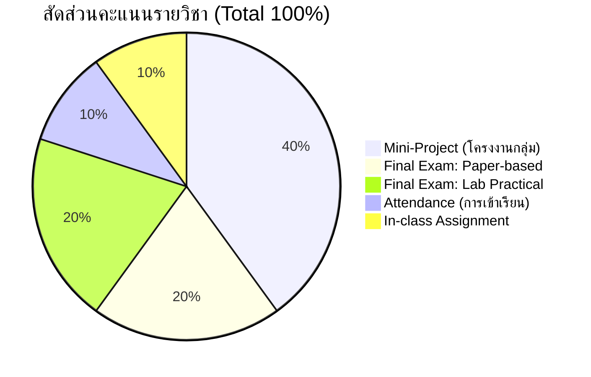

# ภาพรวมรายวิชาและการปฐมนิเทศ (Course Overview & Orientation)

arrow_back กลับไปที่ [[Week1-MOC|MOC สัปดาห์ 1]]

## key Keyword

- **Course Learning Outcomes (CLOs)** — วัตถุประสงค์การเรียนรู้ระดับรายวิชา มุ่งเน้นความเข้าใจหลักการและการเลือกใช้เทคโนโลยี NLP
- **Evaluation & Grading Scale** — เกณฑ์การกระจายคะแนน (สอบ 40%, มินิโปรเจกต์ 40%, งานในชั้น 10%, การเข้าเรียน 10%) และช่วงตัดเกรด A ถึง F
- **Mini-Project (Group Project)** — โครงงานกลุ่ม 6-7 คน ประยุกต์ใช้โมเดลภาษาแก้ปัญหาโจทย์จริง
- **Attendance & Classroom Policy** — กฎการเช็คชื่อตรงเวลา (8:30 / 14:30) และเงื่อนไขการลากิจ/ลาป่วย

## menu_book Theory (เข้าใจง่าย)

### 1. ข้อมูลรายวิชาเบื้องต้น (Course Information)

| รายการ | รายละเอียด |
| :--- | :--- |
| **รหัสวิชา** | `1323404` (ตามแผนหลักสูตร CAI) / `1323326` (รหัสตามเอกสารสไลด์) |
| **ชื่อวิชา** | การประมวลผลภาษาธรรมชาติ (Natural Language Processing) |
| **ห้องเรียนปฏิบัติการ** | ห้อง **1-0303 Computer & Sound Lab 2** |
| **อาจารย์ผู้สอน** | **อาจารย์ สธิดา สุขพงษ์ (Satida Sookpong)** |
| **Microsoft Teams Code** | • **Sec 1:** `pdm1hti` • **Sec 2:** `k3hlsii` |

### 2. วัตถุประสงค์การเรียนรู้ (Course Learning Outcomes: CLOs)

1. **CLO 1:** อธิบายหลักการเบื้องต้นและทฤษฎีพื้นฐานทางภาษาธรรมชาติและการประมวลผลเชิงคำนวณได้อย่างถูกต้อง
2. **CLO 2:** เลือกใช้สถาปัตยกรรมและเทคโนโลยีการประมวลผลภาษาธรรมชาติ (NLP / LLM Models) เพื่อแก้ไขปัญหาได้อย่างเหมาะสมและมีประสิทธิภาพ

### 3. ขอบเขตเนื้อหาตลอดภาคการศึกษา (Course Outline)

การคำนวณและทฤษฎีพื้นฐานของ NLP ประกอบด้วย:
- แบบจำลองภาษา (Language Models)
- การตัดคำและการประมวลผลข้อความ (Tokenization & Segmentation)
- แบบจำลองเอ็นแกรม (N-grams)
- การฝังคำในปริภูมิเวกเตอร์ (Word Embeddings)
- การกำกับหมวดหมู่คำพูด (Part-of-Speech Tagging)
- การติดป้ายลำดับและการสกัดเอนทิตี (Sequence Labelling & NER)
- โครงข่ายประสาทภาษาแบบวนซ้ำ (Recurrent Neural Language Models - RNN/LSTM/GRU)
- สถาปัตยกรรมแบบจำลองเข้ารหัส-ถอดรหัส (Encoder-Decoder Models)
- แบบจำลองกลไกความใส่ใจ (Attention Mechanisms)
- สถาปัตยกรรมหม้อแปลงและแบบจำลองภาษาขนาดใหญ่ (Transformers & LLMs)
- วากยสัมพันธ์ ต้นไม้โครงสร้าง และการวิเคราะห์คำ (Syntax Trees and Parsing)

### 4. สัดส่วนคะแนน (Grading Scheme)

| องค์ประกอบคะแนน | สัดส่วน | เงื่อนไขและรายละเอียด |
| :--- | :---: | :--- |
| **Mini-Project** | **40%** | โครงงานกลุ่ม 6-7 คน จัดทำระบบ NLP ประยุกต์ |
| **Exam (การสอบวัดผล)** | **40%** | แบ่งเป็น 2 ส่วนเท่ากัน: • **Paper-based (ทฤษฎี):** 20% • **Lab (ปฏิบัติการเขียนโค้ด):** 20% |
| **In-class assignment** | **10%** | แบบฝึกหัดและงานที่มอบหมายในห้องเรียน |
| **Attendance (การเข้าเรียน)** | **10%** | ความตรงต่อเวลาและระเบียบวินัยในชั้นเรียน |

> [!important] ระเบียบการเช็คชื่อและการลา (Attendance Policy)
> - **เวลาเช็คชื่อ:** เช็คชื่อได้ไม่เกิน **8:30 น.** (สำหรับคาบเช้า) และ **14:30 น.** (สำหรับคาบบ่าย) หลังจากนี้ถือเป็นสาย/ขาด
> - **การลาป่วย:** ต้องมีเอกสาร **ใบรับรองแพทย์** แนบยืนยันเท่านั้น
> - **การลากิจ:** ต้องแจ้งให้อาจารย์ทราบล่วงหน้าอย่างน้อย 1 วัน (ก่อน **23:59 น.** ของวันก่อนหน้า)
> - **กรณีฉุกเฉิน:** การอนุมัติการลาขึ้นอยู่กับดุลยพินิจของอาจารย์ผู้สอนเป็นรายกรณี

### 5. เกณฑ์การตัดเกรด (Grading Scale)

ระบบตัดเกรดอิงเกณฑ์มาตรฐาน มีช่วงคะแนนดังนี้:

| ช่วงคะแนนรวม | เกรดที่ได้รับ |
| :---: | :---: |
| 80.00 – 100.00 | **A** |
| 75.00 – 79.99 | **B+** |
| 70.00 – 74.99 | **B** |
| 65.00 – 69.99 | **C+** |
| 60.00 – 64.99 | **C** |
| 55.00 – 59.99 | **D+** |
| 40.00 – 54.99 | **D** |
| < 40.00 | **F** |

### 6. โครงงานประจำวิชา (Mini-Project Details)

- **รูปแบบ:** การทำงานร่วมกันเป็นกลุ่มย่อย กลุ่มละ **6 – 7 คน**
- **การจัดกลุ่มตาม Section:**
  - **Sec 1 (นักศึกษา 39 คน):** แบ่งเป็นกลุ่ม 6 คน จำนวน 3 กลุ่ม และกลุ่ม 7 คน จำนวน 3 กลุ่ม
  - **Sec 2 (นักศึกษา 26 คน):** แบ่งเป็นกลุ่ม 6 คน จำนวน 2 กลุ่ม และกลุ่ม 7 คน จำนวน 2 กลุ่ม
- **การส่งงาน:** ลงทะเบียนรายชื่อสมาชิกกลุ่มในช่องทาง Microsoft Teams ตามกลุ่มเรียน (หัวข้อโจทย์และรายละเอียดเพิ่มเติม TBC)

### 7. กำหนดการสำคัญประจำภาคเรียน (Time Table)

| วันที่ / สัปดาห์ | กิจกรรมสำคัญ |
| :--- | :--- |
| **11 กันยายน 2026** | กำหนดการวันสุดท้ายของการ **Drop รายวิชาโดยไม่ติด W** |
| **30 ตุลาคม 2026** | กำหนดการวันสุดท้ายของการ **Drop รายวิชาแบบติด W** |
| **18 – 22 พฤศจิกายน 2026** | สัปดาห์การ **สอบปลายภาค (Final Examination Week)** |

### 8. เอกสารและตำราอ้างอิงหลัก (References)

- **Lee, Raymond. (2023).** *Natural Language Processing : A Textbook with Python Implementation.* Springer, Singapore. [DOI: 10.1007/978-981-99-1999-4](https://doi.org/10.1007/978-981-99-1999-4).
- **Daniel Jurafsky and James H. Martin. (2026).** *Speech and Language Processing: An Introduction to Natural Language Processing, Computational Linguistics, and Speech Recognition with Language Models*, 3rd edition. Online manuscript released January 6, 2026. Available at: [web.stanford.edu/~jurafsky/slp3](https://web.stanford.edu/~jurafsky/slp3).

---

arrow_forward ต่อไป: [[Week1-MOC|เข้าสู่สารบัญสัปดาห์ 1 (Week 1 MOC)]]
