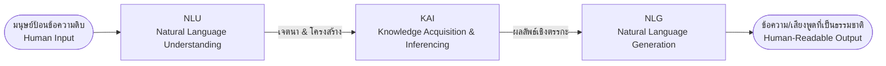
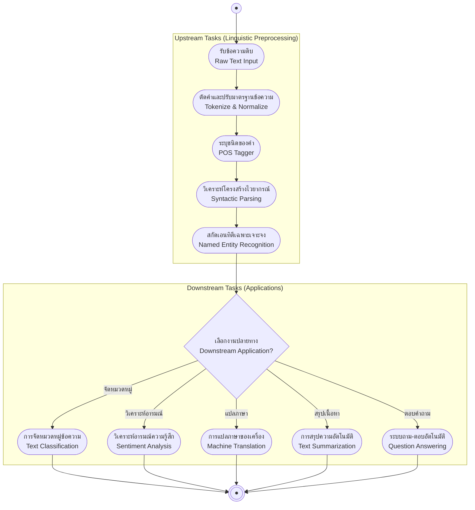

# ความรู้เบื้องต้นเกี่ยวกับ NLP (Introduction to NLP)

arrow_back กลับไปที่ [[Week1-MOC|MOC สัปดาห์ 1]] | อ่านเพิ่มเติม: [[Course-Overview|ภาพรวมรายวิชา]]

## key Keyword

- **Natural Language Processing (NLP)** — ศาสตร์ที่ผสานภาษาศาสตร์ (Linguistics), วิทยาการคอมพิวเตอร์ (Computer Science) และปัญญาประดิษฐ์ (AI) เข้าด้วยกัน เพื่อให้คอมพิวเตอร์เข้าใจ ตีความ และสร้างภาษามนุษย์ได้
- **NLU (Natural Language Understanding)** — โมดูลขาเข้าที่ทำหน้าที่ตีความความหมาย โครงสร้าง และเจตนา (Intent) จากข้อความของมนุษย์
- **KAI (Knowledge Acquisition and Inferencing)** — โมดูลแกนกลางที่นำการแทนความรู้ (Knowledge Representation) และการอนุมานเชิงตรรกะ (Inference/Reasoning) มาประมวลผลเจตนา
- **NLG (Natural Language Generation)** — โมดูลขาออกที่สร้างข้อความหรือเสียงพูดที่เป็นธรรมชาติและมนุษย์เข้าใจได้
- **Upstream / Downstream Tasks** — งานประมวลผลทางภาษาขั้นพื้นฐาน (Tokenization, POS, Parsing) เทียบกับงานประยุกต์ปลายทาง (Classification, Translation, QA)

## menu_book Theory (เข้าใจง่าย)

### 1. NLP คืออะไร (Definition & Foundations)

ตามสไลด์บรรยาย (อ้างอิง Huaping) นิยามของ NLP ไว้ว่า:

> "NLP is the science that integrates linguistics, computer science, and artificial intelligence to enable computers to understand, interpret, and generate human language."

NLP เป็นจุดตัดของ 3 ศาสตร์หลัก:
1. **ภาษาศาสตร์ (Linguistics):** กฎเกณฑ์ โครงสร้างไวยากรณ์ สัทศาสตร์ และความหมายของภาษา
2. **วิทยาการคอมพิวเตอร์ (Computer Science):** อัลกอริทึม โครงสร้างข้อมูล และประสิทธิภาพเชิงคำนวณ
3. **ปัญญาประดิษฐ์ (Artificial Intelligence):** การเรียนรู้ของเครื่อง (ML/DL) และการแทนความรู้เพื่ออนุมานเหตุผล

หากขาดศาสตร์ใดศาสตร์หนึ่ง จะเป็นเพียงระบบ "ประมวลผลตัวอักษร (String Manipulation)" แต่ไม่เข้าใจความหมายและบริบทที่แท้จริง

---

### 2. วิวัฒนาการของ NLP สู่ยุค LLM (6 Stages of NLP History)

ประวัติศาสตร์และการพัฒนาเทคโนโลยี NLP แบ่งออกเป็น 6 ยุคสำคัญ:

| ยุค (Stage) | ช่วงเวลาและแนวคิดหลัก | เทคโนโลยี / ผลงานสำคัญ | สาระสำคัญ |
| :--- | :--- | :--- | :--- |
| **Stage 1: Machine Translation** | **1950s** Rule-based & Stochastic | • 1952 International Conf. on MT • 1957 Noam Chomsky Universal Grammar & Hierarchy | ใช้กฎเกณฑ์ทางไวยากรณ์ มนุษย์เป็นผู้กำหนดความรู้ (Human-defined knowledge) |
| **Stage 2: Early AI on NLP** | **1960s – 1970s** Domain Expert Systems | • 1961 BASEBALL System (Green et al.) • 1968 Minsky's Inference Engine • 1970 Augmented Transition Networks (ATN โดย Woods) | ระบบ Q&A เฉพาะโดเมนในรูป Key-Value, การแปลงข้อความเป็นโครงสร้างที่เครื่องเข้าใจได้ |
| **Stage 3: Grammatical Logic** | **1970s – 1980s** Knowledge, Logic & Reasoning | • SRI's Core Language Engine (CLE) • Discourse Representation Theory (DRT) | วิเคราะห์ข้อความเป็นลำดับขั้น: สัณฐานวิทยา $\to$ ไวยากรณ์ $\to$ อรรถศาสตร์ $\to$ ตรรกศาสตร์ $\to$ บริบท และเริ่มตีความข้ามประโยค |
| **Stage 4: AI & Machine Learning** | **1980s – 2000s** Corpus Linguistics & Features | • Hopfield Network (John Hopfield) • Chomsky's Corpus-based ML • 2006 IBM DeepQA Project (Jeopardy!) | เปลี่ยนผ่านจากการเขียนกฎด้วยมือ มาเป็นการเรียนรู้จากคลังข้อมูลขนาดใหญ่ (Corpus) ร่วมกับ Handcrafted Features |
| **Stage 5: Big Data & Deep Networks** | **2010s Onward** Deep Learning & Vectors | • RNN / LSTM Sequence Modeling • 2013 Word2Vec (คำแทนด้วยเวกเตอร์) • 2014 Seq2Seq + Attention • 2016 Google Neural Machine Translation (GNMT) | พลังประมวลผลและบิ๊กดาต้าผลักดัน Neural Networks โมเดลเรียนรู้ Representation อัตโนมัติ |
| **Stage 6: Transformers & Modern LLMs** | **2017 – 2026** Foundation Models & Agents | • 2017 Transformer (*"Attention is all you need"* โดย Vaswani et al.) • 2018–2020 BERT, GPT-2, GPT-3 (Pre-training & Fine-tuning) • พ.ย. 2022 ChatGPT • 2023–2026 The Frontier Race (GPT-4/5, Claude, Gemini, LLaMA, DeepSeek) | โมเดลขนาดใหญ่รองรับ Multimodal Reasoning, การเขียนโค้ด และขีดความสามารถเชิง Agent (ติดตาม Benchmark ได้ที่ `llm-stats.com`) |

> [!note] รากฐานทางประวัติศาสตร์
> แนวคิดเรื่อง "เครื่องจักรคิดและเข้าใจภาษาได้หรือไม่" มีจุดเริ่มต้นมาจาก **Turing Test** (Alan Turing, 1950) และแชทบอทเชิงกฎเกณฑ์ตัวแรกอย่าง **ELIZA** (Weizenbaum, 1966) ซึ่งจำลองบทสนทนาของนักจิตบำบัด ตำราคลาสสิกที่รวบรวมรากฐานทั้งหมดนี้คือ *Speech and Language Processing* ของ Daniel Jurafsky & James H. Martin

---

### 3. ระดับชั้นของโครงสร้างทางภาษา (Levels of Linguistic Structure)

การทำความเข้าใจภาษาธรรมชาติของมนุษย์ประกอบด้วย 5 ขั้นตอน/ระดับชั้นที่เชื่อมโยงกัน:

1. **ระดับหน่วยคำ (Text $\to$ Paragraph $\to$ Sentence $\to$ Word):** การแบ่งแยกข้อความออกเป็นคำและวิเคราะห์สัณฐานวิทยา (Morphology)
2. **ระดับไวยากรณ์ (Grammar & Syntax):** กฎระเบียบและความสัมพันธ์เชิงโครงสร้างระหว่างคำในประโยค
3. **ระดับอรรถศาสตร์ของประโยคเดี่ยว (Exact Literal Meaning):** ความหมายตรงตัวตามตัวอักษรของแต่ละประโยค
4. **ระดับสัมพันธสาร (Discourse Meaning):** การตีความความหมายที่เชื่อมโยงระหว่างประโยค เช่น การอ้างถึงของคำสรรพนาม (Coreference Resolution)
5. **ระดับวัจนปฏิบัติศาสตร์และบริบทโลกจริง (Pragmatics & World Knowledge):** ความหมายที่แท้จริงตามบริบท เจตนาของผู้พูด วัฒนธรรม และความรู้รอบตัว

---

### 4. ทำไม NLP ถึงยาก: 5 ความท้าทายหลัก และกรณีศึกษาภาษาไทย (Core Challenges)

ความท้าทายสากลของ NLP มี 5 มิติ ซึ่งปรากฏตัวอย่างที่ซับซ้อนอย่างยิ่งในบริบทของ **ภาษาไทย (Thai NLP Challenges)**:

| มิติความท้าทาย | นิยามทางทฤษฎี | ตัวอย่างรูปธรรมในภาษาไทยจากสไลด์ |
| :--- | :--- | :--- |
| **1. Abstractness (ความเป็นนามธรรม)** | ความหมายแท้จริงมักไม่ได้อยู่ตรงๆ ที่รูปคำ คำเดี่ยวเข้ารหัสแนวคิดที่ลึกซึ้งและประชดประชันได้ | • *"ไปให้แม่แกทำ"* (ความหมายไม่ได้สั่งให้แม่ทำจริง แต่เป็นการปฏิเสธ/ประชด) • *"สวย $\to$ สวยกี่โมง"* = **ไม่สวย** • *"ได้ $\to$ ได้อยู่"* = **ไม่ได้ / แย่** |
| **2. Combinability (การผสมคำไม่จำกัด)** | คำเดี่ยวสามารถนำมาผสมกันจนเกิดความหมายใหม่ที่คาดเดาไม่ได้จากคำเดิม | • คำว่า **แม่**: *แม่น้ำ*, *แม่ยก*, *แม่ไม้มวยไทย* • คำว่า **กับ** = with, **ข้าว** = rice แต่ **กับข้าว** = side dish (ไม่มีข้าวสาร) |
| **3. Evolutiveness (ภาษาไม่หยุดนิ่ง)** | วิวัฒนาการทางภาษารวดเร็ว มีศัพท์สแลง คำย่อ และรูปแบบการสะกดใหม่เกิดขึ้นตลอดเวลา | • *"ใช่ไหม"* $\to$ *"ใช่ปะ"* $\to$ *"ช้ะ"* • *"เลิศ"* $\to$ *"เริด"* • *"จะรั่ว"* (สแลงหมายถึง ขำมากจนทนไม่ไหว) |
| **4. Nonstandardness (ความยืดหยุ่นไร้ระเบียบ)** | คำพิมพ์ผิด ภาษาถิ่น และการละเว้นไวยากรณ์ทางการ | • *"กำลัง จะ ไป กินข้าว อยู่ แล้ว"* (สลับคำขยายได้หลากหลายรูปแบบโดยความหมายใกล้เคียงกัน) • *"กำลังจะไปกินข้าว"*, *"กินข้าวอยู่"*, *"กินข้าวแล้ว"* |
| **5. Subjectivity (ขึ้นกับบุคคลและบริบท)** | อารมณ์ น้ำเสียง และเจตนาขึ้นอยู่กับวัฒนธรรม ภูมิภาค และผู้พูด | • เมนูอาหารตามภูมิภาค: *"แกงส้ม"* (ภาคกลาง) vs *"แกงส้ม/แกงเหลือง"* (ภาคใต้) • คำกำกวมตามวัฒนธรรม: *"“ไปส่ง”กินข้าวหน่อย"* |

> [!important] ความท้าทายสูงสุดของภาษาไทย: Segmentation
> ภาษาไทยเป็นภาษาที่เขียนติดกันโดย **ไม่มีเครื่องหมายวรรคตอนหรือช่องว่างคั่นคำ (No whitespace boundary)** ทำให้งาน **Word Segmentation** (การตัดคำ) และ **Sentence Segmentation** (การตัดประโยค) กลายเป็นอุปสรรคสำคัญอันดับแรกสุดของระบบประมวลผลภาษาไทย

---

### 5. สถาปัตยกรรมหลักของระบบ NLP (NLP Architecture: NLU, KAI, NLG)

ระบบประมวลผลภาษาธรรมชาติประกอบด้วย 3 เสาหลัก:

| องค์ประกอบ | ชื่อเต็ม | หน้าที่หลัก |
| :--- | :--- | :--- |
| **NLU** | **Natural Language Understanding** | ตีความความหมาย เจตนา (Intent) และโครงสร้างไวยากรณ์จากข้อความอินพุต |
| **KAI** | **Knowledge Acquisition and Inferencing** | จัดเก็บความรู้ (Knowledge Representation) และทำการอนุมานด้วยเหตุผล (Inference & Reasoning) เพื่อหาคำตอบหรือข้อสรุป |
| **NLG** | **Natural Language Generation** | สังเคราะห์และสร้างข้อความหรือเสียงพูดที่เป็นธรรมชาติ ไวยากรณ์ถูกต้อง และสละสลวยส่งกลับให้ผู้ใช้ |

> [!tip] เทคนิคช่วยจำ
> **NLU = ขาเข้า (Input $\to$ Meaning)** เหมือนหูฟังและสมองส่วนตีความ  
> **NLG = ขาออก (Meaning $\to$ Output)** เหมือนปากที่พูดสื่อสารออกมา

---

### 6. Pipeline: Upstream Tasks vs Downstream Tasks

งานในสายงาน NLP แบ่งออกเป็น 2 ระดับตามบทบาทใน Pipeline:

- **Upstream Tasks (งานประมวลผลทางภาษาขั้นพื้นฐาน):** เป็นการเตรียมข้อมูลและสกัดคุณลักษณะทางภาษาศาสตร์ (Linguistic Preprocessing) และการ Pre-train โมเดล เช่น การตัดคำ (Tokenization), การกำกับชนิดคำ (POS Tagging), การแจกแจงโครงสร้างไวยากรณ์ (Syntactic Parsing)
- **Downstream Tasks (งานประยุกต์ใช้งานจริง):** เป็นงานเฉพาะทางที่นำผลลัพธ์จาก Upstream มาต่อยอดหรือทำการ Fine-tuning เช่น การจำแนกข้อความ (Text Classification), การวิเคราะห์อารมณ์ (Sentiment Analysis), การแปลภาษา (Machine Translation), การสรุปความ (Text Summarization), และระบบถาม-ตอบ (Question Answering)

> [!note] ตำแหน่งของ NER ใน Pipeline
> ในสไลด์สอน Named Entity Recognition (NER) ถูกวางเป็นสะพานเชื่อมระหว่าง Upstream (การวิเคราะห์โครงสร้าง) และ Downstream (การนำไปประยุกต์) โดยในเชิงอัลกอริทึม NER จัดเป็นงาน **Sequence Labeling** ซึ่งจะศึกษาละเอียดใน [[Word-Segmentation-POS-Tagging-Sequence-Labeling|สัปดาห์ที่ 2]]

---

### 7. เครื่องมือมาตรฐานในวงการ NLP (Popular NLP Libraries)

- **NLTK (Natural Language Toolkit):** ไลบรารีคลาสสิกของ Python เหมาะสำหรับงานสอนและวิจัย มีอัลกอริทึมพื้นฐานและ Corpus ครบถ้วน
- **spaCy:** ไลบรารีระดับ Production (Industrial-Strength NLP) เน้นความเร็วสูง รองรับ Pipeline สำเร็จรูป (Tokenization, POS, Parsing, NER)
- **PyThaiNLP:** ไลบรารีโอเพนซอร์สมาตรฐานสำหรับประมวลผลภาษาไทยโดยเฉพาะ มีเอนจินตัดคำและฟังก์ชันด้านภาษาไทยที่ครอบคลุม
- **Hugging Face (`transformers`):** ฮับกลางสำหรับดาวน์โหลดและ Fine-tune โมเดลภาษาและสถาปัตยกรรม Transformer ยุคใหม่

## schema Diagram

---

arrow_forward ต่อไป: [[Tokenization]]
