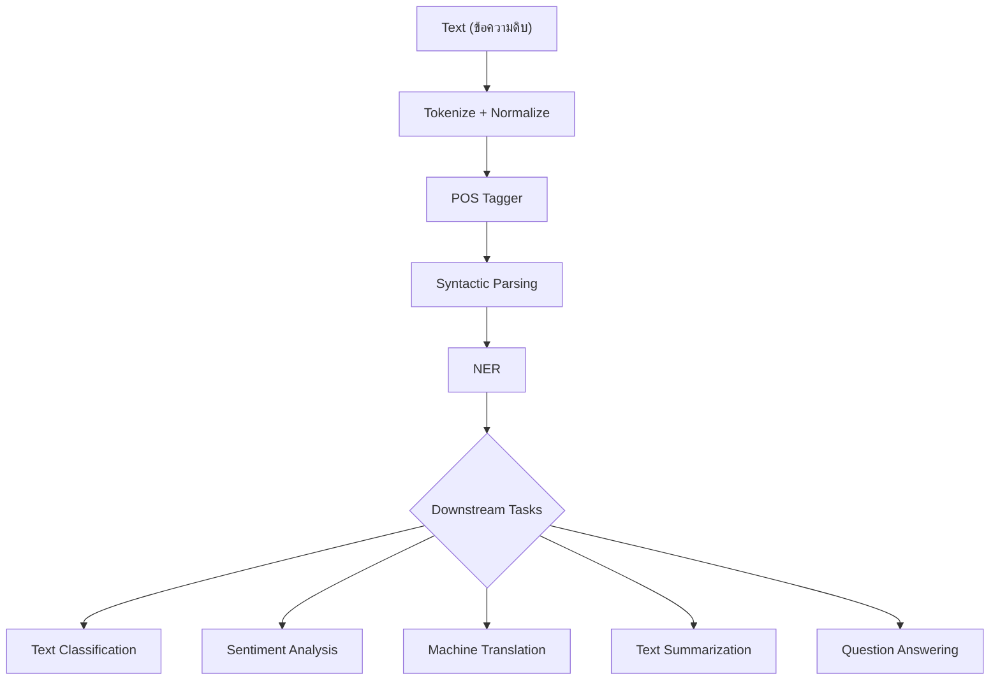

# ความรู้เบื้องต้นเกี่ยวกับ NLP (Introduction to NLP)

⬅️ กลับไปที่ [[Week1-MOC|MOC สัปดาห์ 1]]

## 🔑 Keyword

- **Natural Language Processing (NLP)** — ศาสตร์ที่ผสาน linguistics, computer science และ AI เข้าด้วยกัน เพื่อให้คอมพิวเตอร์เข้าใจและสร้างภาษามนุษย์ได้
- **NLU (Natural Language Understanding)** — ส่วนที่ตีความความหมาย เจตนา และโครงสร้างจากข้อความอินพุต
- **NLG (Natural Language Generation)** — ส่วนที่สร้างข้อความหรือเสียงพูดที่เป็นธรรมชาติออกมาเป็นผลลัพธ์
- **Upstream / Downstream Tasks** — งานประมวลผลภาษาพื้นฐาน (tokenize, POS, parsing) เทียบกับงานประยุกต์ที่ต่อยอดจากงานพื้นฐาน (classification, translation, QA)

## 📖 Theory (เข้าใจง่าย)

### NLP คืออะไร

ตามสไลด์ (อ้างอิง Huaping) นิยาม NLP ไว้ว่า:

> "NLP is the science that integrates linguistics, computer science, and artificial intelligence to enable computers to understand, interpret, and generate human language."

พูดง่าย ๆ คือ NLP เป็นจุดตัดของ 3 ศาสตร์: **ภาษาศาสตร์ (Linguistics)**, **วิทยาการคอมพิวเตอร์ (Computer Science)** และ **ปัญญาประดิษฐ์ (Artificial Intelligence)** — ขาดศาสตร์ใดศาสตร์หนึ่งไปก็จะได้แค่ระบบที่ "ประมวลผลตัวอักษร" แต่ไม่เข้าใจภาษาจริง ๆ

> [!note] รากฐานทางประวัติศาสตร์
> แนวคิดเรื่อง "เครื่องจักรเข้าใจภาษา" มีมาก่อนคำว่า NLP จะถูกใช้เสียอีก เช่น **Turing Test** (Turing, 1950) ที่ใช้บทสนทนาเป็นตัววัดความฉลาดของเครื่องจักร และ **ELIZA** (Weizenbaum, 1966) แชทบอทกฎเกณฑ์ (rule-based) ยุคแรก ๆ ที่เลียนแบบนักจิตบำบัด ตำราอ้างอิงมาตรฐานของวงการที่รวบรวมเนื้อหาทั้งหมดนี้อย่างเป็นระบบคือ *Speech and Language Processing* ของ Jurafsky & Martin

### ทำไม NLP ถึงยาก (Core Challenges)

| ความท้าทาย | ความหมาย |
| --- | --- |
| **Abstractness** | ความหมายไม่ได้อยู่ตรง ๆ ที่ตัวอักษร คำหนึ่งคำแทนแนวคิดที่ลึกกว่าตัวมันเอง |
| **Combinability** | คำผสมกันได้แทบไม่จำกัดรูปแบบ เกิดความหมายใหม่ที่ไม่เคยเห็นมาก่อน |
| **Evolutiveness** | ภาษาเปลี่ยนแปลงตลอดเวลา มีศัพท์สแลง คำใหม่เกิดขึ้นเรื่อย ๆ |
| **Nonstandardness** | คำผิด ภาษาถิ่น ไวยากรณ์ไม่เป็นทางการ ทำให้เบี่ยงเบนจากกฎที่สะอาด |
| **Subjectivity** | โทนเสียง อารมณ์ และเจตนา ขึ้นกับผู้พูด บริบท และวัฒนธรรม |

### ประวัติของ NLP โดยย่อ

พัฒนาการของ NLP ไล่เรียงเป็นยุค ๆ ดังนี้:

**Rule-Based Systems** (กฎที่เขียนโดยมนุษย์ เช่น ELIZA) → **Statistical NLP** (ใช้ความน่าจะเป็นจาก corpus) → **Machine Learning Era** (feature engineering + classifier) → **Word Embeddings** (แทนคำด้วยเวกเตอร์) → **Transformers** (attention mechanism) → **Large Language Models (LLMs)** (โมเดลขนาดใหญ่ที่ฝึกจากข้อมูลมหาศาล)

> [!info] เครื่องมือยุคปัจจุบัน
> ปัจจุบัน **Hugging Face Hub** (huggingface.co) กลายเป็นศูนย์กลาง (de-facto hub) สำหรับโมเดลและ dataset ด้าน NLP โดยมี library **`transformers`** เป็นเครื่องมือมาตรฐานที่ใช้เรียกโมเดลเหล่านี้มาใช้งานได้ในไม่กี่บรรทัดโค้ด

### Pipeline: Upstream vs Downstream Tasks

อ้างอิงแนวคิด pipeline ของ spaCy (spacy.io) แบ่งงาน NLP เป็น 2 กลุ่ม:

- **Upstream Tasks** — งานเตรียมข้อมูลทางภาษา (linguistic preprocessing) เช่น tokenization, POS tagging, syntactic parsing
- **Downstream Tasks** — งานประยุกต์ที่สร้างต่อจากผลลัพธ์ของ upstream เช่น text classification, sentiment analysis, machine translation, text summarization, question answering

> [!important] จุดที่ควรสังเกต
> ในสไลด์ต้นฉบับ Named Entity Recognition (NER) ถูกวางไว้ทั้งใน pipeline (เป็นขั้นตอนหนึ่งต่อจาก syntactic parsing) และในรายการตัวอย่าง downstream applications — ในทางปฏิบัติ NER มักถูกมองเป็นงาน **sequence labeling** ที่อยู่กึ่งกลางระหว่าง upstream/downstream (จะเรียนละเอียดใน [[Word-Segmentation-POS-Tagging-Sequence-Labeling]] สัปดาห์ 2) ควรตรวจสอบกับอาจารย์อีกครั้งว่าต้องการให้นักศึกษาจำ NER อยู่ฝั่งไหนเป็นหลัก

### องค์ประกอบหลักของระบบ NLP

| องค์ประกอบ | ชื่อเต็ม | หน้าที่ |
| --- | --- | --- |
| **NLU** | Natural Language Understanding | ตีความความหมาย เจตนา และโครงสร้างจากอินพุตมนุษย์ |
| **KAI** | Knowledge & AI Reasoning | ใช้ knowledge representation และการอนุมานเพื่อประมวลผลเจตนา |
| **NLG** | Natural Language Generation | สร้างข้อความหรือเสียงพูดที่เป็นธรรมชาติเป็นผลลัพธ์ |

### การประยุกต์ใช้งานจริง

Voice Assistants (Alexa, Google Assistant, Siri), Customer Chatbots, Spam Filtering, Predictive Typing, Translation Tools, Sentiment Tracking (social media monitoring), Document Search (search & recommendation)

### เครื่องมือยอดนิยมสำหรับเรียนและใช้งานจริง

- **NLTK** — Python library คลาสสิกสำหรับสอนและวิจัย มี algorithm และ corpus ครบ
- **spaCy** — NLP แบบ industrial-strength เน้นความเร็วและ production pipeline (tokenization, tagging, parsing, NER)
- **PyThaiNLP** — open-source toolkit ที่ออกแบบมาสำหรับงานภาษาไทยโดยเฉพาะ (จะใช้จริงในสัปดาห์นี้ต่อในหัวข้อ [[Tokenization]])

> [!tip] เคล็ดลับ
> จำ NLU กับ NLG สลับกันบ่อย ให้จำว่า **Understanding = ขาเข้า (input → meaning)** ส่วน **Generation = ขาออก (meaning → output)** เหมือนหูฟัง (เข้าใจ) กับปาก (พูดออกมา)

## 🖼️ Diagram

**ตัวอย่าง:** pipeline นี้อ้างอิงจากแนวคิดของ spaCy (สไลด์หน้า 5) — งานฝั่งซ้าย (upstream) เป็นการเตรียมข้อมูลทางภาษา ส่วนงานฝั่งขวา (downstream) เป็นงานประยุกต์ที่ใช้ผลลัพธ์จาก upstream ไปต่อยอด

---
➡️ ต่อไป: [[Tokenization]]
