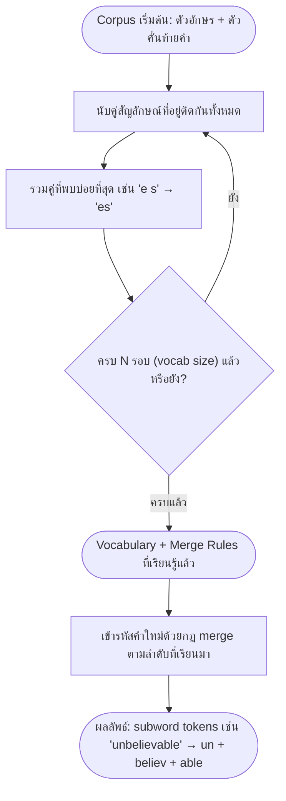

# การตัดคำและการแบ่งหน่วยข้อความ (Tokenization)

<span class="material-symbols-outlined">arrow_back</span> กลับไปที่ [[Week1-MOC|MOC สัปดาห์ 1]] | ก่อนหน้า: [[Intro-to-NLP]]

## <span class="material-symbols-outlined">key</span> Keyword

- **Tokenization** — กระบวนการแบ่งข้อความดิบออกเป็นหน่วยย่อย (token) ที่ประมวลผลต่อได้
- **Byte-Pair Encoding (BPE)** — subword tokenization ที่รวมคู่สัญลักษณ์ที่พบบ่อยที่สุดซ้ำ ๆ จนได้ vocabulary ขนาดที่กำหนด
- **WordPiece** — คล้าย BPE แต่เลือก merge โดยเพิ่ม language-model likelihood แทนความถี่ดิบ ใช้ใน BERT
- **Word Segmentation (ภาษาไทย)** — การหาขอบเขตคำในข้อความที่ไม่มีช่องว่างระหว่างคำ เช่น ภาษาไทย
- **Word Embedding** — การแทนคำด้วยเวกเตอร์ตัวเลขที่คำความหมายใกล้กันอยู่ใกล้กันในปริภูมิเวกเตอร์

## <span class="material-symbols-outlined">menu_book</span> Theory (เข้าใจง่าย)

### ลำดับชั้นของหน่วยข้อความ (Text Unit Hierarchy)

| ระดับ | ตัวอย่าง | ความหมาย |
| --- | --- | --- |
| **Words** | "playing" | หน่วยที่เล็กที่สุดที่มีความหมายและยืนเดี่ยวได้ในประโยค |
| **Morphemes** | "play" + "-ing" | หน่วยความหมายที่เล็กที่สุดในคำ (root, affix, suffix) |
| **Unicode** | U+0041 = "A" | ตัวอักษรแต่ละตัวถูก map เป็น code point สากล เป็นรากฐานของข้อความดิจิทัล |
| **Subword (BPE)** | "un" + "play" + "able" | แบ่งคำที่พบไม่บ่อยออกเป็นชิ้นย่อยที่พบบ่อยในคลังข้อมูล |

### Regular Expressions (Regex) พื้นฐาน

Regex คือลำดับตัวอักษรที่นิยาม pattern สำหรับค้นหา จับคู่ และจัดการสตริงตามกฎ ตัวอย่างที่ใช้บ่อยในงาน NLP:

| Pattern | ความหมาย |
| --- | --- |
| `\w+` | จับคู่ 1 token ที่เป็นคำ |
| `\d{4}-\d{2}-\d{2}` | จับคู่วันที่รูปแบบ YYYY-MM-DD |
| `[A-Z][a-z]+` | จับคู่คำขึ้นต้นด้วยตัวพิมพ์ใหญ่ (hint สำหรับ NER) |
| `\s+` | แบ่งข้อความตาม whitespace |

องค์ประกอบของ regex: character class `[ ]`, quantifier `* + ?`, anchor `^ $`, group `( )`, alternation `\|`, และ shorthand class `\w \d \s`

### Word-based Tokenization และข้อจำกัด

วิธีพื้นฐานที่สุดคือแบ่งตาม whitespace หรือเครื่องหมายวรรคตอน — ง่ายแต่ล้มเหลวกับ contraction, คำประสม และคำนอกคลังศัพท์ (OOV) เช่น `"don't"` → `["don", "'", "t"]` ซึ่งไม่ตรงกับความหมายที่ควรเป็น

### Normalization Pipeline

ก่อนเข้าโมเดล มักผ่านขั้นตอนปรับข้อความให้เป็นมาตรฐานตามลำดับนี้:

1. **Lowercasing** — แปลงเป็นตัวพิมพ์เล็กทั้งหมด: "Hello" → "hello"
2. **Punctuation Removal** — ตัดหรือแยกเครื่องหมายวรรคตอนออกจากคำ
3. **Stop Word Removal** — ตัดคำที่พบบ่อยแต่ไม่ให้ข้อมูลมาก เช่น "the", "is", "at"
4. **Stemming / Lemmatization** — ลดรูปคำที่ผัน เช่น "running" → "run"
5. **Unicode Normalization (NFC/NFD)** — รวมอักขระที่มีเครื่องหมายกำกับเสียงให้อยู่ในรูปเดียวกัน

### Subword Tokenization: Byte-Pair Encoding (BPE)

**การเทรน (Training):**

1. เริ่มจาก character vocabulary: {l, o, w, e, r, n, s, t, i, d, ...}
2. นับคู่สัญลักษณ์ที่อยู่ติดกันทั้งหมดในคลังข้อมูล
3. รวมคู่ที่พบบ่อยที่สุด เช่น "e s" → "es"
4. ทำซ้ำ N รอบ (N = hyperparameter คือขนาด vocabulary ที่ต้องการ)
5. ผลลัพธ์: กฎการ merge ที่เรียนรู้แล้ว + vocabulary สุดท้าย

ตัวอย่างจาก corpus `"low low lower"` → `l o w _` → merge "l o" เป็น "lo" → merge "lo w" เป็น "low"

**การเข้ารหัส (Encoder):** ใช้กฎ merge ตามลำดับที่เรียนรู้มา เริ่มจากตัวอักษรแล้ว apply merge แบบ greedy คำที่ไม่เคยเห็นจะถูกตัดเป็น subword ที่รู้จัก เช่น `"unbelievable"` → `"un" + "believ" + "able"` — ไม่มี true OOV เพราะกรณีเลวร้ายที่สุดคือถอยกลับไปเป็นลำดับตัวอักษรล้วน เช่น `"newer"` (คำที่ไม่เคยเห็น) → `n e w e r` → `ne w er` → `"ne" + "w" + "er"`

> [!note] BPE ในโลกจริง
> BPE ถูกนำมาใช้ในงาน NLP อย่างเป็นระบบครั้งแรกโดย Sennrich et al. (2016, *"Neural Machine Translation of Rare Words with Subword Units"*) ปัจจุบัน GPT-2/GPT-4 ใช้ byte-level BPE ขนาด vocabulary ประมาณ 50,000 token (ทำงานระดับ byte จึงรองรับได้ทุกภาษา) โมเดล Hugging Face อย่าง `gpt2` ก็ใช้ byte-level BPE tokenizer นี้โดยตรง เครื่องมือที่เกี่ยวข้องคือ SentencePiece, tiktoken (ของ OpenAI) และ library `tokenizers` ของ Hugging Face:
> ```python
> from tokenizers import ByteLevelBPETokenizer
> tokenizer = ByteLevelBPETokenizer()
> tokenizer.train(files, vocab_size=30000)
> ```

### WordPiece และ Laplace Smoothing

**WordPiece** พัฒนาโดย Google ใช้ใน BERT และโมเดลหลายภาษาอีกจำนวนมาก หลักการคล้าย BPE แต่เลือก merge สัญลักษณ์ที่ **เพิ่ม language-model likelihood สูงสุด** แทนการเลือกจากความถี่ดิบ คำจะถูกแบ่งด้วย prefix `"##"` เช่น `"playing"` → `"play" + "##ing"` และเก็บ `[UNK]` ไว้เฉพาะตัวอักษรที่ไม่มีใน vocabulary เลยเท่านั้น

| | BPE | WordPiece |
| --- | --- | --- |
| เกณฑ์การ merge | ความถี่ (Frequency) | LM likelihood |
| ใช้ใน | GPT, RoBERTa | BERT, DistilBERT |

> [!note] อ้างอิง
> WordPiece tokenizer ถูกใช้และเผยแพร่ให้เป็นที่รู้จักกว้างขวางผ่านโมเดล BERT (Devlin et al., 2019) บน Hugging Face Hub สามารถลองโหลด tokenizer ของ `bert-base-uncased` มาดูผลการแบ่งคำแบบ WordPiece ได้โดยตรง

**Laplace (Add-1) Smoothing** — โมเดลภาษาจะให้ความน่าจะเป็น 0 กับ n-gram ที่ไม่เคยเห็นมาก่อน ซึ่งเป็นปัญหาเวลาคำนวณ probability ของประโยคทั้งประโยค การ smoothing ช่วยกระจายความน่าจะเป็นเล็กน้อยไปให้เหตุการณ์ที่ไม่เคยเห็น:

$$P(w_i \mid w_{i-1}) = \frac{C(w_{i-1}, w_i) + 1}{C(w_{i-1}) + V}$$

โดย $C$ คือ count และ $V$ คือขนาด vocabulary ส่วน Add-k smoothing คือการขยาย +1 ให้เป็นค่า k เล็ก ๆ ใด ๆ

### การตัดคำภาษาไทย (Thai Word Segmentation)

**ปัญหาหลัก:** ภาษาไทยเขียนติดกันไม่มีช่องว่างระหว่างคำ เช่นประโยค "ฉันรักคุณ" ไม่มีขอบเขตคำที่มองเห็นได้ โมเดลต้องอนุมานขอบเขตจากบริบทและพจนานุกรมเอง

- **Dictionary-Based Word Segmentation** — ใช้ lexicon คำศัพท์ที่สร้างไว้ล่วงหน้า สแกนหาคำที่ตรงกับพจนานุกรม เร็วและอธิบายได้ แต่ถูกจำกัดด้วยความครอบคลุมของ vocabulary (คำนอกพจนานุกรม/OOV เช่น ชื่อเฉพาะ คำสแลง เป็นจุดอ่อนหลัก)
- **Longest Matching Algorithm** — greedy: ในแต่ละตำแหน่งจับคำที่ยาวที่สุดที่มีในพจนานุกรม มี 2 ทิศทาง: **Forward Maximum Matching (FMM)** สแกนซ้ายไปขวา และ **Backward Maximum Matching (BMM)** สแกนขวาไปซ้าย ปัญหาคือ ambiguity — บางข้อความมีการแบ่งคำที่ถูกต้องได้มากกว่าหนึ่งแบบ

> [!example] เครื่องมือจริง
> `PyThaiNLP` เป็น toolkit โอเพนซอร์สสำหรับภาษาไทยที่ implement วิธีเหล่านี้ไว้แล้ว ใช้งานได้ทันทีด้วย `word_tokenize("ฉันรักคุณ", engine="newmm")` ซึ่ง `newmm` คือ dictionary-based engine ที่ผสาน maximum matching กับ Thai word-boundary heuristics

### จาก Token สู่ความหมาย: Word Embedding (ภาพรวม)

**Word Embedding** คือการแทนคำด้วยเวกเตอร์ตัวเลขความหนาแน่นสูง (dense vector) ในปริภูมิมิติสูงต่อเนื่อง ที่เรียนรู้จากคลังข้อความขนาดใหญ่ โดยคำที่มีความหมายใกล้เคียงกันจะอยู่ใกล้กันทางเรขาคณิต ตัวอย่างที่โด่งดังจาก Word2Vec คือความสัมพันธ์เชิงเปรียบเทียบ `king − man + woman ≈ queen` โมเดลหลักที่ควรรู้จักคือ Word2Vec (Skip-gram/CBOW), GloVe (co-occurrence matrix), FastText (subword-aware, รองรับ OOV) และ contextual embeddings อย่าง ELMo/BERT ที่คำเดียวกันได้เวกเตอร์ต่างกันตามบริบท — หัวข้อนี้จะลงรายละเอียดเต็มใน [[Word-Embeddings]] สัปดาห์ที่ 4

> [!tip] เคล็ดลับ
> เวลาแยก BPE กับ WordPiece ไม่ออก ให้จำที่ "เกณฑ์การเลือก merge": BPE เลือกจาก**ความถี่ดิบ** (นับสถิติล้วน ๆ) ส่วน WordPiece เลือกจาก**ความน่าจะเป็นของภาษา** (ต้องมี language model คอยให้คะแนน) — ถ้าโจทย์พูดถึง "##" prefix ให้นึกถึง WordPiece/BERT ทันที

## <span class="material-symbols-outlined">schema</span> Diagram



**ตัวอย่าง:** ขั้นตอนนี้อ้างอิงจากสไลด์หน้า 5 (BPE Training + Encoder) — ฝึกจาก corpus ตัวอย่าง `"low low lower"` จนได้กฎ merge แล้วนำไปใช้เข้ารหัสคำใหม่ที่ไม่เคยเห็นมาก่อน

---
<span class="material-symbols-outlined">arrow_forward</span> กลับไปที่ [[Week1-MOC|MOC สัปดาห์ 1]]
