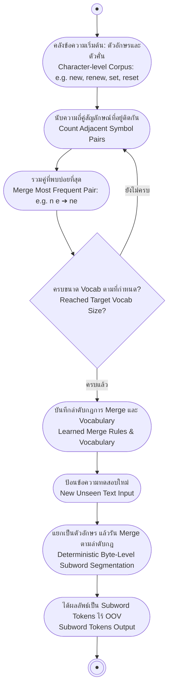

# การตัดคำและการแบ่งหน่วยข้อความ (Tokenization & Text Preprocessing)

<span class="material-symbols-outlined">arrow_back</span> กลับไปที่ [[Week1-MOC|MOC สัปดาห์ 1]] | ก่อนหน้า: [[Intro-to-NLP]]

## <span class="material-symbols-outlined">key</span> Keyword

- **Tokenization** — กระบวนการแบ่งข้อความดิบออกเป็นหน่วยย่อย (Tokens) เช่น คำ คำย่อย สัญลักษณ์ หรืออักขระ เพื่อป้อนเข้าสู่โมเดลประมวลผลภาษา
- **Byte-Pair Encoding (BPE)** — อัลกอริทึม Subword Tokenization ที่รวมคู่สัญลักษณ์ที่ปรากฏติดกันบ่อยที่สุดในคลังข้อความอย่างวนซ้ำ เป็นรากฐานของโมเดลตระกูล GPT
- **WordPiece** — อัลกอริทึม Subword ที่เลือกคู่ Merge โดยคำนวณจากค่าความน่าจะเป็นสูงสุด (Maximum Likelihood) ใช้ใน BERT
- **Unigram Language Model (ULM)** — แนวทาง Subword ที่เริ่มจาก Vocabulary ขนาดใหญ่แล้วค่อยๆ ตัดคู่ที่ลด Likelihood น้อยที่สุดออก ใช้ใน SentencePiece และ T5
- **Byte-Level BPE** — การประยุกต์ BPE บนระดับไบต์ UTF-8 (256 Base Bytes) ช่วยกำจัดปัญหา Out-of-Vocabulary (OOV) ได้ 100%
- **Word Segmentation (การตัดคำภาษาไทย)** — การหาขอบเขตคำในภาษาที่เขียนติดกันโดยไม่มีช่องว่างคั่น เช่น ภาษาไทย ผ่านวิธี Dictionary-Based และ Longest Matching

## <span class="material-symbols-outlined">menu_book</span> Theory (เข้าใจง่าย)

### 1. Tokenization คืออะไร และทำไมถึงสำคัญ

**Tokenization** คือก้าวแรกสุดในการแปลงข้อความ (Text) ให้กลายเป็นตัวเลขที่คอมพิวเตอร์เข้าใจได้

> [!important] 1 Token $\neq$ 1 Word
> การนับความยาวของข้อความขึ้นอยู่กับวิธี Tokenize เสมอ เช่น คำว่า `"don't"`:
> - แยกเป็น 1 Token: `["don't"]`
> - แยกเป็น 2 Tokens: `["do", "n't"]`
> - แยกเป็น 3 Tokens: `["don", "'", "t"]`  
> อัลกอริทึมทางสถิติส่วนใหญ่ (เช่น การวัดค่า Perplexity ของ Language Model) จำเป็นต้องใช้รูปแบบการ Tokenize ที่คงที่และเสถียร (Fixed Tokenization)

#### เปรียบเทียบ 3 แนวทางการแบ่ง Token (Tokenization Techniques)

| แนวทาง | หลักการทำงาน | ตัวอย่าง (`"I love NLP"`) | ข้อดี | ข้อจำกัด |
| :--- | :--- | :--- | :--- | :--- |
| **Word-Based** | ตัดตามช่องว่างหรือเครื่องหมายวรรคตอน | `["I", "love", "NLP"]` | เข้าใจง่าย รักษาความหมายระดับคำ | • เกิดปัญหา **Out-of-Vocabulary (OOV)**<br>• จัดการคำย่อ/คำประสมลำบาก (เช่น `"don't"` $\to$ `["don", "'", "t"]`)<br>• คลังคำศัพท์ (Vocab) มีขนาดใหญ่เกินไป |
| **Character-Based** | ตัดแยกรายตัวอักษร | `["I", " ", "l", "o", "v", "e", ...]` | • ไม่มีปัญหา OOV<br>• Vocab ขนาดเล็กมาก | • สูญเสียความหมายของคำ<br>• ลำดับอินพุต (Sequence Length) ยาวมากเกินไป ทำให้กินหน่วยความจำมหาศาล |
| **Subword-Based**<br>*(BPE, WordPiece)* | แบ่งคำตามหน่วยย่อยที่พบบ่อย | `["un", "##play", "##able"]` | **สมดุลสมบูรณ์แบบ** ระหว่างขนาด Vocab และความยาวลำดับ เป็นมาตรฐานของ LLM ปัจจุบัน | ต้องใช้เวลาฝึกโมเดล Tokenizer บนคลังข้อความล่วงหน้า |

---

### 2. กระบวนการปรับมาตรฐานข้อความ (Text Normalization Pipeline)

ข้อความดิบ (Raw Text) มักมีความไม่สม่ำเสมอ เช่น ตัวพิมพ์ใหญ่-เล็ก, เครื่องหมายวรรคตอน, คำย่อ, และอีโมจิ การทำ Normalization จะช่วยให้โมเดลประมวลผลได้ง่ายและแม่นยำขึ้น:

1. **Lowercasing:** แปลงตัวอักษรเป็นตัวพิมพ์เล็กทั้งหมด เช่น `"Hello"` $\to$ `"hello"` (ลดความซ้ำซ้อนของคำ)
2. **Punctuation Removal:** ตัดหรือแยกเครื่องหมายวรรคตอนออกจากคำ
3. **Stop Word Removal:** กรองคำหยุดที่พบบ่อยแต่ไม่มีความหมายเฉพาะ เช่น `"the"`, `"is"`, `"at"`
4. **Stemming / Lemmatization:** การลดรูปคำที่ผันรูปกลับสู่รากศัพท์ (Stem) หรือรูปพจนานุกรม (Lemma) เช่น `"running"` $\to$ `"run"`
5. **Unicode Normalization (NFC / NFD):** รวมหรือแยกอักขระพิเศษที่มีเครื่องหมายวรรณยุกต์/สระกำกับเสียงให้อยู่ในมาตรฐานเดียวกัน (ป้องกันปัญหาตัวอักษรหน้าตาเหมือนกันแต่รหัส Unicode ต่างกัน)

> [!note] Penn Treebank Tokenization
> มาตรฐานคลาสสิกที่นิยมใช้ในภาษาอังกฤษคือ **Penn Treebank Tokenization** ซึ่งใช้กฎ Rule-based จัดการกับเครื่องหมายวรรคตอน คำย่อ (Clitics) เช่น แยก `"they're"` เป็น `"they"` และ `"'re"`

---

### 3. นิพจน์ทั่วไป (Regular Expressions: Regex in NLP)

Regex เป็นเครื่องมือพื้นฐานสำหรับค้นหา ตรวจสอบ และตัดแบ่งรูปแบบสตริงในงานเตรียมข้อมูล NLP:

| สัญลักษณ์ Regex | หน้าที่และความหมาย | ตัวอย่างการประยุกต์ใช้งานใน NLP |
| :--- | :--- | :--- |
| `\w+` | จับคู่ตัวอักษรหรือคำ 1 คำขึ้นไป | ตัดคำพื้นฐาน (Word Token Extraction) |
| `\d{4}-\d{2}-\d{2}` | จับคู่รูปแบบวันที่มาตรฐาน YYYY-MM-DD | การสกัด Entity ประเภทวันที่ (Date Extraction) |
| `[A-Z][a-z]+` | คำที่ขึ้นต้นด้วยตัวพิมพ์ใหญ่ ตามด้วยตัวพิมพ์เล็ก | เบาะแสสกัดชื่อเฉพาะ (Named Entity Recognition Hint) |
| `\s+` | จับคู่ช่องว่าง (Whitespace) 1 ตัวขึ้นไป | ใช้สำหรับแบ่งคำตามวรรคตอน |
| `[ ]` | Character Class — กลุ่มตัวอักษรที่ต้องการ | เช่น `[aeiou]` จับคู่สระภาษาอังกฤษ |
| `* + ?` | Quantifiers — จำนวนการซ้ำ (0+, 1+, 0หรือ1) | กำหนดความยาวของแพทเทิร์น |
| `^ $` | Anchors — ตำแหน่งเริ่มต้น (`^`) และสิ้นสุด (`$`) ของสตริง | ตรวจสอบขอบเขตทั้งบรรทัด |
| `( )` | Groups — จัดกลุ่มตัวอักษร | สกัดเฉพาะส่วนของสตริงย่อย (Capture Group) |
| `\|` | Alternation — ตัวดำเนินการ หรือ (OR) | เช่น `"cat\|dog"` จับคู่คำว่า cat หรือ dog |

---

### 4. เจาะลึก Byte-Pair Encoding (BPE)

BPE เริ่มต้นจากระดับตัวอักษร แล้วค่อยๆ รวมคู่ที่พบบ่อยที่สุดจนได้จำนวน Vocabulary ตามที่กำหนด

#### ตัวอย่างการคำนวณการฝึก BPE ทีละขั้นตอน (BPE Training Worked Example)
สมมติคลังข้อความฝึกสอน (Corpus) มีคำและความถี่ดังนี้:
$$\text{Corpus: } \text{new (×2), renew (×2), set (×1), reset (×1)}$$

```text
[ขั้นตอนที่ 0: เริ่มต้น]
แยกทุกคำเป็นตัวอักษรเดี่ยว:
  n e w (x2)  /  r e n e w (x2)  /  s e t (x1)  /  r e s e t (x1)
Vocabulary เริ่มต้น: {e, n, r, s, t, w}

[ขั้นตอนที่ 1: ค้นหาคู่ความถี่สูงสุดครั้งที่ 1]
นับความถี่คู่ติดกัน: คู่ (n, e) ปรากฏ 4 ครั้ง (ใน new×2 และ renew×2) ซึ่งบ่อยที่สุด
ทำการ Merge: (n, e) → "ne"
คลังคำกลายเป็น: ne w (x2)  /  r e ne w (x2)  /  s e t (x1)  /  r e s e t (x1)
Vocabulary ใหม่: {e, n, r, s, t, w, "ne"}

[ขั้นตอนที่ 2: รวมคู่ความถี่สูงสุดครั้งที่ 2]
นับความถี่คู่ติดกัน: คู่ (ne, w) ปรากฏ 4 ครั้ง (ใน new×2 และ renew×2)
ทำการ Merge: (ne, w) → "new"
คลังคำกลายเป็น: new (x2)  /  r e new (x2)  /  s e t (x1)  /  r e s e t (x1)
Vocabulary ใหม่: {e, n, r, s, t, w, "ne", "new"}

[ขั้นตอนที่ 3: รวมคู่ความถี่สูงสุดครั้งที่ 3]
นับความถี่คู่ติดกัน: คู่ (r, e) ปรากฏ 3 ครั้ง (ใน renew×2 และ reset×1)
ทำการ Merge: (r, e) → "re"
คลังคำกลายเป็น: new (x2)  /  re new (x2)  /  s e t (x1)  /  re s e t (x1)
จากนั้นรวม (re, new) → "renew"
Vocabulary ใหม่: {..., "re", "renew"}

[ขั้นตอนที่ 4: รวมคู่ในกลุ่ม set และ reset]
นับคู่ (s, e) แล้วรวมเป็น "se" จากนั้นรวม (se, t) → "set"
คำว่า "reset" จึงประกอบขึ้นจาก subwords: "re" + "set"
```

#### การนำไปเข้ารหัสจริง (BPE Encoding in Practice)
- **ลำดับกฎคงที่ (Deterministic Rules):** เมื่อนำโมเดล BPE ไปตัดข้อความใหม่ (Test Data) จะแบ่งเป็นตัวอักษรแล้ว **ใช้กฎ Merge ตามลำดับที่เรียนรู้มาจากการเทรนเท่านั้น** (ความถี่ใน Test Data ไม่มีผล)
- **ไร้ OOV:** ทุกคำที่ไม่เคยเห็นมาก่อน (Unseen Words) จะถูกย่อยสลายเป็น Subwords หรือตัวอักษรเดี่ยวที่โมเดลรู้จักเสมอ

#### Byte-Level BPE ในโมเดล LLM ยุคใหม่
- โมเดลปัจจุบัน (GPT-2, GPT-4o, LLaMA) ใช้ **Byte-Level BPE** โดยทำงานบนรหัสไบต์ UTF-8 ซึ่งมีค่าพื้นฐานเพียง **256 ค่า (Base Bytes)**
- **ข้อดีมหาศาล:** รองรับทุกภาษาในโลก (รวมถึงภาษาไทย อีโมจิ และสัญลักษณ์คณิตศาสตร์) ได้โดย **ไม่มี Unknown Token (`<unk>`) อีกต่อไป**
- **ขนาด Vocabulary:** ทั่วไปอยู่ที่ 50,000 ถึง 200,000 Tokens (เช่น GPT-4o มี Vocab ประมาณ ~200K tokens)
- **ข้อจำกัด (Language Bias):** คลังข้อความเทรนส่วนใหญ่เป็นภาษาอังกฤษ ทำให้ Token ภาษาอังกฤษสั้นและกิน Token น้อย ในขณะที่ภาษาที่ใช้ทรัพยากรน้อย (Low-Resource Languages) เช่น ภาษาไทย อาจถูกแตกเป็นหลายไบต์ ทำให้สิ้นเปลือง Token มากกว่า

---

### 5. ตารางเปรียบเทียบ Subword Tokenization Methods

| คุณลักษณะ | Byte-Pair Encoding (BPE) | WordPiece | Unigram Language Model (ULM) |
| :--- | :--- | :--- | :--- |
| **เกณฑ์การเลือก Merge** | เลือกคู่ที่มี **ความถี่สูงสุด (Most Frequent Pair)** ในคลังข้อความ | เลือกคู่ที่ช่วย **เพิ่ม Language-Model Likelihood สูงสุด** | เริ่มจากคลังคำขนาดใหญ่ แล้ว **ตัดทอน (Prune)** หน่วยที่ลด Likelihood น้อยสุดออก |
| **สัญลักษณ์กำกับ Subword** | ใช้ตัวคั่นเฉพาะ (เช่น `Ġ` ใน GPT) | ใช้ Prefix `##` (เช่น `"play"`, `"##ing"`) | ใช้เครื่องหมายขีดล่าง ` ` (SentencePiece) |
| **โมเดลที่นำไปใช้งาน** | **GPT-2, GPT-3.5, GPT-4o, RoBERTa, LLaMA** | **BERT, DistilBERT, Electra** | **SentencePiece, T5, ALBERT** |

---

### 6. การตัดคำภาษาไทย (Thai Word Segmentation)

**ความท้าทายหลัก:** ภาษาไทยไม่มีช่องว่างคั่นคำ เช่นประโยค `"ฉันรักคุณ"` เขียนติดกัน โมเดลต้องอนุมานขอบเขตคำเอง:

1. **Dictionary-Based Segmentation:**
   - ใช้พจนานุกรมคำศัพท์ (Lexicon) สแกนจับคู่คำ
   - ทำงานได้รวดเร็วและอธิบายได้ แต่มีจุดอ่อนร้ายแรงกับคำนอกพจนานุกรม (OOV) คำสแลง และชื่อเฉพาะ
2. **Longest Matching Algorithm:**
   - **Forward Maximum Matching (FMM):** สแกนจากซ้ายไปขวา แล้วเลือกคำที่ยาวที่สุดที่พบในพจนานุกรม
   - **Backward Maximum Matching (BMM):** สแกนย้อนจากขวาไปซ้าย
   - **ปัญหาความกำกวม (Ambiguity):** ประโยคเดียวกันอาจตัดได้หลายแบบ เช่น `"ตากลม"` $\to$ `"ตาก-ลม"` หรือ `"ตา-กลม"`
3. **เครื่องมือมาตรฐาน:**
   - ไลบรารี `PyThaiNLP` มีเอนจิน `newmm` (Maximal Matching ร่วมกับโครงสร้างกราฟและกฎแก้ความกำกวม) เรียกใช้งานง่าย:
   ```python
   import pythainlp
   tokens = pythainlp.word_tokenize("ฉันรักคุณ", engine="newmm")
   # ผลลัพธ์: ['ฉัน', 'รัก', 'คุณ']
   ```

---

### 7. ภาพรวมสะพานเชื่อมสู่ Word Embeddings

เมื่อข้อความถูกตัดเป็น Tokens แล้ว ขั้นตอนถัดไปคือการแปลง Token แต่ละตัวให้กลายเป็นเวกเตอร์ตัวเลขที่มีความหมายทางภาษา (Dense Vector Representation) ซึ่งคำที่มีความหมายคล้ายกันจะอยู่ใกล้กันในปริภูมิ เช่น $\vec{v}_{\text{king}} - \vec{v}_{\text{man}} + \vec{v}_{\text{woman}} \approx \vec{v}_{\text{queen}}$ ซึ่งจะศึกษาอย่างละเอียดในสัปดาห์ที่ 4

## <span class="material-symbols-outlined">schema</span> Diagram



---

<span class="material-symbols-outlined">arrow_forward</span> สัปดาห์ถัดไป: [[Word-Segmentation-POS-Tagging-Sequence-Labeling|เข้าสู่สัปดาห์ที่ 2: Word Segmentation, POS Tagging & Sequence Labeling]]
