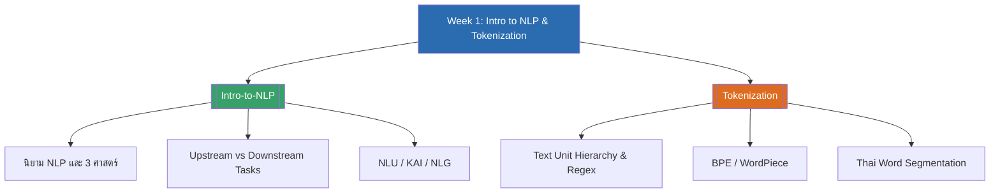

# Week 1 — Introduction to NLP & Tokenization (MOC)

## check_circle เช็คลิสต์ก่อนเข้าเรียน

- [ ] ทบทวนว่า NLP ประกอบด้วย 3 ศาสตร์อะไรบ้าง และทำไม NLP ถึงเป็นเรื่องยาก — ดู [[Intro-to-NLP]]
- [ ] เข้าใจความแตกต่างระหว่าง upstream tasks และ downstream tasks — ดู [[Intro-to-NLP]]
- [ ] ลองแยกความแตกต่างระหว่าง word-based tokenization, BPE และ WordPiece — ดู [[Tokenization]]
- [ ] ทำความเข้าใจว่าทำไมภาษาไทยถึงตัดคำยากกว่าภาษาอังกฤษ — ดู [[Tokenization]]

## assignment ภาพรวมสัปดาห์ 1 (สรุปย่อ)

สัปดาห์แรกของวิชาปูพื้นฐานสองเรื่องใหญ่: (1) ภาพรวมของ NLP — นิยาม ที่มาจาก 3 ศาสตร์ (linguistics, computer science, AI), ความท้าทายหลัก 5 ข้อ (abstractness, combinability, evolutiveness, nonstandardness, subjectivity), ประวัติศาสตร์ตั้งแต่ rule-based จนถึง LLM, แนวคิด pipeline แบบ upstream/downstream tasks, องค์ประกอบ NLU/KAI/NLG, การประยุกต์ใช้งานจริง และเครื่องมือยอดนิยม (NLTK, spaCy, PyThaiNLP) และ (2) Tokenization — การแบ่งข้อความออกเป็นหน่วยย่อยตั้งแต่ระดับคำ/มอร์ฟีม/ยูนิโค้ด ไปจนถึง subword tokenization (BPE, WordPiece), regex พื้นฐาน, ขั้นตอน normalization, ปัญหาการตัดคำภาษาไทยที่ไม่มีช่องว่าง และแนะนำ word embedding เป็นสะพานเชื่อมไปสู่หัวข้อถัดไปของวิชา

## map แผนที่หัวข้อสัปดาห์ 1

## collections_bookmark โน้ตรายหัวข้อ

| หัวข้อ | เนื้อหาหลัก | หน้าสไลด์ |
| --- | --- | --- |
| [[Intro-to-NLP]] | นิยาม NLP, ความท้าทาย, ประวัติศาสตร์, NLU/KAI/NLG, pipeline, แอปพลิเคชัน, เครื่องมือ | 1-8 |
| [[Tokenization]] | ลำดับหน่วยข้อความ, regex, BPE, WordPiece, Laplace smoothing, การตัดคำไทย, word embedding เบื้องต้น | 1-8 |

> [!tip] แอบดูสัปดาห์หน้า
> สัปดาห์ 2 จะต่อยอดจาก word segmentation ในสัปดาห์นี้ไปสู่การกำกับชนิดคำ (POS tagging) และ sequence labeling — เตรียมทบทวนแนวคิดความน่าจะเป็นแบบมีเงื่อนไข (conditional probability) มาก่อน จะช่วยให้เข้าใจ Hidden Markov Model ได้เร็วขึ้น

arrow_forward สัปดาห์ถัดไป: [[Week2-MOC|MOC สัปดาห์ 2]]
