# Week 1 — Introduction to NLP & Tokenization (MOC)

menu_book เอกสารปฐมนิเทศและภาพรวมรายวิชา: [[Course-Overview|ประมวลรายวิชา เกณฑ์คะแนน และโครงงาน (Course Overview)]]

## check_circle เช็คลิสต์ก่อนเข้าเรียน

- [ ] อ่านข้อกำหนดวิชา เกณฑ์การตัดเกรด การเข้าเรียน และข้อกำหนด Mini-Project — ดู [[Course-Overview]]
- [ ] ทบทวนว่า NLP ประกอบด้วย 3 ศาสตร์อะไรบ้าง และประวัติศาสตร์ 6 Stages ตั้งแต่ Rule-based สู่ ยุค Modern LLM — ดู [[Intro-to-NLP]]
- [ ] ทำความเข้าใจ 5 ความท้าทายหลักของ NLP พร้อมตัวอย่างกรณีศึกษาภาษาไทย ("สวยกี่โมง", "กับข้าว", "จะรั่ว") — ดู [[Intro-to-NLP]]
- [ ] เข้าใจความแตกต่างระหว่าง Upstream Tasks และ Downstream Tasks และสถาปัตยกรรม NLU / KAI / NLG — ดู [[Intro-to-NLP]]
- [ ] เข้าใจขั้นตอน Text Normalization, การประยุกต์ใช้ Regex และ Penn Treebank Tokenization — ดู [[Tokenization]]
- [ ] ฝึกคำนวณการเทรน BPE ทีละขั้นตอนจากคลังคำตัวอย่าง และเข้าใจข้อดีของ Byte-level BPE บน UTF-8 — ดู [[Tokenization]]
- [ ] เปรียบเทียบความแตกต่างระหว่าง BPE, WordPiece และ Unigram LM (SentencePiece) — ดู [[Tokenization]]
- [ ] ทำความเข้าใจว่าทำไมภาษาไทยถึงตัดคำยาก (No Whitespace Boundary) และการใช้ Longest Matching / PyThaiNLP — ดู [[Tokenization]]

## assignment ภาพรวมสัปดาห์ 1 (สรุปย่อ)

สัปดาห์แรกของวิชาปูพื้นฐานสำคัญ 2 ส่วนหลัก:
1. **ภาพรวมของ NLP (Introduction to NLP):** นิยามที่เกิดจากจุดตัดของ 3 ศาสตร์ (ภาษาศาสตร์, วิทยาการคอมพิวเตอร์, AI), วิวัฒนาการ 6 ยุคสมัย (Machine Translation, Early AI, Grammatical Logic, ML/Corpus, Deep Networks สู่ Transformer & Modern LLMs), ระดับชั้นของโครงสร้างทางภาษา 5 ระดับ, ความท้าทายหลัก 5 มิติพร้อมตัวอย่างภาษาไทย, สถาปัตยกรรม NLU/KAI/NLG, งาน Upstream vs Downstream และเครื่องมือมาตรฐาน (NLTK, spaCy, PyThaiNLP, Hugging Face)
2. **การตัดคำและการปรับมาตรฐานข้อความ (Tokenization & Normalization):** ความสำคัญของ Tokenization (1 Token $\neq$ 1 Word), ข้อจำกัดของ Word-based และ Character-based, ไปป์ไลน์ Normalization 5 ขั้นตอน, Regex เบื้องต้น, การเจาะลึกอัลกอริทึม Subword (การฝึก BPE ทีละขั้น, BPE Encoding, Byte-Level BPE ไร้ OOV บน UTF-8) พร้อมตารางเปรียบเทียบ BPE vs WordPiece vs Unigram LM, ความท้าทายของการตัดคำภาษาไทย (Dictionary-based, FMM/BMM) และภาพรวม Word Embeddings

```mermaid
graph TD
    MOC[Week 1: Intro to NLP & Tokenization] --> S[[Course-Overview]]
    MOC --> A[[Intro-to-NLP]]
    MOC --> B[[Tokenization]]

    S --> S1[เกณฑ์คะแนนและตัดเกรด A-F]
    S --> S2[โครงงานกลุ่ม Mini-Project]
    S --> S3[กำหนดการ Drop และ Final Exam]

    A --> A1[นิยาม NLP และ 3 ศาสตร์]
    A --> A2[วิวัฒนาการ 6 Stages of NLP]
    A --> A3[5 ความท้าทายและกรณีศึกษาภาษาไทย]
    A --> A4[NLU / KAI / NLG]
    A --> A5[Upstream vs Downstream Pipeline]

    B --> B1[Normalization & Regex Cheat Sheet]
    B --> B2[BPE Step-by-Step Worked Example]
    B --> B3[Byte-Level BPE ใน Modern LLMs]
    B --> B4[BPE vs WordPiece vs Unigram LM]
    B --> B5[Thai Word Segmentation & PyThaiNLP]

    style MOC fill:#2b6cb0,color:#fff
    style S fill:#805ad5,color:#fff
    style A fill:#38a169,color:#fff
    style B fill:#dd6b20,color:#fff
```

## map แผนที่หัวข้อสัปดาห์ 1

## collections_bookmark โน้ตรายหัวข้อ

| หัวข้อ | เนื้อหาหลัก | แหล่งอ้างอิงต้นฉบับ |
| :--- | :--- | :---: |
| [[Course-Overview]] | ประมวลรายวิชา, CLOs, สัดส่วนคะแนน (Exam 40%, Mini-Project 40%), กฎการเช็คชื่อ, ตารางสอบ | `0_Intro_to_the_Class.pdf` |
| [[Intro-to-NLP]] | นิยาม NLP, 6 Stages วิวัฒนาการ, 5 ระดับภาษา, ความท้าทายเฉพาะภาษาไทย, NLU/KAI/NLG, Pipeline, เครื่องมือ | `1-1_Intro_to_NLP.pdf` |
| [[Tokenization]] | Normalization 5 ขั้น, Regex, คำนวณ BPE step-by-step, Byte-level BPE, ตารางเทียบ Subword, ตัดคำไทย | `1-2_Tokenization.pdf` |

> [!tip] แอบดูสัปดาห์หน้า
> สัปดาห์ 2 จะต่อยอดจาก Word Segmentation ในสัปดาห์นี้ไปสู่การกำกับชนิดคำ (POS Tagging) ด้วย Rule-based, HMM (Viterbi) และ Linear-chain CRF ตลอดจนการทำ Sequence Labeling สำหรับ Named Entity Recognition (NER) บนข้อความภาษาไทย

---

arrow_forward สัปดาห์ถัดไป: [[Week2-MOC|MOC สัปดาห์ 2]]
