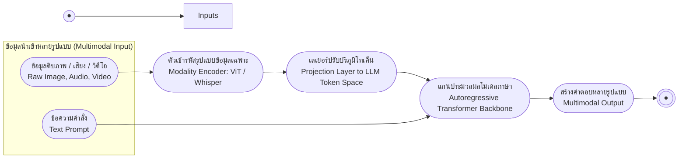

# โมเดลภาษาข้ามโมดัล (Multimodal LLMs)

arrow_back กลับไปที่ [[Week10-MOC|MOC สัปดาห์ 10]]

## key Keyword

- **Multimodal LLM (MLLM)** — โมเดลภาษาที่ประมวลผลและ/หรือสร้างข้อมูลได้มากกว่าข้อความ เช่น ภาพ เสียง วิดีโอ
- **Modality** — ประเภทข้อมูลหรือช่องทางรับรู้หนึ่ง ๆ (text, image, audio, video, code)
- **Modality Encoder** — เครือข่ายเฉพาะทางที่แปลงข้อมูลดิบแต่ละโมดัล (เช่น ViT สำหรับภาพ) ให้เป็น feature vector
- **Projection Layer** — เลเยอร์เชื่อมที่แปลง output ของ encoder ให้อยู่ใน embedding space เดียวกับ text token
- **Shared Conceptual Space** — พื้นที่ vector ร่วมที่ทุกโมดัลถูก map เข้าไป ทำให้เปรียบเทียบข้ามโมดัลได้โดยตรง

## menu_book Theory (เข้าใจง่าย)

### จาก Text-Only สู่ Multimodal LLM

LLM แบบดั้งเดิมอ่านและเขียนข้อความได้ดีมาก แต่ "มองไม่เห็นและไม่ได้ยิน" โลกทางกายภาพส่วนที่เหลือเลย — ทุก input/output ต้องถูกบีบให้อยู่ในรูปคำพูดเท่านั้น (text in → text out) **Multimodal LLM (MLLM)** ทลายข้อจำกัดนี้ โดยประมวลผล เชื่อมโยง และมักจะสร้าง output ข้ามหลายโมดัลพร้อมกัน (text, image, audio, video, code) คำว่า **modality** ในที่นี้หมายถึงประเภทข้อมูลหรือช่องทางรับรู้หนึ่ง ๆ

### Shared Conceptual Space

แทนที่จะประมวลผลแต่ละโมดัลแยกกัน MLLM จะ map ข้อมูลทุกประเภทเข้าสู่ **พื้นที่ concept ร่วม (shared conceptual space)** เดียวกัน เช่น รูปภาพสุนัขกับคำว่า "dog" จะอยู่ใกล้กันในพื้นที่นี้ การให้ทุกโมดัลตกอยู่ใน numerical space เดียวกันทำให้โมเดล "เปรียบเทียบ" สิ่งที่เห็น ได้ยิน และอ่านได้โดยตรง แทนที่จะต้อง reasoning แยกทีละโมดัล

> [!note] อ้างอิงงานวิจัย
> แนวคิด shared embedding space ระหว่างภาพและข้อความถูกพิสูจน์ให้เห็นผลชัดเจนครั้งแรกใน **CLIP** (Radford et al., 2021, "Learning Transferable Visual Models From Natural Language Supervision") ที่เทรน image encoder และ text encoder ให้ embedding ของคู่ภาพ-คำบรรยายที่ตรงกันอยู่ใกล้กัน

### สถาปัตยกรรม 3 ส่วนหลัก

เนื่องจากไม่สามารถป้อน raw pixel หรือ waveform เข้า text Transformer ได้โดยตรง MLLM จึงประกอบด้วย 3 ส่วนหลัก:

1. **Modality Encoders** — เครือข่ายเฉพาะทางต่อโมดัล เช่น **Vision Transformer (ViT)** ตัดภาพเป็น patch แล้วประมวลผล, audio encoder แปลง waveform/spectrogram เป็นลำดับ feature vector, และ video ใช้ vision encoder แบบ sample เฟรม หน้าที่ของ encoder คือ "เข้าใจโครงสร้างของสัญญาณดิบ" เท่านั้น ยังไม่พูดภาษาเดียวกับ LLM
2. **Projection Layer (สะพานเชื่อม)** — เครือข่าย alignment ขนาดเล็ก (มักเป็น linear layer หรือ perceiver resampler) ที่แปลง output ของ encoder ให้มีมิติและ mathematical space ตรงกับ text token embedding พอดี ถ้าไม่มีขั้นนี้ LLM จะ "อ่าน" สิ่งที่ encoder ผลิตออกมาไม่ได้เลย
3. **Core LLM** — Transformer backbone แบบ autoregressive ตัวเดียวกับที่ใช้กับข้อความล้วน เพราะ projection layer แปลงภาพ/เสียงให้กลายเป็น "คำภาพ/คำเสียง" (visual/auditory word) ไปแล้ว LLM จึงประมวลผล token ผสมนี้ต่อเนื่องกับข้อความปกติได้โดยไม่ต้องแก้โครงสร้างภายใน backbone เลย

> [!tip] เคล็ดลับจำ
> ท่องเป็นสามคำ: **Encode → Project → Reason** — เข้ารหัสสัญญาณดิบ, แปลงให้เข้า token space, แล้วให้ Transformer backbone เดิมคิดต่อ

### ความสามารถของ MLLM

- **การตีความภาพซับซ้อน** — วิเคราะห์กราฟข้อมูลหนาแน่น, อ่านแบบพิมพ์เขียว/technical drawing, ดีบัค code จากภาพหน้าจอ, อธิบายกลไกของ diagram ระบบทีละขั้นตอน
- **Video และ Audio Reasoning** — ไล่ดูวิดีโอบรรยายยาวเพื่อหานาทีที่พูดถึงหัวข้อหนึ่ง ๆ, ฟังน้ำเสียงเพื่อประเมินอารมณ์, ให้เหตุผลกับเหตุการณ์ที่ต่อเนื่องข้ามเวลา ไม่ใช่แค่เฟรมเดียว
- **Cross-Modality Generation** — รับ prompt แบบผสม (เช่น ภาพวัตถุดิบ + คำสั่งข้อความ "ทำสูตรอาหารจากนี้ พร้อมสร้างภาพจานเสร็จ") แล้วสร้าง output ทั้งข้อความและภาพพร้อมกัน อาศัย shared conceptual space เดียวกับตอน "เข้าใจ" มาใช้ตอน "สร้าง" ด้วย

> [!example] ตัวอย่างโมเดลบน Hugging Face
> **CLIP** มี checkpoint ให้ลองใช้จริงที่ `openai/clip-vit-base-patch32` ส่วนโมเดลที่ทำตามสถาปัตยกรรม encoder → projection → LLM ตามที่อธิบายไว้ในสไลด์ ตัวอย่างที่ใช้กันแพร่หลายคือ **LLaVA** (Liu et al., 2023, "Visual Instruction Tuning") ซึ่งมีให้ใช้งานที่ `llava-hf/llava-1.5-7b-hf` โมเดล proprietary ที่มีความสามารถใกล้เคียงกันคือ GPT-4V/GPT-4o และงานวิจัยสำคัญอีกชิ้นที่ขยายแนวคิดนี้ไปถึง few-shot ข้ามโมดัลคือ **Flamingo** (Alayrac et al., 2022)

## schema Diagram

**ตัวอย่าง:** pipeline นี้ตรงกับสไลด์ 10-1.2 "Putting It Together: The Full Pipeline" (หน้า 8) ซึ่งสรุปการไหลจาก raw input จนถึง output ของ MLLM

---
arrow_forward กลับไปที่ [[Week10-MOC|MOC สัปดาห์ 10]]
