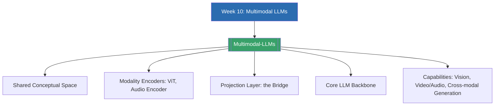

# Week 10 — Beyond Text: Multimodal LLMs (MOC)

⬅️ สัปดาห์ก่อนหน้า: [[Week9-MOC|MOC สัปดาห์ 9]]

## ✅ เช็คลิสต์ก่อนเข้าเรียน

- [ ] ทบทวนว่า embedding space และ similarity ทำงานอย่างไร (จาก Week 4 และ Week 9) — ดู [[Multimodal-LLMs]]
- [ ] ทบทวนโครงสร้าง Transformer backbone แบบ autoregressive จาก Week 7-8 — ดู [[Multimodal-LLMs]]
- [ ] ลองนึกภาพว่าจะแปลง "รูปภาพ" ให้กลายเป็น "token" ที่ LLM อ่านได้อย่างไร ก่อนเข้าเรียน — ดู [[Multimodal-LLMs]]

## 📋 ภาพรวมสัปดาห์ 10 (สรุปย่อ)

สัปดาห์สุดท้ายของคอร์สนี้ขยายขอบเขตจาก NLP แบบข้อความล้วนไปสู่ **Multimodal LLM (MLLM)** ที่ประมวลผลและสร้างข้อมูลข้ามหลายโมดัล (text, image, audio, video) เนื้อหาเริ่มจากแนวคิด shared conceptual space ที่ map ทุกโมดัลเข้าสู่ numerical space เดียวกัน ตามด้วยสถาปัตยกรรมหลัก 3 ส่วนคือ modality encoders, projection layer (สะพานเชื่อมสำคัญที่สุด), และ core LLM backbone ปิดท้ายด้วยความสามารถจริงของ MLLM ทั้งการตีความภาพซับซ้อน (กราฟ, blueprint, code screenshot), การให้เหตุผลข้ามวิดีโอ/เสียง, และการสร้าง output แบบข้ามโมดัล (cross-modal generation)

## 🗺️ แผนที่หัวข้อสัปดาห์ 10

## 📚 โน้ตรายหัวข้อ

| หัวข้อ | เนื้อหาหลัก | หน้าสไลด์ |
| --- | --- | --- |
| [[Multimodal-LLMs]] | Shared conceptual space, สถาปัตยกรรม 3 ส่วน (encoder → projection → core LLM), และความสามารถของ MLLM | หน้า 1-12 (10-1.1 ถึง 10-1.4) |

> [!tip] ปิดท้ายคอร์ส
> นี่คือสัปดาห์สุดท้ายของเนื้อหาที่จัดทำไว้ในคอร์สนี้ ลองย้อนกลับไปเชื่อมโยงว่า pipeline ของ MLLM (encoder → projection → LLM) มีจุดร่วมกับ pipeline ของ RAG (retriever → augment → generator) ในสัปดาห์ที่แล้วอย่างไร — ทั้งสองคือการ "แปลงข้อมูลภายนอกให้อยู่ในรูปที่ core Transformer เข้าใจ" เหมือนกัน
