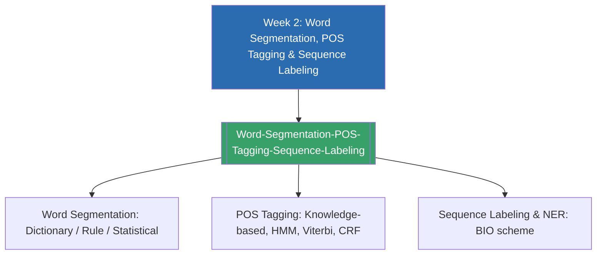

# Week 2 — Word Segmentation, POS Tagging & Sequence Labeling (MOC)

arrow_back สัปดาห์ก่อนหน้า: [[Week1-MOC|MOC สัปดาห์ 1]]

## check_circle เช็คลิสต์ก่อนเข้าเรียน

- [ ] ทบทวนวิธี tokenization และการตัดคำภาษาไทยจาก Week 1 เพราะ word segmentation คือก้าวถัดไป — ดู [[Word-Segmentation-POS-Tagging-Sequence-Labeling]]
- [ ] ทบทวนแนวคิด conditional probability พื้นฐาน ก่อนเรียน Hidden Markov Model
- [ ] เข้าใจว่าทำไมคำอย่าง "flies" ถึงกำกวมทาง POS ได้ — ดู [[Word-Segmentation-POS-Tagging-Sequence-Labeling]]
- [ ] ลองนึกภาพว่า BIO scheme กำกับ entity ในประโยคหนึ่งอย่างไร

## assignment ภาพรวมสัปดาห์ 2 (สรุปย่อ)

สัปดาห์นี้ต่อยอดจากการตัดคำในสัปดาห์ 1 ไปสู่การวิเคราะห์โครงสร้างไวยากรณ์ระดับคำ แบ่งเป็น 3 ส่วน: (1) **Word Segmentation** — ทบทวนแนวทาง dictionary-based, rule-based และ statistical/ML-based สำหรับภาษาที่ไม่มีช่องว่างระหว่างคำ (2) **POS Tagging** — ตั้งแต่วิธีใช้ความรู้ภาษาศาสตร์ (knowledge-based) ไปจนถึงวิธีเชิงสถิติอย่าง Hidden Markov Model (HMM), Viterbi decoding และ Conditional Random Field (CRF) และ (3) **Sequence Labeling** — กรอบคิดทั่วไปที่ครอบคลุมทั้ง POS tagging และ Named Entity Recognition (NER) ผ่าน BIO tagging scheme ทั้งสามหัวข้อนี้ใช้กลไกทางคณิตศาสตร์ร่วมกัน (HMM/CRF/Viterbi) จึงถูกจัดรวมไว้ในโน้ตเดียวกัน

## map แผนที่หัวข้อสัปดาห์ 2

## collections_bookmark โน้ตรายหัวข้อ

| หัวข้อ | เนื้อหาหลัก | หน้าสไลด์ |
| --- | --- | --- |
| [[Word-Segmentation-POS-Tagging-Sequence-Labeling]] | Word segmentation, POS tagging (knowledge-based, HMM, Viterbi, CRF), sequence labeling & NER (BIO scheme) | 1-10 |

> [!tip] จุดที่มักสับสน
> HMM, Viterbi และ CRF ไม่ใช่สามเรื่องแยกกัน — **HMM คือโมเดลความน่าจะเป็น**, **Viterbi คืออัลกอริทึมที่ใช้หาคำตอบจากโมเดลนั้น** และ **CRF คือโมเดลทางเลือกที่แก้ข้อจำกัดของ HMM** ทั้งสามอย่างล้วนถูกใช้แก้ปัญหาเดียวกันคือ sequence labeling

arrow_forward สัปดาห์ถัดไป: [[Week3-MOC|MOC สัปดาห์ 3]]
