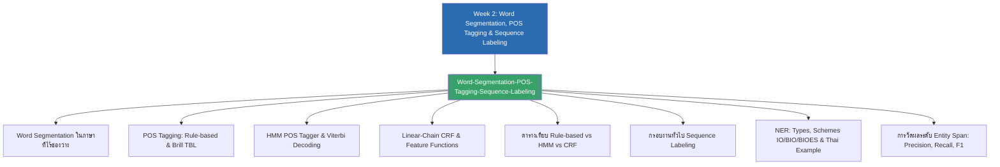

# Week 2 — Word Segmentation, POS Tagging & Sequence Labeling (MOC)

arrow_back สัปดาห์ก่อนหน้า: [[Week1-MOC|MOC สัปดาห์ 1]]

## check_circle เช็คลิสต์ก่อนเข้าเรียน

- [ ] ทบทวนความแตกต่างระหว่างการตัดคำภาษาอังกฤษและภาษาไทย (ปัญหา No Whitespace และความกำกวมของขอบเขตคำ) — ดู [[Word-Segmentation-POS-Tagging-Sequence-Labeling]]
- [ ] เข้าใจแนวคิด POS Tagging และปัญหาความกำกวมทางชนิดคำ เช่น คำว่า *"flies"* (Noun vs Verb) — ดู [[Word-Segmentation-POS-Tagging-Sequence-Labeling]]
- [ ] ทำความเข้าใจวิธี Knowledge-based และอัลกอริทึมการเรียนรู้กฎ Brill Transformation-Based Learning (TBL) — ดู [[Word-Segmentation-POS-Tagging-Sequence-Labeling]]
- [ ] เข้าใจสถาปัตยกรรม Hidden Markov Model (HMM: Hidden States, Observations, Transition, Emission) — ดู [[Word-Segmentation-POS-Tagging-Sequence-Labeling]]
- [ ] ทบทวน 4 ขั้นตอนของ Viterbi Decoding Algorithm (Initialization $\to$ Recursion $\to$ Termination $\to$ Backtrace) — ดู [[Word-Segmentation-POS-Tagging-Sequence-Labeling]]
- [ ] เปรียบเทียบความแตกต่างระหว่าง HMM (Generative) กับ Linear-Chain CRF (Discriminative) และการใช้ Overlapping Features / Word Shape — ดู [[Word-Segmentation-POS-Tagging-Sequence-Labeling]]
- [ ] เข้าใจกรอบคิดภาพรวมของงาน Sequence Labeling ที่ครอบคลุมทั้ง POS, NER, Word Segmentation และ Chunking — ดู [[Word-Segmentation-POS-Tagging-Sequence-Labeling]]
- [ ] จำแนกประเภท Entity สากล (PER, ORG, LOC, GPE) และแยกแยะ Tagging Schemes (IO, BIO, BIOES) — ดู [[Word-Segmentation-POS-Tagging-Sequence-Labeling]]
- [ ] เข้าใจขั้นตอนการทำ NER บนภาษาไทย (ต้องตัดคำก่อนเสมอ และคำนำหน้านาม เช่น "นาย" ติดป้ายเป็น O) — ดู [[Word-Segmentation-POS-Tagging-Sequence-Labeling]]
- [ ] เข้าใจสูตรการวัดประสิทธิภาพ NER ระดับ Span-level (Precision, Recall, F1-score) — ดู [[Word-Segmentation-POS-Tagging-Sequence-Labeling]]

## assignment ภาพรวมสัปดาห์ 2 (สรุปย่อ)

สัปดาห์ที่ 2 ต่อเนื่องจากการตัดคำพื้นฐานไปสู่การวิเคราะห์โครงสร้างภาษาและการสกัดข้อมูลสำคัญระดับคำ แบ่งเป็น 3 แกนหลัก:
1. **การตัดคำ (Word Segmentation):** ทบทวนความท้าทายในภาษาที่ไร้ช่องว่าง (ไทย จีน ญี่ปุ่น), ปัญหา Boundary Ambiguity ("ตากลม", "ไปหามเหสี") และเปรียบเทียบแนวทาง Dictionary-based (FMM/BMM), Rule-based และ ML-based
2. **การกำกับชนิดของคำ (POS Tagging):** ศึกษาตั้งแต่ Rule-based และ Brill TBL ไปจนถึงโมเดลทางสถิติระดับคลาสสิกอย่าง Hidden Markov Model (HMM) พร้อมการถอดรหัสแบบ Dynamic Programming ด้วย Viterbi Algorithm และก้าวข้ามข้อจำกัดของ HMM ด้วย Linear-Chain Conditional Random Fields (CRF) ที่รองรับการสกัด Feature Functions อิสระและ Word Shape (`X.X.X.`, `XXdd-dd`) สำหรับแก้ปัญหาคำนอกคลังคำศัพท์ (Unknown Words)
3. **การประมวลผลลำดับและการรู้จำชื่อเฉพาะ (Sequence Labeling & NER):** กำหนดกรอบแนวคิดทั่วไปที่แมปลำดับอินพุต $X$ ไปยังป้ายกำกับ $Y$ ที่ความยาวเท่ากัน นำไปประยุกต์กับ Named Entity Recognition (NER) เพื่อสกัดเอนทิตี PER, ORG, LOC, GPE ผ่าน Tagging Schemes (IO, BIO, BIOES) พร้อมตัวอย่างจริงบนประโยคภาษาไทย และการวัดผลแบบ Entity-Span Level F1-Score

## map แผนที่หัวข้อสัปดาห์ 2

## collections_bookmark โน้ตรายหัวข้อ

| หัวข้อ | เนื้อหาหลัก | แหล่งอ้างอิงต้นฉบับ |
| :--- | :--- | :---: |
| [[Word-Segmentation-POS-Tagging-Sequence-Labeling]] | การตัดคำภาษาไทย, POS Ambiguity, Brill TBL, HMM, Viterbi Trellis, CRF Feature Functions, Word Shape, Sequence Labeling Tasks, NER (IO/BIO/BIOES), Thai NER Example, Span-level F1 Evaluation | `2-1_Word_Segmentation_POS_Tagging_Sequence_Labeling.pdf` |

> [!tip] เคล็ดลับช่วยจำ HMM vs Viterbi vs CRF
> **HMM คือ "โมเดลเชิงกำเนิด"** ที่กำหนดความน่าจะเป็นของภาษา, **Viterbi คือ "อัลกอริทึม"** ที่ค้นหาลำดับป้ายกำกับที่ดีที่สุดจากโมเดลนั้น และ **CRF คือ "โมเดลเชิงจำแนก"** ที่เปิดให้เราใส่ฟีเจอร์คำแวดล้อมได้อย่างอิสระโดยไม่ติดกรอบสมมติฐานทางสถิติที่เข้มงวด ทั้งสามส่วนเป็นหัวใจสำคัญของงาน Sequence Modeling ก่อนก้าวสู่ยุค Deep Learning

---

arrow_forward สัปดาห์ถัดไป: [[Week3-MOC|MOC สัปดาห์ 3]]
