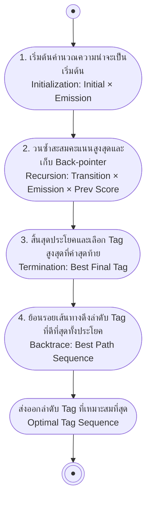

# การตัดคำ, การกำกับชนิดคำ และ Sequence Labeling (Word Segmentation, POS Tagging & Sequence Labeling)

<span class="material-symbols-outlined">arrow_back</span> กลับไปที่ [[Week2-MOC|MOC สัปดาห์ 2]]

## <span class="material-symbols-outlined">key</span> Keyword

- **Word Segmentation** — การแบ่งข้อความต่อเนื่องออกเป็นหน่วยคำ จำเป็นมากสำหรับภาษาที่ไม่มีช่องว่างระหว่างคำ
- **POS Tagging (Part-of-Speech Tagging)** — การกำกับหมวดหมู่ไวยากรณ์ให้แต่ละคำในประโยค เช่น NOUN, VERB
- **Hidden Markov Model (HMM)** — โมเดล generative ที่หาลำดับ tag ที่น่าจะเป็นที่สุดจาก transition และ emission probability
- **Conditional Random Field (CRF)** — โมเดล discriminative ที่ให้คะแนนทั้งลำดับ tag โดยใช้ feature ที่ซับซ้อนและ overlap กันได้
- **BIO Tagging Scheme** — รูปแบบการกำกับ label ระดับ token สำหรับงาน sequence labeling เช่น NER (B- เริ่ม, I- ต่อเนื่อง, O- ไม่ใช่ entity)

## <span class="material-symbols-outlined">menu_book</span> Theory (เข้าใจง่าย)

### 1. Word Segmentation (การตัดคำ)

การตัดคำ คือการแบ่งกระแสตัวอักษรออกเป็นคำแต่ละคำ — เป็นขั้นตอนแรกของ pipeline NLP เกือบทุกงาน ในภาษาอังกฤษ ช่องว่างช่วยบอกขอบเขตคำอยู่แล้ว แต่ภาษาอย่างไทย จีน และญี่ปุ่นเขียนติดกันโดยไม่มีช่องว่าง ต้องอนุมานขอบเขตเอง เช่น

`ผมชอบเรียนภาษา` → `ผม | ชอบ | เรียน | ภาษา`

แนวทางหลักในการตัดคำมี 3 กลุ่ม:

- **Dictionary-based Matching** — จับคู่คำที่ยาวที่สุด/สั้นที่สุดกับพจนานุกรม (เช่น maximum matching ที่เรียนไปแล้วใน [[Tokenization]] สัปดาห์ 1)
- **Rule-based Heuristics** — ใช้กฎภาษาศาสตร์ที่มนุษย์เขียนขึ้นเพื่อแก้ความกำกวมของขอบเขตคำ
- **Statistical / ML-based** — ใช้ classifier ระดับตัวอักษรหรือ sequence model (เช่น CRF) ทำนายตำแหน่งขอบเขตคำ

> [!note] เครื่องมือจริงสำหรับภาษาไทย
> `PyThaiNLP` เป็น toolkit โอเพนซอร์สที่ implement ทั้งวิธี dictionary-based (`newmm`) และวิธี ML-based สำหรับตัดคำภาษาไทยไว้พร้อมใช้งาน เป็นตัวอย่างที่ดีว่าการตัดคำในภาษาที่ไม่มีช่องว่างต้องพึ่งทั้งพจนานุกรมและสถิติควบคู่กัน

### 2. Part-of-Speech (POS) Tagging

**POS (Part of Speech)** คือหมวดหมู่ไวยากรณ์ที่กำกับให้คำตามบทบาทในประโยค เช่น noun, verb, adjective, adverb, pronoun, preposition, conjunction

```
Time    flies    like    an    arrow
NOUN    VERB     ADP     DET   NOUN
```

ความท้าทายหลักคือ **ความกำกวม (ambiguity)** — คำว่า "flies" อาจเป็น NOUN (แมลงวัน) หรือ VERB (บิน) ก็ได้ ขึ้นอยู่กับบริบท

**POS Tagging แบบใช้ความรู้ (Knowledge-based):** กำหนด tag จากความรู้ทางภาษาศาสตร์ที่เขียนไว้ล่วงหน้า แทนที่จะเรียนรู้จากความน่าจะเป็น ได้แก่

- ค้นจากพจนานุกรม/lexicon ว่าคำนั้นเป็นได้กี่ tag
- กฎแก้ความกำกวมที่เขียนด้วยมือ (เช่น คำหลัง "the" มักเป็น NOUN)
- เบาะแสทางสัณฐานวิทยา เช่น suffix "-ing", "-ed", "-ly"

#### แนวทางเชิงสถิติ (Statistical Approaches)

**Hidden Markov Model (HMM)** — โมเดล generative ที่มองว่า tag คือ **hidden state** ที่สังเกตไม่ได้โดยตรง ส่วนคำในประโยคคือ **observation** ที่สังเกตได้ กำหนด:

- **Transition probability** $P(tag_i \mid tag_{i-1})$ — โอกาสที่ tag หนึ่งจะตามหลัง tag ก่อนหน้า
- **Emission probability** $P(word_i \mid tag_i)$ — โอกาสที่ tag หนึ่งจะให้กำเนิดคำที่สังเกตเห็น

เป้าหมายคือหาลำดับ tag ที่ทำให้ความน่าจะเป็นร่วมสูงสุด:

$$\hat{t}_{1..n} = \arg\max_t \prod_i P(w_i \mid t_i) \cdot P(t_i \mid t_{i-1})$$

โดยตั้งสมมติฐานว่าแต่ละ tag ขึ้นกับ tag ก่อนหน้าเพียงตัวเดียว (Markov assumption) และแต่ละคำขึ้นกับ tag ของตัวเองเท่านั้น

**Viterbi Decoding** — การลองทุกลำดับ tag ที่เป็นไปได้จะเป็น exponential ดังนั้น Viterbi จึงใช้ dynamic programming หาลำดับที่ดีที่สุดในเวลาเชิงเส้น มี 4 ขั้นตอน: Initialization → Recursion → Termination → Backtrace (รายละเอียดดูใน <span class="material-symbols-outlined">schema</span> Diagram ด้านล่าง) ความซับซ้อนคือ $O(N \times T^2)$ สำหรับ N คำและ T tag — ถูกกว่าการค้นหาแบบ brute-force มาก

**Conditional Random Field (CRF)** — ต่างจาก HMM ตรงที่ CRF เป็นโมเดล **discriminative** ที่โมเดล $P(tags \mid words)$ โดยตรง แทนที่จะโมเดลว่าคำถูกสร้างขึ้นมาอย่างไร CRF ให้คะแนนทั้งลำดับ tag ด้วย weighted feature function แล้ว normalize แบบ global:

$$P(t \mid w) = \frac{1}{Z(w)} \exp\left(\sum_k \lambda_k f_k(t, w)\right)$$

ข้อดีของ CRF เหนือ HMM: ใช้ feature ได้อิสระและซ้อนทับกันได้ (word shape, prefix/suffix, ตัวพิมพ์ใหญ่, คำแวดล้อม) ไม่มีสมมติฐาน independence ระหว่าง observation แบบ HMM's emission model และถูกเทรนแบบ discriminative เพื่อ optimize ความแม่นยำของการ tag โดยตรง จึงมักได้ผลดีกว่า HMM ในทางปฏิบัติ

> [!important] อ้างอิงงานวิจัย
> CRF ถูกเสนอโดย Lafferty, McCallum & Pereira (2001) และกลายเป็นมาตรฐานของงาน sequence labeling มานาน ต่อมามีการรวม CRF เข้ากับ neural network เป็น **BiLSTM-CRF** (Huang, Xu & Yu, 2015, *"Bidirectional LSTM-CRF Models for Sequence Tagging"*) ซึ่งให้ BiLSTM เรียนรู้ feature อัตโนมัติ แล้วให้ CRF layer ทำหน้าที่ตัดสินใจลำดับ tag ที่สอดคล้องกันทั้งประโยค — เป็นสถาปัตยกรรมที่ครองมาตรฐานงาน NER/POS ก่อนยุค Transformer

### 3. Sequence Labeling & Named Entity Recognition (NER)

**Sequence Labeling** คืองานทั่วไปที่กำหนด label หนึ่งตัวให้ทุก token ในลำดับอินพุต โดย label แต่ละตัวขึ้นกับ token ข้างเคียงด้วย ไม่ใช่แค่ตัวมันเอง:

$$\text{input: } x_1, x_2, \dots, x_n \;\to\; \text{labels: } y_1, y_2, \dots, y_n$$

**POS tagging, chunking และ NER ล้วนเป็นตัวอย่างของ sequence labeling** — ใช้กลไกเดียวกันหมด ไม่ว่าจะเป็น HMM, CRF หรือ Viterbi decoding

**NER ในฐานะ Sequence Labeling** ใช้ **BIO scheme** กำกับประเภท entity ให้แต่ละ token: `B-` เริ่มต้น entity, `I-` ต่อเนื่อง entity เดิม, `O` ไม่ใช่ entity

| John | lives | in | New | York |
| --- | --- | --- | --- | --- |
| B-PER | O | O | B-LOC | I-LOC |

> [!example] โมเดลจริงบน Hugging Face
> โมเดล `dbmdz/bert-large-cased-finetuned-conll03-english` เป็นตัวอย่าง token classification model ที่ fine-tune BERT บน dataset CoNLL-2003 เพื่อทำ NER ด้วยรูปแบบ label แบบ BIO นี้โดยตรง สามารถเรียกใช้ผ่าน `transformers.pipeline("ner", model="dbmdz/bert-large-cased-finetuned-conll03-english")` ได้ทันที

> [!tip] เคล็ดลับ
> แยก HMM กับ CRF ไม่ออก ให้เทียบกับคู่ที่คุ้นเคยกว่า: **HMM เหมือน Naive Bayes** (generative, สมมติ feature เป็นอิสระต่อกัน) ส่วน **CRF เหมือน Logistic Regression** (discriminative, ใช้ feature ที่ซ้อนทับกันได้อย่างอิสระ) — ถ้าโจทย์พูดถึง feature ที่ซับซ้อนหลายตัวพร้อมกัน ให้นึกถึง CRF ก่อน

## <span class="material-symbols-outlined">schema</span> Diagram



**ตัวอย่าง:** ขั้นตอนนี้อ้างอิงจาก Viterbi Decoding บนสไลด์หน้า 7 ความซับซ้อนโดยรวมคือ $O(N \times T^2)$ ซึ่งเร็วกว่าการลองทุกลำดับ tag แบบ brute-force ที่เป็น exponential มาก

---
<span class="material-symbols-outlined">arrow_forward</span> กลับไปที่ [[Week2-MOC|MOC สัปดาห์ 2]]
