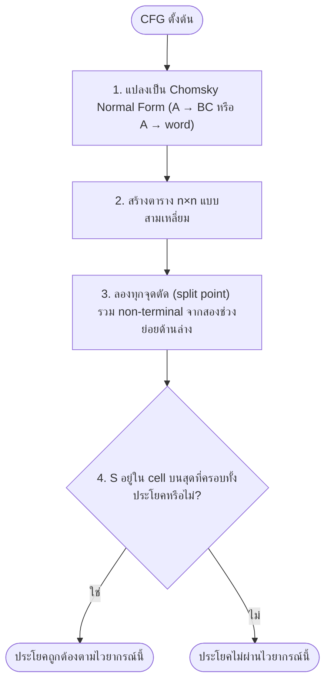

# วากยสัมพันธ์และการแจงส่วนประโยค (Syntax and Parsing)

⬅️ กลับไปที่ [[Week3-MOC|MOC สัปดาห์ 3]]

## 🔑 Keyword

- **Syntax Tree / Parse Tree** — โครงสร้างต้นไม้ที่แสดงความสัมพันธ์ทางไวยากรณ์ของคำในประโยค
- **Constituency Parsing** — การแจงประโยคเป็นวลีที่ซ้อนกัน (nested phrases) ตาม phrase-structure grammar
- **Dependency Parsing** — การแจงประโยคเป็นความสัมพันธ์แบบมีทิศทางระหว่างคำต่อคำโดยตรง
- **Context-Free Grammar (CFG)** — ชุดกฎการเขียนแทนสัญลักษณ์ที่ใช้นิยามโครงสร้างประโยค
- **CYK Algorithm** — อัลกอริทึม dynamic programming แบบ bottom-up ที่ตรวจสอบว่าประโยคถูกสร้างจาก CFG ได้หรือไม่

## 📖 Theory (เข้าใจง่าย)

### Syntax Tree คืออะไร

**Syntax tree (หรือ parse tree)** คือการแสดงโครงสร้างไวยากรณ์ของประโยคในรูปแบบต้นไม้ — แบ่งประโยคออกเป็นคำและวลี แล้วแสดงความสัมพันธ์เชิงลำดับชั้นตามกฎไวยากรณ์ที่กำหนดไว้ ให้นึกภาพว่ามันคือ "พิมพ์เขียว" ที่แสดงว่าประโยคถูกประกอบขึ้นมาอย่างไร และคำไหนขยายคำไหน

ประโยคเดียวกันสามารถแจงได้ 2 รูปแบบหลัก ขึ้นกับทฤษฎีภาษาศาสตร์หรือเครื่องมือที่ใช้:

- **Constituency Trees** — วลีที่ซ้อนกันตั้งแต่คำจนถึงประโยคทั้งหมด
- **Dependency Trees** — ความสัมพันธ์ทางไวยากรณ์แบบมีทิศทางระหว่างคำต่อคำ

> [!important] ตัวอย่างความกำกวมคลาสสิก
> ประโยค *"I saw the man with the telescope."* — ใครเป็นเจ้าของกล้องโทรทรรศน์? ผู้พูดใช้กล้องส่องดูผู้ชาย หรือผู้ชายถือกล้องอยู่? syntax tree บังคับให้ parser ต้องตัดสินใจแนบ "with the telescope" เข้ากับ "saw" หรือ "man" อย่างใดอย่างหนึ่งอย่างชัดเจน

### Constituency-based Parse Tree

Constituency tree แบ่งประโยคเป็นวลีที่ซ้อนกัน (constituents) โดยใช้ phrase-structure grammar หน่วยเล็ก (คำ) รวมกันเป็นวลีที่ใหญ่ขึ้น จนครบทั้งประโยค:

- **S** — Sentence รากของต้นไม้
- **NP** — Noun Phrase กลุ่มคำรอบคำนาม เช่น "The smart professor"
- **VP** — Verb Phrase การกระทำและกรรมของมัน เช่น "taught data science"
- **DT / JJ / NN / VB** — part of speech เป็น terminal node เหนือคำจริง

ตัวอย่าง — *"The smart professor taught data science."*

```
S
├── NP
│   ├── DT   "The"
│   ├── JJ   "smart"
│   └── NN   "professor"
└── VP
    ├── VB   "taught"
    └── NP
        ├── NN   "data"
        └── NN   "science"
```

### Dependency-based Parse Tree

Dependency tree ข้ามการจัดกลุ่มวลีแบบนามธรรม (NP, VP) และมุ่งไปที่ความสัมพันธ์แบบทวิภาคที่มีทิศทางระหว่างคำโดยตรง

- **Root** — มักเป็นกริยาหลักของประโยค เป็นจุดยึดโครงสร้าง
- **Edges/Arrows** — เชื่อมคำ governor ("head") ไปยัง dependent กำกับด้วยความสัมพันธ์ที่ชัดเจน (เช่น `nsubj`, `dobj`)

ตัวอย่างประโยคเดียวกัน — "taught" เป็น root, ลูกศรชี้จาก governor ไปยัง dependent พร้อม label ความสัมพันธ์:

| ความสัมพันธ์ | จาก → ไป |
| --- | --- |
| `nsubj` | taught → professor |
| `dobj` | taught → science |
| `det` | professor → The |
| `amod` | professor → smart |
| `compound` | science → data |

> [!note] อ้างอิงเครื่องมือและงานวิจัย
> เครื่องมือ NLP สมัยใหม่อย่าง spaCy นิยมใช้ dependency tree เพราะคำนวณได้เร็วและรองรับลำดับคำที่ยืดหยุ่นได้ดี งานวิจัยพื้นฐานของแนวทางนี้คือ **transition-based dependency parsing** (Nivre, 2003) และต่อมามีการนำ neural network มาแทนที่ feature แบบเดิมใน **neural dependency parsing** (Chen & Manning, 2014, *"A Fast and Accurate Dependency Parser using Neural Networks"*) มาตรฐานข้อมูลที่ใช้เทรน/ประเมินโมเดลเหล่านี้ทั่วโลกคือ **Universal Dependencies** (มี dataset `universal_dependencies` บน Hugging Face Hub) และเครื่องมือจริงที่ implement การ parse แบบนี้ได้คือ `stanfordnlp/stanza`

### เปรียบเทียบ Constituency vs Dependency

| | Constituency Trees | Dependency Trees |
| --- | --- | --- |
| **Structure** | วลีที่ซ้อนกัน (NP, VP, ...) | เชื่อมคำต่อคำโดยตรง |
| **Root** | Sentence (S) | กริยาหลัก (Main verb) |
| **จำนวน node** | คำ + phrase node | เท่ากับจำนวนคำพอดี 1 node ต่อคำ |
| **สื่อถึง** | การจัดกลุ่มระดับวลี | หน้าที่ทางไวยากรณ์ (ประธาน, กรรม, ...) |
| **เครื่องมือที่นิยม** | Stanford PCFG Parser | spaCy, Universal Dependencies |

### Context-Free Grammar (CFG)

**CFG** นิยามชุดกฎการเขียนแทน (rewrite rules) ว่าสัญลักษณ์หนึ่งถูกแทนที่ด้วยอะไรได้บ้าง แต่ละกฎขยาย non-terminal หนึ่งตัวเป็นลำดับสัญลักษณ์ โดยไม่ขึ้นกับบริบทรอบข้าง — ตรงกับสิ่งที่ constituency tree เข้ารหัสไว้พอดี กฎมีรูปแบบ:

$$A \rightarrow \beta \quad (\beta = \text{สัญลักษณ์ตั้งแต่ 1 ตัวขึ้นไป})$$

ตัวอย่างไวยากรณ์จากสไลด์:

```
S  → NP VP
NP → DT JJ NN | NN NN
VP → VB NP
DT → "the"
JJ → "smart"
NN → "professor" | "data" | "science"
VB → "taught"
```

การไล่ apply กฎเหล่านี้ซ้ำ ๆ แบบ recursive จะสร้าง parse tree ทั้งประโยคขึ้นมาได้ (ในทางปฏิบัติ มักขยาย CFG ให้เป็น **Probabilistic CFG (PCFG)** ที่แนบความน่าจะเป็นให้แต่ละกฎ เพื่อเลือก parse ที่เป็นไปได้มากที่สุดเมื่อประโยคกำกวม)

### The CYK Algorithm

**Cocke–Younger–Kasami (CYK/CKY) algorithm** เป็น bottom-up dynamic-programming parser ที่ตัดสินว่าประโยคหนึ่งสร้างได้จาก CFG หรือไม่ (และสร้างได้อย่างไร) โดยกำหนดให้ไวยากรณ์อยู่ใน **Chomsky Normal Form (CNF)** ก่อน (ทุกกฎต้องอยู่ในรูป $A \rightarrow BC$ หรือ $A \rightarrow \text{word}$)

ขั้นตอนหลัก 4 ขั้น (ดูรายละเอียดใน 🖼️ Diagram): แปลงไวยากรณ์เป็น CNF → สร้างตาราง n×n รูปสามเหลี่ยม → ลองทุกจุดตัดรวม non-terminal จากช่วงย่อย → ตรวจว่า start symbol S ปรากฏใน cell บนสุดที่ครอบทั้งประโยคหรือไม่ ความซับซ้อนของอัลกอริทึมคือ $O(n^3 \cdot |G|)$ สำหรับประโยคความยาว n และไวยากรณ์ G — มีประสิทธิภาพเพียงพอสำหรับงาน parsing จริง

### เหตุผลที่ Syntax Tree สำคัญ

- **Disambiguation** — ประโยคอย่าง "I saw the man with the telescope" ต้องอาศัย syntax tree บังคับให้ parser ตัดสินใจความหมายที่ชัดเจน
- **Feature Extraction** — ก่อนยุค deep learning syntax tree เป็นแหล่งสกัด feature เชิงโครงสร้างสำคัญสำหรับงานแปลภาษา สกัดสารสนเทศ และวิเคราะห์ sentiment
- **Grammar Checking** — เครื่องมืออย่าง Grammarly หรือ Microsoft Word ใช้ syntactic parsing ตรวจจับข้อผิดพลาดเชิงโครงสร้าง เช่น subject–verb agreement

> [!tip] เคล็ดลับ
> จำ constituency vs dependency ด้วยภาพ: constituency คือ **"กล่องซ้อนกล่อง"** (วลีอยู่ในวลี) ส่วน dependency คือ **"ลูกศรระหว่างคำ"** (ไม่มีวลีเป็นตัวกลาง) และถ้าอยากเช็คคำตอบเร็ว ๆ ว่า tree ที่วาดเป็น dependency tree ถูกไหม ให้นับ node: dependency tree ต้องมี node เท่ากับจำนวนคำพอดี ถ้ามากกว่านั้นแสดงว่าคุณกำลังวาด constituency tree อยู่

## 🖼️ Diagram



**ตัวอย่าง:** อ้างอิงจากสไลด์หน้า 8 (The CYK Algorithm) ความซับซ้อนของอัลกอริทึมคือ $O(n^3 \cdot |G|)$ — เร็วพอสำหรับ parsing ประโยคจริงเมื่อเทียบกับการลองทุกวิธีตีความแบบ exhaustive search

---
➡️ กลับไปที่ [[Week3-MOC|MOC สัปดาห์ 3]]
