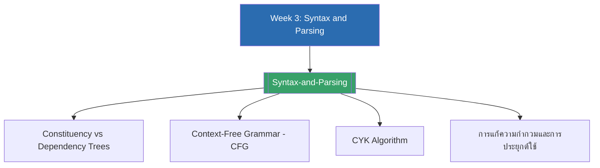

# Week 3 — Syntax and Parsing (MOC)

⬅️ สัปดาห์ก่อนหน้า: [[Week2-MOC|MOC สัปดาห์ 2]]

## ✅ เช็คลิสต์ก่อนเข้าเรียน

- [ ] ทบทวนความแตกต่างระหว่าง constituency tree กับ dependency tree — ดู [[Syntax-and-Parsing]]
- [ ] ทบทวนกฎการเขียน Context-Free Grammar (CFG) พื้นฐาน — ดู [[Syntax-and-Parsing]]
- [ ] ลองนึกภาพความกำกวมของประโยค "I saw the man with the telescope"
- [ ] ทบทวนหลักการ dynamic programming เบื้องต้น ก่อนเรียน CYK algorithm

## 📋 ภาพรวมสัปดาห์ 3 (สรุปย่อ)

สัปดาห์นี้ว่าด้วยการวิเคราะห์โครงสร้างไวยากรณ์ของประโยค (syntax/parsing) เนื้อหาแบ่งเป็น 3 ส่วน: (1) **Syntax Trees** — สองรูปแบบหลักคือ constituency tree (วลีซ้อนกันแบบ S/NP/VP) และ dependency tree (ความสัมพันธ์ทิศทางระหว่างคำ) พร้อมเปรียบเทียบจุดเด่นจุดด้อย (2) **Algorithms** — Context-Free Grammar (CFG) ที่ใช้นิยามโครงสร้างประโยคอย่างเป็นทางการ และ CYK (Cocke–Younger–Kasami) algorithm ที่ใช้ dynamic programming ตรวจสอบและ parse ประโยคตาม CFG ในเวลา $O(n^3)$ และ (3) **ทำไมเรื่องนี้สำคัญ** — syntax tree ช่วยแก้ความกำกวมของประโยค สกัด feature เชิงโครงสร้าง และเป็นพื้นฐานของเครื่องมือตรวจไวยากรณ์

## 🗺️ แผนที่หัวข้อสัปดาห์ 3

## 📚 โน้ตรายหัวข้อ

| หัวข้อ | เนื้อหาหลัก | หน้าสไลด์ |
| --- | --- | --- |
| [[Syntax-and-Parsing]] | Constituency vs dependency trees, CFG, CYK algorithm, การแก้ความกำกวม | 1-10 |

> [!tip] จุดที่มักสับสน
> อย่าสับสนระหว่าง CFG กับ CYK: **CFG คือชุดกฎที่นิยามไวยากรณ์** ส่วน **CYK คืออัลกอริทึมที่ใช้ตรวจ/parse ประโยคตามกฎ CFG นั้น** — ต้องแปลง CFG เป็น Chomsky Normal Form ก่อนเสมอ ถึงจะรัน CYK ได้

➡️ สัปดาห์ถัดไป: [[Week4-MOC|MOC สัปดาห์ 4]]
