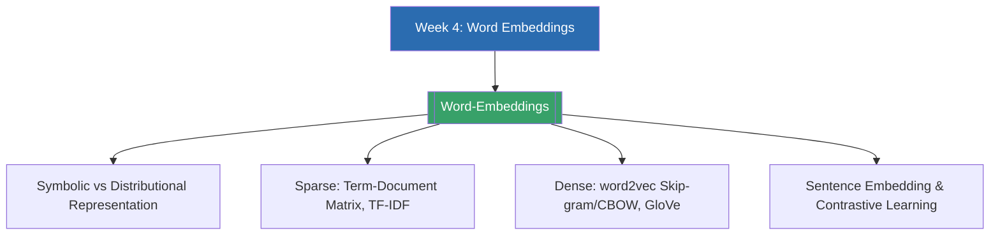

# Week 4 — Word Embeddings (MOC)

⬅️ สัปดาห์ก่อนหน้า: [[Week3-MOC|MOC สัปดาห์ 3]]

## ✅ เช็คลิสต์ก่อนเข้าเรียน

- [ ] ทบทวนความแตกต่างระหว่าง one-hot vector (symbolic) กับ dense vector — ดู [[Word-Embeddings]]
- [ ] ทบทวนวิธีวัดความคล้ายของเวกเตอร์ด้วย cosine similarity — ดู [[Word-Embeddings]]
- [ ] ลองนึกตัวอย่างคำที่ความหมายใกล้เคียงกัน (เช่น cat/kitten) เทียบกับคำที่ไม่เกี่ยวข้องกัน (เช่น cat/car)
- [ ] เตรียมคำถาม: ทำไม word2vec ถึงจับ analogy แบบ king − man + woman ≈ queen ได้

## 📋 ภาพรวมสัปดาห์ 4 (สรุปย่อ)

สัปดาห์นี้ต่อยอดจากการแทนคำแบบสัญลักษณ์ (symbolic representation) ไปสู่การแทนคำด้วยเวกเตอร์ (word embeddings) ซึ่งเป็นรากฐานสำคัญของ NLP สมัยใหม่ เริ่มจากแนวคิด distributional hypothesis ("You shall know a word by the company it keeps") ที่แบ่งการแทนคำออกเป็นสองสาย คือ sparse vector (term-document matrix, TF-IDF) ที่นับความถี่ตรง ๆ กับ dense vector ที่เรียนรู้จากข้อมูลขนาดใหญ่ด้วยโมเดลอย่าง word2vec (skip-gram, CBOW) และ GloVe จากนั้นขยายแนวคิดจากระดับคำไปสู่ระดับประโยค/เอกสาร (sentence embedding) และปิดท้ายด้วยแนวทางการฝึก embedding สมัยใหม่ด้วย contrastive learning (เช่น MUSE, SimCSE, BGE, CLIP) ซึ่งเป็นสะพานเชื่อมไปสู่โมเดลภาษาและ transformer ในสัปดาห์ถัด ๆ ไป

## 🗺️ แผนที่หัวข้อสัปดาห์ 4

## 📚 โน้ตรายหัวข้อ

| หัวข้อ | เนื้อหาหลัก | หน้าสไลด์ |
| --- | --- | --- |
| [[Word-Embeddings]] | Symbolic vs distributional representation, sparse vs dense vectors, word2vec (skip-gram/CBOW), GloVe, pretrained vectors, sentence embedding, contrastive learning (MUSE, SimCSE, BGE, CLIP) | หน้า 1-8 |

> [!tip] จุดที่มักสับสน
> อย่าสับสนระหว่าง "TF-IDF" กับ "word embedding" — TF-IDF ยังเป็น sparse vector ที่นับความถี่ตรง ๆ (มิติ = ขนาด vocabulary) ในขณะที่ word embedding เป็น dense vector ที่ได้จากการเรียนรู้ (learned) โดยแต่ละมิติไม่มีความหมายตายตัว แต่รวมกันแล้วเข้ารหัสความหมายแฝงไว้

➡️ สัปดาห์ถัดไป: [[Week5-MOC|MOC สัปดาห์ 5]]
