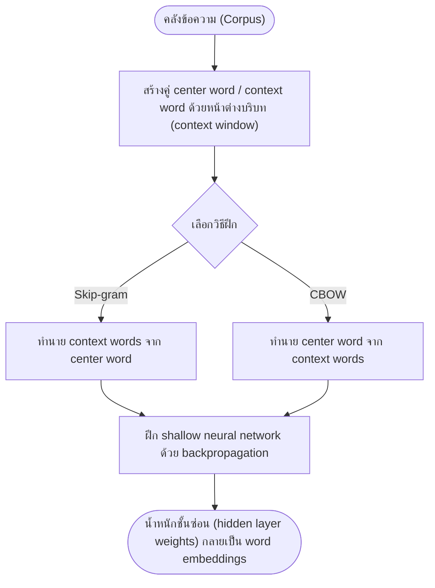

# การแทนคำด้วยเวกเตอร์ (Word Embeddings)

arrow_back กลับไปที่ [[Week4-MOC|MOC สัปดาห์ 4]]

## key Keyword

- **Word Embedding** — เวกเตอร์ค่าจริงหนาแน่น (dense vector) ที่แทนความหมายของคำ เรียนรู้จากคลังข้อความขนาดใหญ่
- **Skip-gram / CBOW** — สองวิธีฝึก word2vec: ทายบริบทจากคำกลาง (skip-gram) หรือทายคำกลางจากบริบท (CBOW)
- **GloVe** — โมเดลที่เรียนรู้เวกเตอร์จากสถิติการปรากฏร่วมกันของคำทั้งคลัง (global co-occurrence)
- **Cosine Similarity** — ตัวชี้วัดความคล้ายระหว่างเวกเตอร์สองตัวโดยพิจารณามุมระหว่างเวกเตอร์
- **Contrastive Learning** — วิธีฝึก embedding โดยดึงคู่ที่คล้ายกันเข้าใกล้และผลักคู่ที่ต่างกันออกจากกัน

## menu_book Theory (เข้าใจง่าย)

### จาก Symbolic สู่ Distributional Representation

การแทนคำแบบ **symbolic** คือมองแต่ละคำเป็นสัญลักษณ์เดี่ยว ๆ (เช่น one-hot vector หรือ index ในดิกชันนารี) วิธีนี้ไม่มีความรู้เรื่องความคล้ายในตัวเอง — "cat" กับ "kitten" ถูกมองว่าไม่เกี่ยวข้องกันพอ ๆ กับ "cat" กับ "car"

แนวคิด **distributional representation** แก้ปัญหานี้ด้วยหลักการที่ว่า "You shall know a word by the company it keeps" กล่าวคือ ความหมายของคำสามารถอนุมานได้จากบริบทที่มันปรากฏ ซึ่งแบ่งออกเป็น 2 สาย: sparse vector (นับตรง ๆ) และ dense vector (เรียนรู้)

### Sparse vs Dense Vectors

| ประเภท | วิธีสร้าง | ตัวอย่าง | ลักษณะ |
| --- | --- | --- | --- |
| **Sparse** (Term-Document Matrix, TF-IDF) | นับความถี่การปรากฏร่วมของคำกับเอกสาร แล้วถ่วงน้ำหนักด้วย TF-IDF (Term Frequency–Inverse Document Frequency) | `vector("bank") = [3, 0, 0, 12, 0, 1, 0, 0, 7, ...]` | มิติสูงเท่าขนาด vocabulary ส่วนใหญ่เป็น 0 |
| **Dense** (word2vec, GloVe) | ฝึกโครงข่ายประสาทตื้น (shallow neural network) ให้ทายบริบทของคำ | `v(king) − v(man) + v(woman) ≈ v(queen)` | มิติต่ำ (~100–300) แทบทุกมิติไม่เป็น 0 และเข้ารหัสความหมายแฝง |

TF-IDF ช่วยลดน้ำหนักของคำที่พบบ่อยทั่วคลัง (เช่น "the") และเพิ่มน้ำหนักคำที่เด่นในเอกสารนั้น ๆ แต่ยังเป็น sparse vector อยู่ดี ไม่ใช่ embedding

### word2vec: Skip-gram และ CBOW

word2vec (Mikolov et al., 2013, *"Efficient Estimation of Word Representations in Vector Space"*) ฝึกโครงข่ายตื้นด้วยสองวิธี:

- **Skip-gram** — ให้คำกลาง (center word) แล้วทายคำบริบทรอบข้าง เหมาะกับข้อมูลน้อยและคำหายาก (rare words) แต่ฝึกช้ากว่า
- **CBOW (Continuous Bag-of-Words)** — ให้คำบริบทรอบข้าง แล้วทายคำกลาง ฝึกเร็วกว่าและทำงานดีกับคำที่พบบ่อย

น้ำหนักของ hidden layer หลังฝึกเสร็จ คือ word embedding นั่นเอง — โมเดลไม่ได้ถูกใช้เพื่อ "ทาย" จริง ๆ แต่ใช้เป็นตัวบังคับให้เกิดเวกเตอร์ที่ดี

### GloVe และการใช้ Pretrained Vectors

**GloVe (Global Vectors for Word Representation)** (Pennington, Socher & Manning, 2014) ต่างจาก word2vec ตรงที่เรียนรู้จากสถิติการปรากฏร่วม (co-occurrence) ของทั้งคลังข้อความโดยตรง ผ่านการแยกตัวประกอบเมทริกซ์ (matrix factorization) ไม่ได้อาศัยแค่หน้าต่างบริบท (context window) ในระดับท้องถิ่นเหมือน word2vec

ในทางปฏิบัติ ไม่จำเป็นต้องฝึกเวกเตอร์เองเสมอไป สามารถนำ **pretrained vectors** ที่ฝึกจากคลังขนาดมหาศาล (เช่น Wikipedia, Google News) มาใช้ต่อได้เลย หรือทำ **fine-tuning/adaptation** ปรับเวกเตอร์ทั่วไปให้เข้ากับ domain เฉพาะทาง และยังสามารถรวมเวกเตอร์ระดับคำ (เช่น เฉลี่ยหรือ pooling) เพื่อสร้างเวกเตอร์ของวลีหรือประโยคได้ (**compositionality**)

> [!note] ตัวอย่างจริงบน Hugging Face
> เวกเตอร์ word2vec ที่ฝึกจาก Google News สามารถโหลดใช้ได้ทันทีจาก `fse/word2vec-google-news-300` บน Hugging Face Hub ตรงกับแนวคิด "Pretrained Vectors" ในสไลด์หน้า 6

### จากคำสู่ประโยค: Sentence Embeddings

แนวคิด "ความหมาย = เวกเตอร์" ไม่ได้จำกัดแค่ระดับคำ แต่ขยายไปถึงวลี ประโยค และเอกสารได้ **Embedding** จึงเป็นคำกว้าง ๆ ที่หมายถึงเวกเตอร์หนาแน่นของหน่วยข้อความใด ๆ ส่วน **Sentence Embedding** คือการเข้ารหัสทั้งประโยคให้เป็นเวกเตอร์เดียวที่จับความหมายโดยรวม ทำให้เปรียบเทียบ ค้นหา หรือจัดกลุ่มประโยคได้โดยตรง (เช่นโมเดล `sentence-transformers/all-MiniLM-L6-v2` บน Hugging Face)

### Contrastive Learning สำหรับ Representation

หลักการ **contrastive learning** คือดึงคู่ที่คล้ายกัน (positive pair) เข้าใกล้กัน และผลักคู่ที่ต่างกัน (negative pair) ออกจากกันในปริภูมิเวกเตอร์ เป็นแนวทางฝึก embedding สมัยใหม่ที่ต่อยอดจาก word2vec/GloVe:

| โมเดล | แนวคิดหลัก |
| --- | --- |
| **MUSE** | จัดแนว word embeddings ข้ามหลายภาษาให้อยู่ใน shared multilingual vector space เดียวกัน |
| **SimCSE** | สร้าง sentence embedding แบบ contrastive โดยใช้ dropout noise เป็นวิธี data augmentation ง่าย ๆ แต่ได้ผลดี |
| **BGE** | โมเดล embedding อเนกประสงค์ที่ปรับด้วย contrastive objective เพื่องาน retrieval/search |
| **CLIP** | ฝึกภาพและข้อความคู่กันแบบ contrastive จนได้ joint multimodal embedding space |

> [!tip] เคล็ดลับ
> จำความต่าง skip-gram กับ CBOW ง่าย ๆ ด้วยทิศทางการทาย: skip-gram = "1 คำ ทายหลายคำ" (skip ออกไปรอบ ๆ) ส่วน CBOW = "หลายคำ ทาย 1 คำ" (bag ของบริบท → คำกลาง)

## schema Diagram

**ตัวอย่าง:** สไลด์หน้า 5-6 แสดงว่าเมื่อฝึกเสร็จแล้ว เวกเตอร์ผลลัพธ์จะจับความสัมพันธ์เชิงความหมายได้ เช่น `v(king) − v(man) + v(woman) ≈ v(queen)` และสามารถนำเวกเตอร์ที่ฝึกจากคลังหนึ่งไปใช้ต่อ (pretrained) หรือปรับจูน (fine-tune) กับงานปลายทางอื่นได้โดยไม่ต้องฝึกใหม่ทั้งหมด

---
arrow_forward กลับไปที่ [[Week4-MOC|MOC สัปดาห์ 4]]
