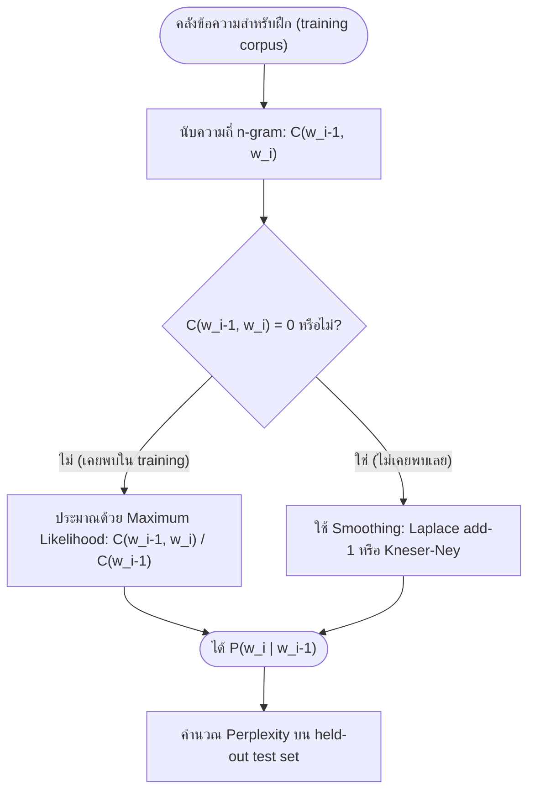

# โมเดลภาษาและ N-grams (Language Models and N-grams)

arrow_back กลับไปที่ [[Week5-MOC|MOC สัปดาห์ 5]]

## key Keyword

- **Language Model (LM)** — โมเดลที่กำหนดความน่าจะเป็นให้กับลำดับคำ หรือทำนายคำถัดไปจากคำก่อนหน้า
- **N-gram** — ลำดับ token ที่ต่อเนื่องกัน n ตัว ใช้ประมาณความน่าจะเป็นแบบมีเงื่อนไขจากความถี่
- **Markov Assumption** — ข้อสมมติที่ตัดบริบทให้สั้นลงเหลือแค่ n-1 คำก่อนหน้า เพื่อให้ประมาณค่าได้จริง
- **Perplexity** — ตัวชี้วัดคุณภาพ LM แบบ intrinsic ยิ่งต่ำยิ่งดี
- **Kneser-Ney Smoothing** — เทคนิค smoothing ที่ได้รับการยอมรับว่าแข็งแกร่งที่สุดในกลุ่ม classic smoothing

## menu_book Theory (เข้าใจง่าย)

### Language Model คืออะไร

**Language Model** คือโมเดลที่กำหนดความน่าจะเป็นให้กับลำดับคำ หรือเทียบเท่ากับการทำนายคำถัดไปที่น่าจะเป็นที่สุดจากคำที่มาก่อนหน้า เป็นรากฐานของแอปพลิเคชัน NLP ในชีวิตประจำวัน เช่น การเติมคำอัตโนมัติ (autocomplete), การรู้จำเสียงพูด (speech recognition), การแปลภาษาด้วยเครื่อง (machine translation) และการตรวจแก้คำผิด/ไวยากรณ์

งานหลักของ LM คือประมาณค่า $P(w_1, w_2, \ldots, w_n)$ โดยอาศัย **chain rule** สลายความน่าจะเป็นร่วม (joint probability) ให้เป็นผลคูณของความน่าจะเป็นแบบมีเงื่อนไข (conditional probability) ทีละคำ

### Markov Assumption และ N-gram

การคำนวณความน่าจะเป็นของคำโดยอิงประวัติทั้งหมดของประโยคเป็นไปไม่ได้ในทางปฏิบัติ (ข้อมูลไม่พอ) **Markov Assumption** จึงประมาณค่าโดยอิงแค่ $n-1$ คำก่อนหน้าเท่านั้น:

$$P(w_n \mid w_1, \ldots, w_{n-1}) \approx P(w_n \mid w_{n-1})$$

**N-gram** คือลำดับ token ต่อเนื่องกัน $n$ ตัว การนับความถี่ของ n-gram ในคลังข้อความทำให้ประมาณความน่าจะเป็นแบบมีเงื่อนไขได้โดยตรงจากข้อมูลจริง

| ลำดับ | นิยาม | ลักษณะ |
| --- | --- | --- |
| **Unigram** | $P(w)$ ประมาณอิสระจากบริบท (ความถี่สัมพัทธ์ล้วน ๆ) | ไม่มีความรู้เรื่องลำดับคำเลย |
| **Bigram** | $P(w_n \mid w_{n-1})$ อิงคำก่อนหน้า 1 คำ (first-order Markov) | จับรูปแบบคู่คำท้องถิ่นได้ในต้นทุนต่ำ |
| **Trigram** | $P(w_n \mid w_{n-2}, w_{n-1})$ อิงคำก่อนหน้า 2 คำ | บริบทกว้างขึ้น แต่จำนวนครั้งที่นับได้ (count) เบาบางลง (sparse) มากขึ้น |

### การประเมินผล: Perplexity

การประเมินแบบ **intrinsic evaluation** วัดว่าโมเดลทำนายข้อมูลทดสอบ (held-out test set) ได้ดีแค่ไหน โดยไม่ต้องนำไปใช้กับงานปลายทางจริง (เช่นการแปลภาษา) ตัวชี้วัดมาตรฐานคือ **Perplexity**:

$$PP(W) = P(w_1, w_2, \ldots, w_N)^{-\frac{1}{N}}$$

ค่า perplexity ยิ่งต่ำ แปลว่าโมเดล "แปลกใจ" กับข้อมูลทดสอบน้อยกว่า นั่นคือทำนายได้แม่นยำกว่า

### ปัญหา Sparsity: Zero Probability และ OOV

**The Zero Problem**: n-gram ใดก็ตามที่ไม่เคยปรากฏในข้อมูลฝึกจะได้ความน่าจะเป็นเท่ากับ 0 พอดี และเนื่องจาก perplexity เกี่ยวข้องกับการคูณ (หรือ log ของ) ความน่าจะเป็นเหล่านี้ ค่า 0 เพียงตัวเดียวก็ทำให้การคำนวณทั้งหมดพังได้ ไม่ว่าส่วนอื่นของโมเดลจะดีแค่ไหน

**Unknown Words (OOV)**: คำที่พบตอนทดสอบแต่ไม่เคยอยู่ใน vocabulary ตอนฝึกเลย วิธีแก้ทั่วไปคือใช้ token พิเศษ `<UNK>` แทนคำหายากตอนฝึก เพื่อให้โมเดลเรียนรู้ที่จะรับมือกับคำที่ไม่เคยเห็นได้อย่างสมเหตุสมผล

### Smoothing: แก้ปัญหา Zero

**Smoothing** คือการดึงความน่าจะเป็นส่วนหนึ่งออกจาก n-gram ที่เคยพบในข้อมูลฝึก แล้วกระจายไปให้ n-gram ที่ไม่เคยพบ เพื่อไม่ให้มีค่า 0 แบบตายตัวอีกต่อไป เหตุผลที่ต้องทำเช่นนี้เพราะภาษาธรรมชาติมีความเบาบางสูงมาก (sparse) — n-gram ที่ถูกไวยากรณ์จำนวนมากไม่เคยปรากฏแม้แต่ในคลังข้อความขนาดใหญ่มาก

| เทคนิค | แนวคิด | ข้อดี/ข้อเสีย |
| --- | --- | --- |
| **Laplace (Add-1)** | บวก 1 เข้ากับทุก count ก่อน normalize: $P(w_i \mid w_{i-1}) = \dfrac{C(w_{i-1}, w_i) + 1}{C(w_{i-1}) + V}$ (V = ขนาด vocabulary) | ง่าย ทำได้ทันที แต่ประเมินความน่าจะเป็นของเหตุการณ์ที่ไม่เคยพบสูงเกินจริงเมื่อ vocabulary ใหญ่ |
| **Kneser-Ney** | ใช้ "continuation probability" (จำนวน context ที่แตกต่างกันที่คำนั้นตามหลัง) แทนความถี่ดิบ | ถือเป็นเทคนิค classic smoothing ที่แข็งแกร่งที่สุด |

Kneser-Ney smoothing มาจากงานของ Kneser & Ney (1995) และถูกเปรียบเทียบอย่างละเอียดกับเทคนิคอื่น ๆ ในงานสำรวจคลาสสิก *"An Empirical Study of Smoothing Techniques for Language Modeling"* (Chen & Goodman, 1999) ซึ่งสรุปว่า Kneser-Ney (โดยเฉพาะ modified Kneser-Ney) ให้ผลลัพธ์ดีที่สุดในบรรดาวิธี smoothing แบบคลาสสิก

> [!note] เครื่องมือจริงที่ใช้แนวคิดนี้
> **KenLM** เป็นไลบรารีที่ใช้กันแพร่หลายในงานวิจัยและอุตสาหกรรมสำหรับฝึกและ query n-gram language model ที่ใช้ modified Kneser-Ney smoothing ได้อย่างรวดเร็วและประหยัดหน่วยความจำ มักถูกใช้เป็น baseline หรือ re-ranker คู่กับโมเดล neural

> [!tip] เคล็ดลับ
> เช็คสูตร Laplace ง่าย ๆ ด้วยการดูตัวส่วน: ถ้าไม่มี smoothing ตัวส่วนคือ $C(w_{i-1})$ อย่างเดียว แต่ Laplace ต้องบวก $V$ (ขนาด vocabulary) เข้าไปด้วย เพื่อให้ผลรวมความน่าจะเป็นของทุกคำที่เป็นไปได้ยังคงเท่ากับ 1

## schema Diagram

**ตัวอย่าง:** ตามสไลด์หน้า 6-8 หากประโยคทดสอบมี bigram ที่ไม่เคยปรากฏในข้อมูลฝึกแม้แต่คู่เดียว การประมาณแบบ MLE ล้วน ๆ จะให้ความน่าจะเป็นทั้งประโยคเท่ากับ 0 ทันที การใส่ smoothing (เช่น Laplace หรือ Kneser-Ney) ก่อนคำนวณ perplexity จึงจำเป็นเสมอในโมเดล n-gram ที่ใช้งานจริง

---
arrow_forward ต่อไป: [[RNN]]
