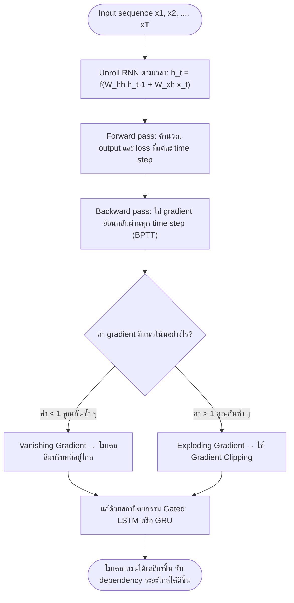

# โครงข่ายประสาทเวียนกลับ (Recurrent Neural Networks - RNN)

⬅️ กลับไปที่ [[Week5-MOC|MOC สัปดาห์ 5]] | ก่อนหน้า: [[Language-Models-Ngrams]]

## 🔑 Keyword

- **RNN (Recurrent Neural Network)** — โครงข่ายที่ประมวลผลข้อมูลทีละ time step โดยสะสมความจำไว้ใน hidden state
- **Hidden State ($h_t$)** — ตัวแปรความจำภายในที่สรุปข้อมูลทั้งหมดที่โมเดลเคยเห็นมาจนถึงเวลา $t$
- **BPTT (Backpropagation Through Time)** — วิธีฝึก RNN โดย unroll โครงข่ายตามเวลาแล้วไล่ gradient ย้อนกลับ
- **LSTM (Long Short-Term Memory)** — สถาปัตยกรรมแบบ gated ที่มี cell state และ 3 gates เพื่อแก้ปัญหา vanishing gradient
- **GRU (Gated Recurrent Unit)** — เวอร์ชันย่อของ LSTM ที่เหลือแค่ hidden state และ 2 gates

## 📖 Theory (เข้าใจง่าย)

### ทำไมต้องมี RNN: ข้อจำกัดของ Feed-Forward

โมเดล fixed-window อย่าง n-gram หรือโครงข่าย dense ทั่วไป มองเห็นได้แค่จำนวน token ก่อนหน้าที่กำหนดตายตัวเท่านั้น จึงไม่สามารถจับความสัมพันธ์ระยะไกล (long-range dependency) หรือรองรับลำดับที่มีความยาวแปรผัน (variable-length sequence) ได้ดี

**RNN** แก้ปัญหานี้ด้วยการประมวลผลข้อมูลทีละขั้นตามเวลา ($t-1, t, t+1, \ldots$) พร้อมส่งต่อ **hidden state** $h_t$ ไปเรื่อย ๆ ทำหน้าที่เป็นบัฟเฟอร์ความจำที่สรุปทุกอย่างที่ผ่านมาจนถึงตอนนี้

### สถาปัตยกรรม RNN ตามรูปแบบ Input-Output

| รูปแบบ (Topology) | ลักษณะ | ตัวอย่างงาน |
| --- | --- | --- |
| **Many-to-Many** | 1 output ต่อ 1 input แต่ละ time step | Token classification / POS tagging |
| **Many-to-One** | ทั้งลำดับยุบรวมเหลือ label เดียว | Sentiment analysis |
| **One-to-Many** | input เดียวคลี่ออกเป็นลำดับที่สร้างขึ้น | Image captioning |
| **Many-to-Many (Encoder-Decoder)** | input/output เป็นคนละลำดับ แยกกันชัดเจน | Machine translation, summarization |
| **Text Generation** | ทำนาย token ถัดไปแบบ autoregressive แล้วป้อน output กลับเป็น input | การสร้างข้อความต่อเนื่อง |

### การฝึกด้วย Backpropagation Through Time (BPTT)

RNN ถูก "unroll" ออกตามทุก time step แล้วไล่ gradient ย้อนกลับผ่านแต่ละ step เพื่ออัปเดตเมทริกซ์น้ำหนักที่ใช้ร่วมกัน (shared weight matrix) — หลักการเดียวกับ backprop ทั่วไป เพียงแต่ทำซ้ำตลอดความยาวของลำดับ:

$$\text{gradient} \propto W_{hh}^{T} \cdot W_{hh}^{T-1} \cdot \ldots \cdot W_{hh}^{1}$$

เพราะเมทริกซ์น้ำหนักตัวเดียวกันถูกคูณซ้ำทุก step ลำดับที่ยาวจึงหมายถึงสายการคูณซ้ำ ๆ ที่ยาวมาก ซึ่งไวต่อการที่ค่าน้อยกว่าหรือมากกว่า 1 เพียงเล็กน้อยอย่างมาก

### ปัญหา Vanishing และ Exploding Gradient

**Vanishing Gradient**: การคูณซ้ำของ $W_{hh}$ ร่วมกับอนุพันธ์ของฟังก์ชัน activation อย่าง tanh หรือ sigmoid (ซึ่งมีค่าน้อยกว่า 1 เสมอ) ทำให้ gradient หดตัวเข้าใกล้ 0 เมื่อลำดับยาวขึ้น ผลคือโมเดล "ลืม" ข้อมูลช่วงต้นของประโยคยาว ๆ ไม่สามารถเชื่อมโยงบริบทที่อยู่ไกลกันได้ ไม่ว่าบริบทนั้นจะสำคัญแค่ไหน

**Exploding Gradient**: ตรงข้ามกัน หากน้ำหนักมีค่ามาก การคูณซ้ำแบบเดียวกันจะทำให้ gradient ขยายตัวแบบทวีคูณ (exponential) แทน ส่งผลให้ค่าตัวเลขไม่เสถียร (NaN) และการอัปเดตน้ำหนักผิดเพี้ยนจนโมเดลไม่ลู่เข้า (converge) เลย วิธีแก้คือ **Gradient Clipping** กำหนดค่าสูงสุด (threshold) ให้ gradient แล้วตัดค่าที่เกินลง:

$$\text{if } \|\text{gradient}\| > \text{threshold}:\quad \text{gradient} = \text{gradient} \cdot \frac{\text{threshold}}{\|\text{gradient}\|}$$

### LSTM: Cell State และ 3 Gates

**LSTM** (Hochreiter & Schmidhuber, 1997, *"Long Short-Term Memory"*) แก้ปัญหา vanishing gradient ด้วยนวัตกรรมหลักคือ **Cell State ($C_t$)** — เส้นทางเชิงเส้นต่อเนื่องที่วิ่งตลอดทั้งลำดับ โดยมีการปรับแก้เพียงเล็กน้อยและถูกควบคุมอย่างระมัดระวังในแต่ละ step เปรียบเสมือน "ทางด่วน" ให้ข้อมูลระยะยาวเดินทางได้โดยไม่หายไป

หลักปรัชญาการ gating คือทุก gate ใช้ sigmoid activation บีบค่าผลลัพธ์ให้อยู่ระหว่าง 0 (ปิดสนิท) ถึง 1 (เปิดสนิท) เป็นสวิตช์แบบ soft ที่เรียนรู้ได้ ควบคุมการไหลเข้า-ออกของ cell state ผ่าน 3 gates:

| Gate | หน้าที่ |
| --- | --- |
| **Forget Gate ($f_t$)** | ตัดสินใจว่าข้อมูลใดใน cell state เดิมควรถูกทิ้งไป โดยอิงจาก input ปัจจุบันและ hidden state ก่อนหน้า |
| **Input/Update Gate ($i_t, \tilde{C}_t$)** | ตัดสินใจว่าข้อมูลใหม่จาก token ปัจจุบันควรถูกเก็บไว้ และเสนอค่าผู้สมัคร (candidate) เพื่อเพิ่มเข้า cell state |
| **Output Gate ($o_t$)** | ตัดสินใจว่า hidden state ถัดไป ควรเป็นอะไร โดยอิงจาก cell state ที่อัปเดตแล้ว |

### GRU: เวอร์ชันย่อของ LSTM

**GRU (Gated Recurrent Unit)** (Cho et al., 2014, *"Learning Phrase Representations using RNN Encoder-Decoder for Statistical Machine Translation"*) ลดความซับซ้อนโครงสร้างของ LSTM ลง ไม่มี cell state แยกต่างหาก ใช้เพียง hidden state $h_t$ และรวม 3 gates ของ LSTM ให้เหลือแค่ 2 gates:

- **Reset Gate ($r_t$)** — กำหนดว่าจะ "ลืม" hidden state เดิมมากแค่ไหนตอนคำนวณค่าผู้สมัครใหม่
- **Update Gate ($z_t$)** — ทำหน้าที่เป็นทั้ง forget gate และ input gate พร้อมกัน โดยตัดสินใจว่าจะเก็บ state เดิมไว้มากแค่ไหน เทียบกับการรับ state ใหม่เข้ามา

### LSTM vs GRU: เลือกใช้อย่างไร

| เลือก | เหตุผล |
| --- | --- |
| **GRU** | พารามิเตอร์น้อยกว่า ฝึกเร็วกว่า และเสี่ยง overfitting น้อยกว่าเมื่อข้อมูลหรือ compute มีจำกัด — ตัวเลือกเริ่มต้นที่ใช้งานได้จริง |
| **LSTM** | cell state ที่แยกต่างหากให้พลังในการแสดงออก (expressive power) สูงกว่าเล็กน้อยสำหรับ dependency ที่ซับซ้อนและยาวมาก ๆ แลกกับพารามิเตอร์ที่มากกว่า |

### การใช้งานจริงใน PyTorch

ก่อนป้อนข้อมูลเข้า RNN/LSTM/GRU layer ข้อมูลลำดับต้องถูกจัดรูปเป็น 3D tensor ตามรูปแบบมาตรฐาน:

```
(batch_size, sequence_length, embedding_dim)
```

ในทางปฏิบัติ การเปลี่ยนจาก `nn.RNN` ธรรมดาไปเป็น `nn.LSTM` หรือ `nn.GRU` ช่วยลดปัญหา vanishing gradient ได้อย่างเห็นผล — loss curve จะเสถียรขึ้นชัดเจนเมื่อลำดับข้อมูลฝึกยาวขึ้น

> [!note] LSTM ในฐานะ Language Model และในงานจริงบน Hugging Face
> ก่อนยุค Transformer โมเดลภาษาแบบ LSTM ที่แข็งแกร่งที่สุดตัวหนึ่งคือ **AWD-LSTM** (Merity et al., 2017) ซึ่งใช้เทคนิค regularization หลายชั้นจน LSTM ธรรมดาแข่งกับสถาปัตยกรรมใหม่ ๆ ได้ในยุคนั้น ส่วนตัวอย่างการใช้ LSTM ในงานจริงที่ยังหาโหลดได้บน Hugging Face Hub คือโมเดลตระกูล Flair (เช่น `flair/ner-english`) ซึ่งใช้ BiLSTM-CRF ร่วมกับ contextual string embeddings (Akbik et al., 2018) สำหรับงาน sequence labeling อย่าง named entity recognition

> [!tip] เคล็ดลับ
> จำแนก LSTM กับ GRU ง่าย ๆ ด้วยจำนวนสิ่งที่ต้องส่งต่อ: LSTM ส่งต่อ 2 อย่าง ($h_t$ และ $C_t$) ผ่าน 3 gates ส่วน GRU ส่งต่อแค่ 1 อย่าง ($h_t$) ผ่าน 2 gates — ยิ่งน้อย ยิ่งเบา ยิ่งเร็ว แต่ก็ยิ่งมีพลังน้อยกว่าเล็กน้อย

## 🖼️ Diagram



**ตัวอย่าง:** ตามสไลด์หน้า 4-6 การ unroll RNN ยาว ๆ แล้วไล่ gradient ย้อนกลับ (BPTT) คือสาเหตุโดยตรงของทั้ง vanishing และ exploding gradient เพราะเป็นการคูณเมทริกซ์น้ำหนักเดิมซ้ำ ๆ กันตามจำนวน time step ทางแก้ที่สไลด์เสนอคือ gradient clipping สำหรับ exploding gradient และเปลี่ยนไปใช้สถาปัตยกรรม gated (LSTM/GRU ในหน้า 7-9) สำหรับ vanishing gradient

---
➡️ กลับไปที่ [[Week5-MOC|MOC สัปดาห์ 5]]
