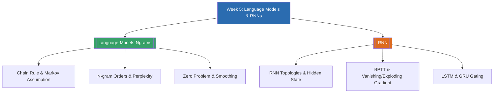

# Week 5 — Language Models & RNNs (MOC)

arrow_back สัปดาห์ก่อนหน้า: [[Week4-MOC|MOC สัปดาห์ 4]]

## check_circle เช็คลิสต์ก่อนเข้าเรียน

- [ ] ทบทวน chain rule ของความน่าจะเป็นแบบมีเงื่อนไข (conditional probability) — ดู [[Language-Models-Ngrams]]
- [ ] ลองคำนวณ bigram probability ด้วยมือจากประโยคสั้น ๆ สัก 1 ประโยค — ดู [[Language-Models-Ngrams]]
- [ ] ทบทวนโครงสร้าง feed-forward neural network พื้นฐาน ก่อนเข้าเรื่อง RNN — ดู [[RNN]]
- [ ] ทบทวนว่า backpropagation/gradient descent ทำงานอย่างไร (จะต่อยอดเป็น Backpropagation Through Time)

## assignment ภาพรวมสัปดาห์ 5 (สรุปย่อ)

สัปดาห์นี้แบ่งเป็นสองส่วนที่ต่อเนื่องกัน ส่วนแรกคือ **Language Models และ N-grams** ซึ่งอธิบายว่าโมเดลภาษาประมาณความน่าจะเป็นของลำดับคำอย่างไรด้วย chain rule, ทำไมต้องมี Markov assumption เพื่อลดความซับซ้อน, การแบ่งลำดับ n-gram (unigram/bigram/trigram), การประเมินผลด้วย perplexity, ปัญหา zero probability/OOV และวิธีแก้ด้วย smoothing (Laplace, Kneser-Ney) ส่วนที่สองคือ **Recurrent Neural Networks (RNN)** ซึ่งเป็นแนวทางแบบ neural ที่จับบริบทลำดับได้ดีกว่าโมเดล n-gram แบบ fixed-window เดิม ครอบคลุมสถาปัตยกรรม RNN หลายรูปแบบ, การฝึกด้วย Backpropagation Through Time (BPTT), ปัญหา vanishing/exploding gradient และสถาปัตยกรรมแบบ gated ที่แก้ปัญหานี้คือ LSTM และ GRU ทั้งสองหัวข้อรวมกันแสดงให้เห็นวิวัฒนาการของโมเดลภาษาจากสถิติ (statistical) ไปสู่ neural ซึ่งเป็นพื้นฐานก่อนเข้าสู่ seq2seq และ attention ในสัปดาห์ถัดไป

## map แผนที่หัวข้อสัปดาห์ 5

## collections_bookmark โน้ตรายหัวข้อ

| หัวข้อ | เนื้อหาหลัก | หน้าสไลด์ |
| --- | --- | --- |
| [[Language-Models-Ngrams]] | นิยาม language model, chain rule, Markov assumption, unigram/bigram/trigram, perplexity, zero problem/OOV, Laplace & Kneser-Ney smoothing | หน้า 1-8 |
| [[RNN]] | ข้อจำกัดของ feed-forward, RNN topologies, BPTT, vanishing/exploding gradient, LSTM (cell state, 3 gates), GRU (2 gates), การใช้งานจริงใน PyTorch | หน้า 1-11 |

> [!tip] จุดที่มักสับสน
> Markov assumption ใน n-gram model กับ hidden state ใน RNN แก้ปัญหาเดียวกัน (การจำบริบท) แต่คนละวิธี — n-gram "ตัดบริบท" ให้สั้นลงเพื่อให้นับได้ ในขณะที่ RNN "สะสมบริบท" ทั้งหมดไว้ใน hidden state เดียว แต่ก็แลกมาด้วยปัญหา vanishing gradient เมื่อลำดับยาวเกินไป

arrow_forward สัปดาห์ถัดไป: [[Week6-MOC|MOC สัปดาห์ 6]]
