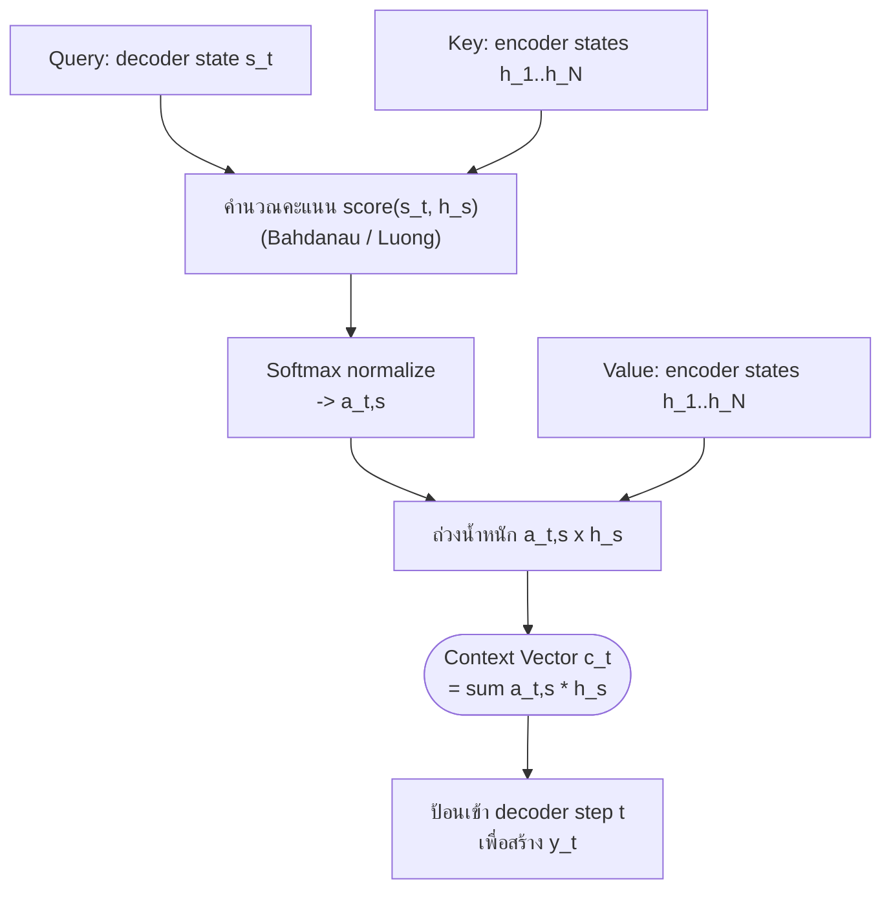

# กลไก Attention (Attention Mechanism)

⬅️ กลับไปที่ [[Week6-MOC|MOC สัปดาห์ 6]] | ก่อนหน้า: [[Encoder-Decoder-Seq2Seq]]

## 🔑 Keyword

- **Bahdanau Attention (Additive)** — คำนวณคะแนนจับคู่ด้วย feed-forward network + tanh
- **Luong Attention (Multiplicative)** — คำนวณคะแนนจับคู่ด้วย dot product (แบบ dot / general / concat)
- **Global vs Local Attention** — attend ทุกตำแหน่งของ encoder เทียบกับ attend เฉพาะ window รอบตำแหน่งที่คาดการณ์
- **Context Vector ($c_t$)** — ผลรวมถ่วงน้ำหนัก (weighted sum) ของ encoder hidden states ณ decoder step ปัจจุบัน
- **Coverage Mechanism** — กลไกติดตามว่าคำต้นทางใดถูก/ยังไม่ถูก attend เพื่อลดปัญหาแปลซ้ำหรือแปลตกหล่น

## 📖 Theory (เข้าใจง่าย)

### แรงจูงใจ: จาก Bottleneck สู่ Attention

จากโน้ตก่อนหน้า ปัญหาของ Seq2Seq แบบ RNN คือต้องบีบอัดทั้งประโยคลง context vector $C$ เวกเตอร์เดียว **Attention** แก้ปัญหานี้โดยให้ decoder "มองย้อนกลับ" ไปยัง encoder hidden state ทุกตำแหน่ง $h_1, \dots, h_N$ ในทุก step ของการสร้างคำ แล้วให้โมเดลเรียนรู้เองว่าตำแหน่งไหน "สำคัญที่สุด" ในแต่ละจังหวะ ไอเดียนี้เลียนแบบการมองของมนุษย์ที่เพ่งความสนใจไปยังจุดที่เกี่ยวข้องแทนที่จะประมวลผลทุกอย่างเท่ากันหมด

> [!note] งานวิจัยอ้างอิง
> แนวคิด attention สำหรับ NMT เสนอโดย Bahdanau, Cho & Bengio (2015) "Neural Machine Translation by Jointly Learning to Align and Translate" และถูกทำให้เร็วและง่ายขึ้นโดย Luong, Pham & Manning (2015)

### รูปแบบ Query / Key / Value

แม้ในยุคนี้ยังไม่มีคำว่า self-attention แต่แนวคิดพื้นฐานเหมือนกัน:

- **Query (Q)** — สิ่งที่ decoder กำลังมองหา ณ ขณะนั้น (decoder state $s_t$)
- **Key (K)** — สิ่งที่แต่ละตำแหน่งของ encoder "นำเสนอ" ไว้สำหรับจับคู่ (encoder state $h_s$)
- **Value (V)** — เนื้อหาจริงที่จะถูกดึงมาใช้เมื่อจับคู่ได้ (ในกรณีนี้คือ $h_s$ เช่นกัน)

### ฟังก์ชันคำนวณคะแนน (Scoring Functions)

| แบบ | สูตร | ลักษณะเด่น |
| --- | --- | --- |
| Bahdanau (Additive) | $\text{score}(s_{t-1}, h_s) = v^\top \tanh(W_1 s_{t-1} + W_2 h_s)$ | feed-forward network ขนาดเล็ก เรียนรู้การจับคู่ได้ยืดหยุ่น |
| Luong — dot | $\text{score}(s_t, h_s) = s_t^\top h_s$ | ง่ายและเร็วที่สุด ต้องมีมิติเท่ากัน |
| Luong — general | $\text{score}(s_t, h_s) = s_t^\top W h_s$ | เพิ่มเมทริกซ์เรียนรู้ รองรับมิติต่างกันได้ |
| Luong — concat | $\text{score}(s_t, h_s) = v^\top \tanh(W[s_t; h_s])$ | โครงสร้างคล้าย additive แต่ต่อ (concat) เวกเตอร์เข้าด้วยกัน |

การคูณจุด (dot product) ของ Luong คือรากฐานของ scaled dot-product attention ที่จะไปเจอใน Transformer สัปดาห์หน้า

### Global Attention vs Local Attention

**Global attention** ให้ decoder attend ทุกตำแหน่งของ encoder ในทุก step — ไม่ตัดอะไรออกไปก่อน โมเดลเรียนรู้เองว่าคำไหนสำคัญ แต่ต้นทุนคำนวณคือ $O(T_x \cdot T_y)$ ต่อ layer ($T_x$ = ความยาวต้นทาง, $T_y$ = ความยาวปลายทาง) ซึ่งจะแพงมากสำหรับเอกสารยาว ๆ (ปัญหาเดียวกันนี้จะกลับมาอีกครั้งในรูปแบบ self-attention ของ Transformer)

**Local attention** แก้ปัญหาต้นทุนโดยเลือกตำแหน่งกึ่งกลาง $p_t$ แล้ว attend เฉพาะ window $[p_t - D, p_t + D]$ ลดต้นทุนเหลือ $O(D)$ มีสองแบบ:

- **Local-m (monotonic)**: สมมติว่าคำแปลเรียงตามลำดับเดิม จึงกำหนด $p_t = t$ ตรง ๆ ไม่ต้องเรียนพารามิเตอร์เพิ่ม เหมาะกับภาษาที่โครงสร้างประโยคคล้ายกัน (เช่น อังกฤษ-เยอรมัน) แต่พังถ้าลำดับคำต่างกันมาก
- **Local-p (predictive)**: ให้โมเดลทำนายตำแหน่งเอง $p_t = S \cdot \text{sigmoid}(v_p^\top \tanh(W_p s_t))$ โดย $S$ คือความยาวประโยคต้นทาง รองรับการเรียงลำดับที่ไม่ตรงกันได้ดีกว่า และมักถ่วงน้ำหนักภายใน window ด้วยเส้นโค้งแบบ Gaussian ที่มีจุดสูงสุดตรง $p_t$

| ประเด็น | Global Attention | Local Attention |
| --- | --- | --- |
| ขอบเขต | ทุกตำแหน่งต้นทาง | เฉพาะ window ขนาด $D$ รอบ $p_t$ |
| ต้นทุน | $O(T_x)$ ต่อ decoder step | $O(D)$ ต่อ decoder step ($D \ll T_x$) |
| ความแม่นยำ | สูงกว่าเล็กน้อยโดยเฉลี่ย | ใกล้เคียงกัน บางครั้งดีกว่าในประโยคยาว |
| ความซับซ้อน | ทำง่าย | ต้องมีโมเดลทำนายตำแหน่ง (local-m/p) |

### การคำนวณ Context Vector

$$c_t = \sum_s a_{t,s} \, h_s$$

โดยน้ำหนัก $a_{t,s}$ มาจากการทำ softmax บนคะแนนจับคู่ $e_{t,s} = \text{score}(s_t, h_s)$ ทำให้ผลรวมของน้ำหนักตำแหน่งต้นทางทั้งหมดเท่ากับ 1 เสมอ

### ส่วนขยาย: Input-Feeding และ Coverage Mechanism

- **Input-feeding**: นำ attentional vector ของ step ก่อนหน้า ($\tilde h_{t-1}$) มาต่อ (concat) เข้ากับ embedding ของ token ถัดไปก่อนป้อนเข้า decoder ทำให้ decoder "รู้" ว่าเคยตัดสินใจ attend อะไรไปแล้ว ช่วยลดการ attend คำเดิมซ้ำ ๆ
- **Coverage mechanism** (Tu et al., 2016): เก็บสะสมน้ำหนัก attention ที่เคยให้กับแต่ละคำต้นทาง เพื่อลงโทษการ attend คำเดิมซ้ำ (over-translation / แปลซ้ำ) และการไม่เคย attend คำใดเลย (under-translation / แปลตกหล่น)

### การตีความ Attention ด้วย Visualization

น้ำหนัก attention $a_{t,s}$ สามารถวาดเป็น heatmap (แกนหนึ่งเป็นคำเป้าหมาย อีกแกนเป็นคำต้นทาง) สีเข้มกว่าหมายถึงน้ำหนักสูงกว่า ทำให้เห็น soft word alignment ระหว่างสองภาษาได้โดยตรง

> [!important] เชื่อมโยงสู่สัปดาห์หน้า
> Bahdanau/Luong attention เชื่อมสองลำดับต่างกันเสมอ (decoder ↔ encoder) แต่แนวคิด Query/Key/Value เดียวกันนี้ เมื่อให้ "ลำดับเดียวกัน" attend ตัวเองได้โดยไม่ต้องมี recurrence เลย จะกลายเป็น **self-attention** ซึ่งเป็นหัวใจของ Transformer ในสัปดาห์ที่ 7 และเครื่องมืออย่าง `bertviz` ก็ใช้หลักการ heatmap แบบเดียวกันนี้ในการแสดงผล attention ของโมเดลตระกูล Transformer

> [!tip] เคล็ดลับ
> จำง่าย ๆ ว่า "Bahdanau บวก-แล้วทานห์ (additive), Luong คูณจุด (multiplicative)" ส่วน global/local ให้จำว่า local คือ "ซูมเข้าไปดูเฉพาะช่วง" เพื่อประหยัดการคำนวณ

## 🖼️ Diagram

**ตัวอย่าง:** สไลด์ 6-2 หน้า 3 (Bahdanau) และหน้า 4-7 (Luong: dot/general/concat, global attention) หน้า 8-11 (local attention และ Gaussian window) หน้า 12 (สูตร context vector) และหน้า 15 (heatmap การแปล "The cat sits on the mat" → "Le chat s'assoit sur le tapis")

---
➡️ กลับไปที่ [[Week6-MOC|MOC สัปดาห์ 6]]
