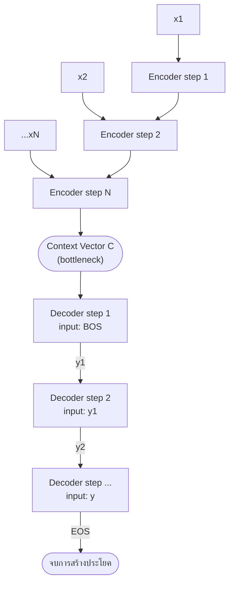

# สถาปัตยกรรม Encoder-Decoder และ Seq2Seq (Sequence-to-Sequence Learning)

⬅️ กลับไปที่ [[Week6-MOC|MOC สัปดาห์ 6]]

## 🔑 Keyword

- **Encoder-Decoder** — สถาปัตยกรรมสองส่วน ส่วนแรกอ่านและบีบอัดอินพุต ส่วนที่สองสร้างเอาต์พุตจากผลบีบอัดนั้น
- **Context Vector (C)** — เวกเตอร์ขนาดคงที่ที่ encoder สรุปข้อมูลทั้งประโยคอินพุตไว้
- **Autoregressive Decoding** — การสร้างเอาต์พุตทีละ token โดยแต่ละ token อิงจาก token ที่สร้างไปแล้วก่อนหน้า
- **Information Bottleneck** — ปัญหาที่ context vector ขนาดคงที่ไม่พอเก็บข้อมูลเมื่ออินพุตยาวขึ้น
- **Beam Search** — กลยุทธ์การถอดรหัสที่เก็บลำดับความน่าจะเป็นสูงสุดหลายเส้นทางไว้พร้อมกัน

## 📖 Theory (เข้าใจง่าย)

### จาก Sequence Labeling สู่ Seq2Seq

สัปดาห์ก่อนหน้าเราเห็นงาน **sequence labeling** (เช่น NER, POS tagging ด้วย BIO/IOB2) ซึ่งมีข้อสมมติสำคัญคือ input และ output ยาวเท่ากันเสมอ: $f(x_1, \dots, x_T) \rightarrow (y_1, \dots, y_T)$ — token ที่ 1 ของ input จับคู่กับ label ที่ 1 ของ output แบบตรงตำแหน่ง (เป็น **alignment task**)

แต่งานจริงจำนวนมากไม่เป็นแบบนั้น เช่น

- **การแปลภาษา (Machine Translation)** — ประโยคภาษาหนึ่งแปลเป็นอีกภาษาหนึ่งที่ความยาวไม่เท่ากัน และลำดับคำอาจสลับกัน
- **การสรุปความ (Summarization)** — เอกสารยาว ๆ สรุปเป็นข้อความสั้น
- **บทสนทนา (Dialogue)** — ประโยคคำถามได้คำตอบที่ความยาวไม่สัมพันธ์กันเลย

งานเหล่านี้ต้องการ mapping แบบ **N → M** (ความยาว input และ output เป็นอิสระต่อกัน) และเป็นงานเชิง **abstraction** ไม่ใช่ alignment กล่าวคือโมเดลต้องเรียงลำดับใหม่ ถอดความ หรือย่อเนื้อหาโดยไม่มีตำแหน่งอ้างอิงตายตัวกับ input

### สถาปัตยกรรม Recurrent Encoder-Decoder

แนวทางคลาสสิกคือใช้ RNN/LSTM สองตัวทำงานร่วมกัน:

- **Encoder** อ่านลำดับอินพุต $(x_1, \dots, x_N)$ ทีละ step แล้วบีบอัดข้อมูลทั้งหมดให้เหลือ **context vector** $C$ ขนาดคงที่หนึ่งเวกเตอร์ (มักคือ hidden state สุดท้ายของ encoder)
- **Decoder** เป็น RNN แบบ **autoregressive** ที่สร้างลำดับเอาต์พุต $(y_1, \dots, y_M)$ ทีละ step โดยแต่ละ step รับทั้ง $C$ และ token ที่สร้างไปแล้วทั้งหมด $y_{<t}$ เป็นเงื่อนไข
- การสร้างเริ่มจาก token พิเศษ `<BOS>` และหยุดเมื่อ decoder สร้าง `<EOS>` หรือถึงความยาวสูงสุดที่กำหนดไว้

> [!note] งานวิจัยอ้างอิง
> แนวคิดนี้มาจาก Sutskever, Vinyals & Le (2014) "Sequence to Sequence Learning with Neural Networks" และ Cho et al. (2014) ที่เสนอ RNN encoder-decoder สำหรับงานแปลภาษาเชิงสถิติ ปัจจุบันบน Hugging Face มีโมเดล encoder-decoder จริงที่ใช้แนวคิดนี้ต่อยอด เช่น `Helsinki-NLP/opus-mt-en-th` (โมเดล MarianMT สำหรับแปลอังกฤษ-ไทย)

### ปัญหา Information Bottleneck

จุดอ่อนสำคัญของ context vector เดี่ยว ๆ คือมิติของมันคงที่ $\dim(C) = d$ ไม่ว่าประโยคอินพุตจะยาวแค่ไหน ในขณะที่ปริมาณข้อมูลใน $(x_1, \dots, x_N)$ เพิ่มขึ้นตาม $N$ เมื่อประโยคยาวขึ้น encoder ต้องอัดข้อมูลมากขึ้นเรื่อย ๆ ลงในพื้นที่ขนาดเท่าเดิม ทำให้ข้อมูลของ token แรก ๆ มักถูกเจือจางหรือถูกเขียนทับไปเมื่อถึง token สุดท้าย

ผลที่สังเกตได้จริงคือคุณภาพการแปล (วัดด้วย BLEU) จะตกลงอย่างชัดเจนเมื่อความยาวประโยคต้นทางเพิ่มขึ้น นี่คือแรงจูงใจโดยตรงที่นำไปสู่ **attention mechanism** ซึ่งจะกล่าวถึงในโน้ตถัดไป

> [!tip] เคล็ดลับ
> จำง่าย ๆ ว่า context vector คือ "การสรุปทั้งประโยคด้วยประโยคเดียว (เวกเตอร์เดียว)" ยิ่งต้นฉบับยาว ยิ่งสรุปตกหล่นมาก — ถ้าเห็นโจทย์ถามว่าทำไม vanilla Seq2Seq แปลประโยคยาวได้แย่ ให้ตอบด้วยคำว่า fixed-size bottleneck ทันที

### กลยุทธ์การถอดรหัส (Decoding Strategies)

เมื่อ decoder สร้างเอาต์พุตทีละ token จะต้อง "เลือก" token ในแต่ละ step ด้วยกลยุทธ์ใดกลยุทธ์หนึ่ง:

| กลยุทธ์ | หลักการ | ข้อดี/ข้อเสีย |
| --- | --- | --- |
| Greedy Search | เลือก token ที่ความน่าจะเป็นสูงสุดในแต่ละ step | เร็ว แต่อาจติดอยู่ในเส้นทางที่ไม่เหมาะที่สุด |
| Beam Search | เก็บ top-k ลำดับที่ดีที่สุดไว้พร้อมกัน (beam width $k$) แล้วขยายต่อทุก step | สำรวจพื้นที่คำตอบกว้างขึ้น ต้องใช้ **length penalty** หารคะแนนด้วยความยาว เพื่อไม่ให้เอนเอียงเลือกประโยคสั้นเกินไป |
| Sampling + Temperature | สุ่มจากการแจกแจงหลัง rescale ด้วยอุณหภูมิ $T$ — $T$ ต่ำทำให้มั่นใจ/นิ่งขึ้น, $T$ สูงทำให้สุ่ม/สร้างสรรค์ขึ้น | ให้ความหลากหลาย เหมาะกับงานสร้างสรรค์ |
| Top-k / Top-p (Nucleus) | จำกัดกลุ่มผู้สมัครเป็น k อันดับแรก หรือกลุ่มที่ความน่าจะเป็นสะสมเกิน $p$ | ตัด long-tail ที่ไม่น่าจะเป็นออก ลดความเพี้ยนจากการสุ่มเดา |

ใน Hugging Face แนวคิด Seq2Seq ทั้งหมดนี้ (encoder-decoder + decoding strategies) ถูกครอบด้วยคลาส `AutoModelForSeq2SeqLM` ซึ่งใช้กับโมเดลอย่าง T5 หรือ BART สำหรับงานแปลภาษาและสรุปความ

## 🖼️ Diagram

**ตัวอย่าง:** ตามสไลด์ 6-1 หน้า 8 แสดงตัวอย่างแปล "The cat" → "Le chat" ด้วย encoder-decoder แบบ RNN และหน้า 9 แสดงกราฟ BLEU ที่ตกลงเมื่อความยาวประโยคเพิ่มขึ้น ส่วนกลยุทธ์การถอดรหัสอยู่ที่หน้า 16 (beam width $k=2$)

---
➡️ ต่อไป: [[Attention-Mechanism]]
