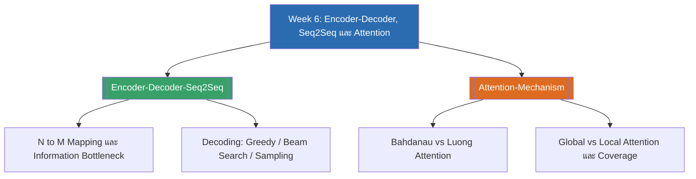

# Week 6 — Encoder-Decoder, Seq2Seq & Attention (MOC)

⬅️ สัปดาห์ก่อนหน้า: [[Week5-MOC|MOC สัปดาห์ 5]]

## ✅ เช็คลิสต์ก่อนเข้าเรียน

- [ ] ทบทวน RNN/LSTM และวิธีคิด hidden state จากสัปดาห์ที่แล้ว เพราะ encoder-decoder แบบคลาสสิกสร้างจากมันโดยตรง — ดู [[Encoder-Decoder-Seq2Seq]]
- [ ] ทำความเข้าใจความต่างระหว่างงาน alignment (input/output ยาวเท่ากัน เช่น NER) กับงาน abstraction (N→M mapping เช่น แปลภาษา) — ดู [[Encoder-Decoder-Seq2Seq]]
- [ ] ทบทวนพื้นฐาน softmax, dot product และ weighted sum เพื่อเตรียมเข้าใจสูตร attention — ดู [[Attention-Mechanism]]
- [ ] ลองนึกภาพว่ามนุษย์ "เพ่งความสนใจ" ไปยังบางจุดของภาพหรือประโยคอย่างไร เพื่อเชื่อมโยงกับสัญชาตญาณของ attention — ดู [[Attention-Mechanism]]

## 📋 ภาพรวมสัปดาห์ 6 (สรุปย่อ)

สัปดาห์นี้ต่อยอดจากงาน sequence labeling (ที่ input/output ยาวเท่ากัน) ไปสู่ปัญหาที่ทั่วไปกว่า คือ **Sequence-to-Sequence (Seq2Seq)** ซึ่งความยาว input และ output เป็นอิสระต่อกัน (N→M mapping) เช่น การแปลภาษา การสรุปความ และบทสนทนา เราจะเห็นสถาปัตยกรรม **Encoder-Decoder** แบบ RNN ที่ encoder บีบอัดประโยคทั้งหมดเป็น context vector เดียว และ decoder สร้างคำตอบทีละ token แบบ autoregressive จากนั้นจะพบข้อจำกัดสำคัญคือ **information bottleneck** — เวกเตอร์ขนาดคงที่ไม่พอเก็บข้อมูลเมื่อประโยคยาวขึ้น ซึ่งนำไปสู่การแก้ปัญหาด้วย **Attention Mechanism** ทั้งแบบ Bahdanau (additive) และ Luong (multiplicative) รวมถึงแนวคิด global vs local attention และกลไกเสริมอย่าง coverage mechanism เนื้อหาทั้งหมดนี้เป็นพื้นฐานสำคัญก่อนเข้าสู่ Transformer ในสัปดาห์ถัดไป

## 🗺️ แผนที่หัวข้อสัปดาห์ 6

## 📚 โน้ตรายหัวข้อ

| หัวข้อ | เนื้อหาหลัก | หน้าสไลด์ |
| --- | --- | --- |
| [[Encoder-Decoder-Seq2Seq]] | จาก sequence labeling สู่ N→M mapping, สถาปัตยกรรม encoder-decoder แบบ RNN, ปัญหา information bottleneck, กลยุทธ์การถอดรหัส (greedy/beam/sampling) | สไลด์ 1-9, 16-18 (6-1) |
| [[Attention-Mechanism]] | Query/Key/Value, Bahdanau (additive) vs Luong (multiplicative) attention, global vs local attention, context vector, input-feeding และ coverage mechanism | สไลด์ 1-21 (6-2) |

> [!tip] จุดที่มักสับสน
> Attention ในสัปดาห์นี้ (Bahdanau/Luong) เป็น **cross-sequence attention** ที่เชื่อม decoder เข้ากับ encoder เสมอ ยังไม่ใช่ self-attention ที่ตำแหน่งในลำดับเดียวกัน attend กันเอง — self-attention จะไปเจอในสัปดาห์หน้าตอนเรียน Transformer อย่าเพิ่งสับสนสองแนวคิดนี้เข้าด้วยกัน

➡️ สัปดาห์ถัดไป: [[Week7-MOC|MOC สัปดาห์ 7]]
