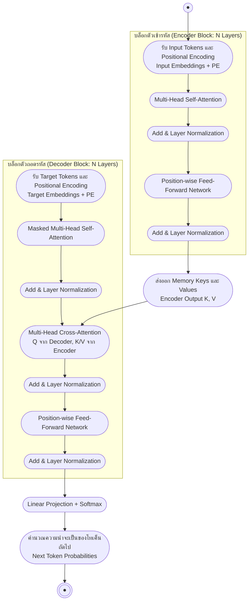

# สถาปัตยกรรม Transformer (The Transformer Architecture)

arrow_back กลับไปที่ [[Week7-MOC|MOC สัปดาห์ 7]]

## key Keyword

- **Self-Attention** — กลไกที่ทุกตำแหน่งในลำดับเดียวกัน attend ซึ่งกันและกันได้โดยตรง ไม่ต้องมี recurrence
- **Scaled Dot-Product Attention** — สูตรแกนกลางของ Transformer: $\text{softmax}(QK^\top/\sqrt{d_k})V$
- **Multi-Head Attention** — รัน attention หลายชุดขนานกัน (หลาย head) แล้ว concat ผลลัพธ์
- **Positional Encoding** — สัญญาณ sin/cos ที่เติมข้อมูลลำดับตำแหน่งให้ token เพราะ self-attention ไม่รู้ลำดับโดยธรรมชาติ
- **Cross-Attention** — attention ที่ Query มาจาก decoder ส่วน Key/Value มาจากผลลัพธ์ของ encoder

## menu_book Theory (เข้าใจง่าย)

### ข้อจำกัดของ RNN ที่นำไปสู่ Self-Attention

RNN ประมวลผลลำดับทีละ step เท่านั้น ทำให้ (1) ขนานการคำนวณ (parallelize) ระหว่างการฝึกไม่ได้ และ (2) รักษาความสัมพันธ์ระยะไกลได้ยากแม้จะมี gate ช่วยแล้วก็ตาม แนวคิดของ Transformer คือมอง attention ใหม่ผ่านมุมมองการ "ค้นคืนข้อมูล" (retrieval): Query ถูกเทียบกับชุด Key แล้วดึง Value ที่ตรงกันมาผสมกันตามน้ำหนักความเข้ากัน

สัปดาห์ก่อน Bahdanau/Luong attention เชื่อม decoder เข้ากับ encoder เสมอ (คนละลำดับ) แต่ **self-attention** ให้ทุกตำแหน่งของ "ลำดับเดียวกัน" attend กันเองได้โดยตรง — นี่คือจุดเปลี่ยนสำคัญที่ทำให้ตัดการวนซ้ำ (recurrence) ออกไปได้ทั้งหมด

### Scaled Dot-Product Attention

สมการหลักของ Transformer คือ

$$\text{Attention}(Q, K, V) = \text{softmax}\left(\frac{QK^\top}{\sqrt{d_k}}\right)V$$

Query และ Key ถูกเทียบกันด้วย dot product แล้วหารด้วย $\sqrt{d_k}$ ก่อนเข้า softmax เพื่อไม่ให้ค่าดิบมีขนาดใหญ่เกินไป — เพราะเมื่อมิติ $d_k$ โต ค่า dot product ดิบจะยิ่งมีขนาดใหญ่ ผลักให้ softmax เข้าสู่ช่วงอิ่มตัว (saturated) ที่ gradient เกือบเป็นศูนย์ การ scale จึงช่วยให้เทรนได้เสถียร กล่าวได้ว่า attention ทำงานเหมือน "soft dictionary lookup" คือแทนที่จะคืนค่าตรงกันแบบเป๊ะ ๆ หนึ่งค่า มันคืนค่าผสมถ่วงน้ำหนักของทุก Value และคำนวณทุกตำแหน่งพร้อมกันแบบขนานได้

> [!note] งานวิจัยอ้างอิง
> ทั้งหมดนี้มาจาก Vaswani et al. (2017) "Attention Is All You Need" ซึ่งเป็นต้นกำเนิดของสถาปัตยกรรม Transformer ที่โมเดลยุคหลังแทบทั้งหมดต่อยอดมา

### Multi-Head Attention

แทนที่จะทำ attention เพียงชุดเดียว Transformer รัน attention หลาย "หัว" (head) ขนานกัน แต่ละ head มีเมทริกซ์ฉาย $W_Q, W_K, W_V$ เป็นของตัวเอง ทำให้แต่ละ head เรียนรู้มุมมองความสัมพันธ์ระหว่าง token ที่ต่างกันได้ (เช่น บาง head จับ syntactic dependency บาง head จับ coreference บาง head จับแค่คำข้างเคียง) จากนั้นนำผลลัพธ์ทุก head มา concat และผ่านเมทริกซ์ฉายผลลัพธ์ $W_O$ อีกชั้นหนึ่ง เครื่องมืออย่าง `bertviz` ใช้แสดงภาพน้ำหนัก attention ของแต่ละ head ในโมเดลจริงได้โดยตรง

### Positional Encoding

เพราะ self-attention ไม่มีกลไกรับรู้ลำดับ token ในตัวเอง (เป็น **permutation-equivariant** — สลับลำดับ input ผลลัพธ์ก็สลับตามโดยไม่เปลี่ยนอย่างอื่น) จึงต้องเติมสัญญาณตำแหน่งเข้าไปที่ embedding โดยตรง สูตรดั้งเดิมใช้ค่า sin/cos ที่ความถี่ต่างกันในแต่ละมิติ:

$$PE_{(pos, 2i)} = \sin\left(\frac{pos}{10000^{2i/d}}\right)$$

Positional encoding แบบ sinusoidal (fixed) ขยายไปยังความยาวที่ไม่เคยเห็นตอนเทรนได้ดีกว่า ส่วนแบบเรียนรู้ (learned) จะ fit กับข้อมูลเทรนได้แม่นกว่าแต่ generalize แย่กว่า ส่วน Rotary Position Embeddings (RoPE) เป็นแนวทางผสมทั้งสองแบบที่นิยมในโมเดลยุคหลัง

### Masked Self-Attention (Causal Mask)

ในฝั่ง decoder ต้องรักษาคุณสมบัติ autoregressive คือแต่ละตำแหน่งห้ามมองเห็นตำแหน่งในอนาคต ทำได้โดยตั้งค่าคะแนน attention ของตำแหน่งอนาคตให้เป็น $-\infty$ ก่อนเข้า softmax ทำให้ token หนึ่ง ๆ attend ได้แค่ตัวเองกับตำแหน่งก่อนหน้าเท่านั้น

### ต้นทุนการคำนวณและส่วนขยาย

Self-attention แลกต้นทุนแบบลำดับของ RNN ($O(n \cdot d^2)$) มาเป็นต้นทุนต่อ layer ที่โตแบบกำลังสองตามความยาวลำดับ ($O(n^2 \cdot d)$) ซึ่งถูกมากสำหรับลำดับสั้น แต่เป็นเหตุผลที่โมเดล long-context ต้องมีเทคนิคเสริม เช่น linear attention approximation ที่ลดความซับซ้อนเหลือ $O(n)$ โดยไม่สร้าง score matrix ขนาด $n \times n$ เต็มรูปแบบ หรือ reversible Transformer ที่คำนวณ activation ย้อนกลับตอน backward pass แทนการเก็บทุกชั้นไว้ในหน่วยความจำ แนวคิด self-attention เดียวกันนี้ยังถูกนำไปใช้นอกเหนือข้อความ เช่น Vision Transformer (ViT) ที่ตัดภาพเป็น patch แล้วปฏิบัติเหมือน token

### สถาปัตยกรรม Encoder-Decoder แบบเต็มรูปแบบ

Transformer เต็มรูปแบบประกอบด้วย stack ของ encoder block จำนวน $N$ ชั้น และ stack ของ decoder block จำนวน $N$ ชั้นเชื่อมกันด้วย cross-attention

- **Encoder block**: multi-head self-attention ตามด้วย position-wise feed-forward network (FFN สองชั้นแบบ $\text{FFN}(x) = \max(0, xW_1+b_1)W_2+b_2$) โดยแต่ละ sub-layer ห่อด้วย residual connection แล้วตามด้วย layer normalization
- **Decoder block**: มีสาม sub-layer คือ masked self-attention (มอง target ที่สร้างมาแล้ว) → cross-attention (มอง encoder output) → feed-forward network โดยแต่ละ sub-layer ก็ห่อด้วย residual + layer norm เช่นกัน
- **Cross-attention**: $\text{CrossAttn}(Q{=}\text{Dec}, K{=}\text{Enc}, V{=}\text{Enc}) = \text{softmax}(QK^\top/\sqrt{d_k})V$ — Query มาจากสถานะของ decoder เอง ส่วน Key และ Value มาจากผลลัพธ์สุดท้ายของ encoder ทั้งหมด นี่คือจุดเดียวที่ decoder "อ่าน" ประโยคต้นทางจริง ๆ
- **Residual connection**: บวก input กลับเข้ากับ output ของแต่ละ sub-layer ก่อน normalize ทำให้ gradient ไหลผ่าน network ลึกหลายสิบชั้นได้โดยไม่หายไป (vanishing)
- **Layer Normalization**: Pre-norm (normalize ก่อน sub-layer) ให้ gradient เสถียรกว่าในโมเดลลึกมาก ส่วน post-norm (normalize หลัง sub-layer แบบ paper ต้นฉบับปี 2017) ก็ยังใช้ได้ผลดี
- **Output**: ผลลัพธ์สุดท้ายของ decoder ผ่าน linear layer ฉายไปยังขนาด vocabulary ทั้งหมด แล้วตามด้วย softmax ให้เป็นการแจกแจงความน่าจะเป็น น้ำหนักของชั้นนี้มักถูก "ผูก" (tie) กับ embedding matrix ของ input เพื่อประหยัดพารามิเตอร์

### การฝึกและการอนุมานอย่างมีประสิทธิภาพ

สูตรการเทรนดั้งเดิมใช้ learning-rate warmup ร่วมกับ Adam ที่ตั้ง $\beta_2 = 0.98$ (สูงกว่าค่าเริ่มต้นทั่วไป) และ label smoothing ($\epsilon_{ls}=0.1$) เพื่อไม่ให้โมเดลมั่นใจเกินไป ด้านการอนุมาน (inference) เทคนิค **KV-cache** จะเก็บค่า Key/Value ที่เคยคำนวณไว้แล้ว ไม่ต้องคำนวณซ้ำในทุก step ของการ generate ซึ่งใช้ร่วมกับ beam search ได้ ส่วน tokenizer ของ GPT-2 ใช้ byte-level BPE ที่สร้าง vocabulary จาก byte ดิบโดยตรง ทำให้รองรับได้ทุกภาษา/สัญลักษณ์โดยไม่ต้องมีขั้นตอน pre-tokenize เฉพาะภาษา ข้อผิดพลาดที่พบบ่อยเวลา implement เอง ได้แก่ ลืมทำ padding mask, ตั้ง causal mask ผิดใน decoder และตั้งค่า dropout ของ attention ไม่ถูกต้อง

### ตระกูล Transformer: Encoder-only / Decoder-only / Encoder-Decoder

| | Encoder-Only (BERT) | Decoder-Only (GPT) | Encoder-Decoder (T5) |
| --- | --- | --- | --- |
| เหมาะกับ | งานทำความเข้าใจ (classification, NER) | งาน generate แบบเปิด | งานแปลง input → output |
| Attention | Bidirectional self-attention | Causal self-attention | Bidirectional + causal + cross |

> [!example] โมเดลจริงบน Hugging Face
> ลองเปิดดู `bert-base-uncased` (encoder-only, bidirectional self-attention) และ `gpt2` (decoder-only, causal self-attention) บน Hugging Face — ทั้งสองเป็นทายาทโดยตรงของสถาปัตยกรรม Transformer ที่เรียนในสัปดาห์นี้ นอกจากงาน NLP สถาปัตยกรรมเดียวกันนี้ยังถูกใช้ใน AlphaFold (ทำนายโครงสร้างโปรตีน), time-series forecasting และข้อมูลแบบ graph ด้วย Kaplan et al. ยังพบว่า test loss ของ Transformer ลดลงตามกฎกำลัง (power law) แบบคาดเดาได้เมื่อ compute/ข้อมูล/พารามิเตอร์เพิ่มขึ้นพร้อมกัน ซึ่งเป็นรากฐานที่ทำให้ GPT-3 ขยายสถาปัตยกรรมเดียวกันนี้ไปถึง 175 พันล้านพารามิเตอร์และปลดล็อกความสามารถ few-shot learning ได้

> [!tip] เคล็ดลับ
> เวลาสับสนระหว่าง self-attention กับ cross-attention ให้ดูที่แหล่งของ Q/K/V: ถ้า Q, K, V มาจากลำดับเดียวกันทั้งหมด = self-attention, ถ้า Q มาจาก decoder แต่ K, V มาจาก encoder = cross-attention

## schema Diagram

**ตัวอย่าง:** สูตร Scaled Dot-Product Attention อยู่ที่สไลด์ Lecture A หน้า 5 (จากทั้งหมด 41 หน้าของ 7-1_Transformer.pptx) ส่วน Encoder/Decoder block และ Cross-Attention อยู่ที่ Lecture B หน้า 23, 27-28 และตระกูล BERT/GPT/T5 สรุปไว้ที่หน้า 35

---
arrow_forward กลับไปที่ [[Week7-MOC|MOC สัปดาห์ 7]]
