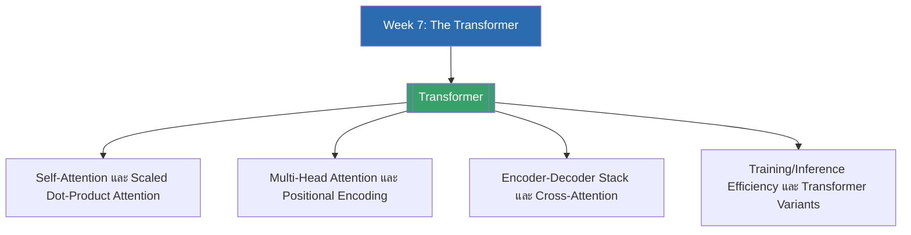

# Week 7 — The Transformer (MOC)

arrow_back สัปดาห์ก่อนหน้า: [[Week6-MOC|MOC สัปดาห์ 6]]

## check_circle เช็คลิสต์ก่อนเข้าเรียน

- [ ] ทบทวนกลไก Attention (Query/Key/Value, Bahdanau/Luong) จากสัปดาห์ที่แล้ว เพราะ self-attention ต่อยอดจากแนวคิดเดียวกัน — ดู [[Attention-Mechanism]]
- [ ] ทบทวนพื้นฐาน softmax และ dot product เพื่อเข้าใจสูตร Scaled Dot-Product Attention — ดู [[Transformer]]
- [ ] เตรียมทำความเข้าใจ residual connection และ layer normalization ที่ใช้กับโครงข่ายลึกหลายสิบชั้น — ดู [[Transformer]]
- [ ] ลองเปิดดูโมเดล `bert-base-uncased` และ `gpt2` บน Hugging Face เพื่อเห็นตัวอย่าง Transformer จริงก่อนเข้าเรียน — ดู [[Transformer]]

## assignment ภาพรวมสัปดาห์ 7 (สรุปย่อ)

สัปดาห์นี้เป็นบทเรียนหลัก 3 ชั่วโมงแบ่งเป็นสองภาค ภาคแรก (Lecture A) ปูพื้นฐาน **Self-Attention และ Multi-Head Attention** ตั้งแต่ข้อจำกัดของ RNN, สูตร scaled dot-product attention, เหตุผลของการ scale ด้วย $\sqrt{d_k}$, multi-head attention, positional encoding และ masked self-attention สำหรับ decoding แบบ autoregressive ภาคที่สอง (Lecture B) ประกอบร่างเป็น **สถาปัตยกรรม Encoder-Decoder แบบเต็มรูปแบบ** ที่มี residual connection, layer normalization, cross-attention เชื่อม encoder กับ decoder, การฝึกและการอนุมานอย่างมีประสิทธิภาพ (KV-cache, byte-level BPE) และปิดท้ายด้วยตระกูลโมเดล Transformer สามสาย (encoder-only อย่าง BERT, decoder-only อย่าง GPT, encoder-decoder อย่าง T5) พร้อม scaling laws ที่นำไปสู่ LLM ขนาดใหญ่ในสัปดาห์ถัดไป

## map แผนที่หัวข้อสัปดาห์ 7

## collections_bookmark โน้ตรายหัวข้อ

| หัวข้อ | เนื้อหาหลัก | หน้าสไลด์ |
| --- | --- | --- |
| [[Transformer]] | Self-attention, scaled dot-product attention, multi-head attention, positional encoding, masking, สถาปัตยกรรม encoder-decoder เต็มรูปแบบ, cross-attention, training/inference efficiency, ตระกูล BERT/GPT/T5, scaling laws | สไลด์ 1-43 (Lecture A + Lecture B) |

> [!tip] จุดที่มักสับสน
> อย่าสับสนระหว่าง self-attention (Q/K/V มาจากลำดับเดียวกัน ใช้ในทั้ง encoder และ masked-decoder) กับ cross-attention (Q มาจาก decoder แต่ K/V มาจาก encoder) — ทั้งสองอยู่ในสถาปัตยกรรมเดียวกันแต่ทำหน้าที่ต่างกันคนละจุด

arrow_forward สัปดาห์ถัดไป: [[Week8-MOC|MOC สัปดาห์ 8]]
