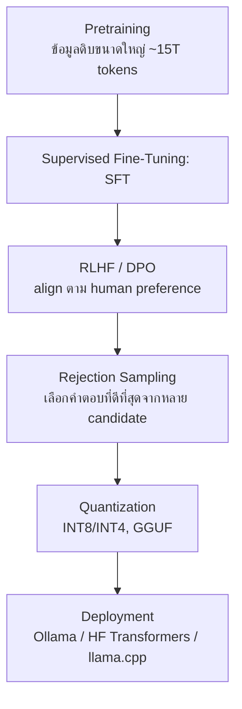

# โมเดลภาษาขนาดใหญ่สมัยใหม่ (Modern LLMs) — Llama 3/4, Prompting & PEFT

arrow_back กลับไปที่ [[Week8-MOC|MOC สัปดาห์ 8]]

## key Keyword

- **Decoder-only LLM** — โมเดลภาษาที่สร้างข้อความทีละ token จากซ้ายไปขวาด้วย causal masking (มองเห็นเฉพาะ token ก่อนหน้า)
- **Scaling Laws** — กฎที่บอกว่า loss ของโมเดลลดลงอย่างมีแบบแผนเมื่อเพิ่ม compute, data, และ parameter
- **Mixture-of-Experts (MoE)** — สถาปัตยกรรมแบบ sparse ที่ route แต่ละ token ไปยัง "ผู้เชี่ยวชาญ" (expert) เพียงบางส่วนแทนที่จะใช้ทุก parameter
- **LoRA (Low-Rank Adaptation)** — เทคนิค Parameter-Efficient Fine-Tuning ที่ freeze น้ำหนักเดิมแล้วเทรนเฉพาะ low-rank matrix ขนาดเล็ก
- **RLHF / DPO** — วิธี align โมเดลให้ตอบตรงใจมนุษย์ ผ่าน reward model + RL (RLHF) หรือ optimize ตรงจาก preference pairs (DPO)

## menu_book Theory (เข้าใจง่าย)

### ทบทวน: จาก BERT/GPT สู่ LLM สมัยใหม่

Transformer มี 3 รูปแบบหลัก คือ encoder-only (เช่น BERT), decoder-only (เช่น GPT), และ encoder-decoder (เช่น T5) LLM สมัยใหม่แทบทั้งหมด (GPT, Llama) เป็นแบบ **decoder-only autoregressive** คือสร้างข้อความทีละ token จากซ้ายไปขวา โดยใช้ causal masking ทำให้แต่ละตำแหน่งมองเห็นได้เฉพาะตัวเองกับ token ที่มาก่อนหน้าเท่านั้น

### Scaling Laws และ Emergent Abilities

Kaplan et al. (2020) แสดงให้เห็นว่า loss ของโมเดลลดลงอย่างมีแบบแผน (predictable) เมื่อเพิ่ม compute, ข้อมูล, และจำนวน parameter ขึ้นเรื่อย ๆ ต่อมางานวิจัย Chinchilla ชี้ว่าโมเดลยุคแรก ๆ จำนวนมาก "เทรนด้วยข้อมูลน้อยเกินไป" เมื่อเทียบกับขนาดโมเดล (under-trained)

> [!note] อ้างอิงงานวิจัย
> แนวคิด scaling laws มาจาก Kaplan et al. (2020, "Scaling Laws for Neural Language Models") ส่วนความสามารถของโมเดลขนาดใหญ่ที่ฝึกด้วยข้อมูลมหาศาลแบบ few-shot ถูกแสดงครั้งแรกใน GPT-3 (Brown et al., 2020, "Language Models are Few-Shot Learners") ความสามารถบางอย่าง เช่น in-context learning จากตัวอย่างไม่กี่ตัวอย่าง มักจะ "โผล่ขึ้นมาแบบก้าวกระโดด" (emergent) เมื่อโมเดลข้าม scale หนึ่ง ๆ ไม่ใช่ค่อย ๆ ดีขึ้นทีละนิด

### สถาปัตยกรรม Llama 3 และ Llama 4

Llama เป็นตระกูล LLM แบบ open-weights ของ Meta (Touvron et al., 2023) ที่นิยมใช้เป็นฐานสำหรับ fine-tune ทั้งงานวิจัยและเชิงพาณิชย์

| รุ่น | สถาปัตยกรรม | จุดเด่น |
| --- | --- | --- |
| Llama 3 | Dense Transformer (8B/70B/405B) | Grouped-Query Attention (GQA), context ยาวถึง 128K token, เทรนด้วยข้อมูล ~15 ล้านล้าน token |
| Llama 4 (Scout / Maverick) | Sparse **Mixture-of-Experts** | Scout เลือกจาก 16 experts, Maverick เลือกจาก 128 experts, รองรับ multimodal (ภาพ+ข้อความ), context ยาวถึง 10 ล้าน token ด้วย **iRoPE** (สลับ layer ที่ใช้ RoPE กับที่ไม่ใช้) |

เทคนิคย่อยที่ทำให้ Llama มีประสิทธิภาพ:

- **GQA (Grouped-Query Attention)** — ให้ query heads หลายตัวใช้ key/value heads ร่วมกันเป็นกลุ่ม แทนที่แต่ละ query head จะมี key/value เป็นของตัวเอง ช่วยลดหน่วยความจำและ compute ตอน inference โดยคุณภาพแทบไม่ตก
- **SwiGLU** — activation แบบ gated linear unit ที่ใช้ใน feed-forward layer:
$$\text{SwiGLU}(x) = \text{Swish}_1(xW) \otimes (xV)$$
- **RMSNorm** — normalization ที่เบากว่า LayerNorm เพราะ rescale ด้วย root-mean-square อย่างเดียว ไม่ต้อง centering ค่าเฉลี่ย:
$$\text{RMSNorm}(x) = \frac{x}{\text{RMS}(x)} \cdot g$$
- **RoPE (Rotary Position Embeddings)** — เข้ารหัสตำแหน่ง token ด้วยการหมุน (rotate) vector ของ query/key ทำให้ attention score ขึ้นกับ "ระยะห่างสัมพัทธ์" ระหว่าง token เท่านั้น

### การรันและ Deploy Llama

การรัน Llama ในเครื่องมีหลายทาง: **Ollama** (ติดตั้งง่ายที่สุด คำสั่งเดียว), **Hugging Face Transformers** (ควบคุมระดับ Python เต็มรูปแบบ), และ **llama.cpp** (runtime C++ เบา ไม่มี dependency เหมาะกับ CPU/edge device) เพื่อให้รันบนเครื่องทั่วไปได้ มักใช้ **quantization** บีบน้ำหนักโมเดลเป็น INT8/INT4 (มักเก็บในไฟล์ฟอร์แมต GGUF) ลด memory footprint ลงมาก โดยที่ Llama เองปล่อยภายใต้ community license ใช้ฟรีจนกว่าผลิตภัณฑ์จะมีผู้ใช้เกิน 700 ล้าน MAU ต่อเดือน และมี **Llama Guard** เป็นตัวจำแนกความปลอดภัยที่กรองทั้ง prompt และผลลัพธ์

> [!example] ตัวอย่างโมเดลบน Hugging Face
> โมเดล decoder-only ที่เข้าถึงง่ายสำหรับทดลอง ได้แก่ `gpt2` (baseline ขนาดเล็ก), `meta-llama/Llama-2-7b-hf`, และ `mistralai/Mistral-7B-v0.1` (dense, ใช้ GQA เช่นกัน)

### Prompt Engineering vs Fine-Tuning

**Prompt Engineering** คือการออกแบบข้อความ input เพื่อชี้นำพฤติกรรมโมเดล โดยไม่แก้ไข weight เลย:

- **Zero-shot / Few-shot** — สั่งงานตรง ๆ (zero-shot) หรือใส่ตัวอย่างสำเร็จรูปในprompt ก่อน (few-shot) อาศัย in-context learning
- **Chain-of-Thought (CoT)** — ให้โมเดลแสดงขั้นตอนคิดก่อนตอบ (เช่นเติมคำว่า "let's think step by step") ช่วยงาน reasoning หลายขั้นตอนได้ดีขึ้นชัดเจน
- **Self-Consistency** — สุ่ม sample หลาย reasoning path แล้ว vote คำตอบส่วนใหญ่ แทนที่จะเชื่อ CoT เพียงเส้นทางเดียว
- **ReAct (Reasoning + Acting)** — สลับระหว่างการคิดของโมเดลกับการเรียกใช้ tool จริง (เช่น search) แล้วนำผลลัพธ์กลับมาคิดต่อ
- **Prompt Hacking** — jailbreaking (พยายามให้โมเดลหลุด safety training) และ prompt injection (แอบฝังคำสั่งอันตรายผ่าน content ที่ไม่น่าเชื่อถือ)

**Fine-Tuning** คือการอัปเดต weight จริงด้วยตัวอย่างใหม่ ตั้งแต่ full fine-tuning (อัปเดตทุก parameter แต่ใช้ทรัพยากรมหาศาล) ไปจนถึง **Parameter-Efficient Fine-Tuning (PEFT)** ที่ freeze น้ำหนักส่วนใหญ่ไว้:

- **LoRA** — freeze weight เดิม $W_0$ แล้วเรียนรู้เฉพาะ low-rank update $BA$:
$$W = W_0 + BA \quad (\text{rank } r \ll d)$$
- **QLoRA** — รวม LoRA เข้ากับ 4-bit NormalFloat quantization ของโมเดลฐาน ทำให้ fine-tune โมเดลขนาดใหญ่บน GPU สำหรับผู้ใช้ทั่วไปเครื่องเดียวได้
- **Instruction Tuning** (เช่น FLAN, T0) — เทรนบน task หลากหลายที่เขียนเป็นคำสั่งภาษาธรรมชาติ ช่วยให้ generalize ไปยังคำสั่งใหม่ที่ไม่เคยเห็น
- **RLHF vs DPO** — RLHF เทรน reward model จาก human preference แล้ว optimize LLM ด้วย PPO ส่วน **DPO (Direct Preference Optimization)** ทำสิ่งเดียวกันได้ตรงกว่า โดย optimize จาก preference pairs โดยตรง ไม่ต้องมี reward model หรือ RL loop แยก

> [!note] อ้างอิงงานวิจัย
> InstructGPT (Ouyang et al., 2022, "Training language models to follow instructions with human feedback") เป็นงานที่ทำให้แนวทาง SFT + RLHF เป็นมาตรฐานสำหรับ align LLM สมัยใหม่

ในทางปฏิบัติ การ fine-tune Llama มักใช้ไลบรารีของ Hugging Face: **PEFT** (สำหรับ LoRA-style adapter), **trl** (สำหรับ RLHF/DPO training loop), และ **accelerate** (กระจายการเทรนหลาย GPU) ตัวอย่างการใช้งานจริง ได้แก่ **MedAlpaca** (fine-tune สำหรับ medical QA) และ **CodeLlama** (fine-tune เฉพาะทาง code)

> [!tip] เคล็ดลับ
> เลือก **prompting** ก่อนเสมอถ้าข้อมูลมีน้อยและต้องการ iterate เร็ว/รักษาความเป็นส่วนตัวของข้อมูล ส่วน **fine-tuning** ค่อยพิจารณาเมื่อ prompt ยาวซ้ำ ๆ กลายเป็นภาระ หรือต้องการยกระดับความแม่นยำเกินกว่าที่ prompt เพียงอย่างเดียวจะทำได้

## schema Diagram

**ตัวอย่าง:** pipeline นี้สรุปจากสไลด์ Lecture A slide 8 (Llama 3 Post-Training) ต่อเนื่องถึง Lecture B slide 10-17 (Fine-Tuning และ Deployment)

---
arrow_forward กลับไปที่ [[Week8-MOC|MOC สัปดาห์ 8]]
