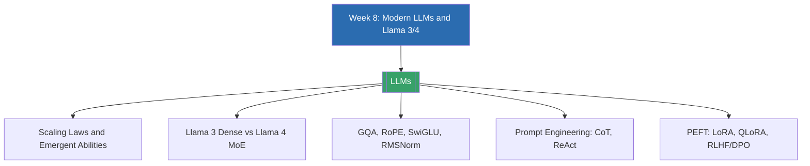

# Week 8 — Modern LLMs & Llama 3/4 (MOC)

arrow_back สัปดาห์ก่อนหน้า: [[Week7-MOC|MOC สัปดาห์ 7]]

## check_circle เช็คลิสต์ก่อนเข้าเรียน

- [ ] ทบทวนสถาปัตยกรรม decoder-only และ causal masking จาก Week 7 — ดู [[LLMs]]
- [ ] เข้าใจแนวคิด scaling laws และทำไมโมเดลใหญ่ขึ้นถึง "ดีขึ้นแบบมีแบบแผน" — ดู [[LLMs]]
- [ ] รู้จักความแตกต่างระหว่าง prompting กับ fine-tuning คร่าว ๆ ก่อนเข้าเรียน — ดู [[LLMs]]
- [ ] ลองติดตั้ง Ollama หรือ Hugging Face Transformers เพื่อทดลองรันโมเดลขนาดเล็ก — ดู [[LLMs]]

## assignment ภาพรวมสัปดาห์ 8 (สรุปย่อ)

สัปดาห์นี้เจาะลึก LLM สมัยใหม่ผ่านตระกูล Llama ของ Meta ครึ่งแรก (Lecture A) ครอบคลุมสถาปัตยกรรม ตั้งแต่ scaling laws, emergent abilities, ไปจนถึงรายละเอียดภายในของ Llama 3 (dense, GQA, RoPE) และ Llama 4 (sparse Mixture-of-Experts, iRoPE, multimodal) รวมถึงเทคนิคประสิทธิภาพอย่าง SwiGLU และ RMSNorm ตลอดจนการรันโมเดลจริงด้วย quantization และเรื่อง license/safety ครึ่งหลัง (Lecture B) เปลี่ยนโฟกัสมาที่การ "ใช้งาน" LLM ให้ได้ผลดีที่สุด ทั้งฝั่ง prompt engineering (zero/few-shot, Chain-of-Thought, Self-Consistency, ReAct) และฝั่ง fine-tuning (PEFT, LoRA, QLoRA, RLHF, DPO) ปิดท้ายด้วย case study จริงอย่าง MedAlpaca และ CodeLlama

## map แผนที่หัวข้อสัปดาห์ 8

## collections_bookmark โน้ตรายหัวข้อ

| หัวข้อ | เนื้อหาหลัก | หน้าสไลด์ |
| --- | --- | --- |
| [[LLMs]] | สถาปัตยกรรม Llama 3/4 (scaling laws, GQA, MoE, RoPE) และการใช้งาน LLM (prompting, PEFT, RLHF/DPO) | Lecture A slide 1-21, Lecture B slide 22-41 |

> [!tip] ก่อนทำ Lab สัปดาห์นี้
> ลองแยกให้ออกก่อนว่างานที่ทำอยู่เหมาะกับ "prompting" (ข้อมูลน้อย ต้องการรวดเร็ว ไม่อยากแตะ infra) หรือ "fine-tuning" (ต้องการความแม่นยำสูงสุด มีข้อมูล label พอสมควร) เพราะ LoRA/QLoRA จะมีความหมายก็ต่อเมื่อเข้าใจ trade-off นี้ก่อน

arrow_forward สัปดาห์ถัดไป: [[Week9-MOC|MOC สัปดาห์ 9]]
