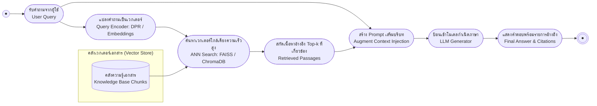

# การประยุกต์ใช้ขั้นสูง: RAG และ Vector Search (Retrieval-Augmented Generation)

arrow_back กลับไปที่ [[Week9-MOC|MOC สัปดาห์ 9]]

## key Keyword

- **RAG (Retrieval-Augmented Generation)** — สถาปัตยกรรมที่รวม retriever (ค้นข้อมูล) กับ generator (สร้างข้อความ) เข้าด้วยกัน
- **Dense Passage Retrieval (DPR)** — bi-encoder ที่เข้ารหัส query และ passage เป็น dense vector แล้ววัดความคล้ายด้วย dot product
- **Vector Database** — ฐานข้อมูลที่ออกแบบมาให้ index และค้นหา embedding vector ได้อย่างมีประสิทธิภาพ (เช่น ChromaDB)
- **Hybrid Search** — การผสม dense embedding similarity กับ sparse keyword search (เช่น BM25)
- **Agentic RAG** — RAG ที่โมเดลตัดสินใจเองว่าจะ retrieve เพิ่มเมื่อไหร่ และแก้ไขคำตอบตัวเองแบบวนซ้ำ

## menu_book Theory (เข้าใจง่าย)

### ข้อจำกัดของ Parametric Memory และแนวคิด RAG

LLM แบบ parametric ล้วน ๆ เก็บความรู้ทั้งหมดไว้ใน weight ที่ frozen แล้ว ความรู้จึงล้าสมัยทันทีที่เทรนเสร็จ และโมเดลไม่มีทางไป "เปิดหา" ข้อมูลใหม่ได้ ซึ่งเป็นสาเหตุหลักของ hallucination **RAG (Retrieval-Augmented Generation)** แก้ปัญหานี้โดยรวม **parametric memory** (ความรู้ใน weight) เข้ากับ **non-parametric memory** (knowledge base ภายนอกที่ query ได้ตอน inference)

> [!note] อ้างอิงงานวิจัย
> แนวคิดนี้มาจาก Lewis et al. (2020, NeurIPS, "Retrieval-Augmented Generation for Knowledge-Intensive NLP Tasks") ซึ่งแสดงว่า retriever กับ generator เทรนร่วมกันแบบ end-to-end ได้:
> $$p(y \mid x) \approx \sum_z p_{\text{retriever}}(z \mid x)\, p_{\text{generator}}(y \mid x, z)$$
> โดยมีสองรูปแบบคือ **RAG-Sequence** (ใช้ passage เดียวสร้างคำตอบทั้งหมด) และ **RAG-Token** (เลือก passage ใหม่ได้ทุก token)

### Dense Passage Retrieval (DPR) และ ANN Search

**DPR** (Karpukhin et al., 2020, EMNLP) ใช้สถาปัตยกรรม bi-encoder: BERT encoder ตัวหนึ่งเข้ารหัส query อีกตัวเข้ารหัส passage แล้ววัดความเกี่ยวข้องด้วย dot product ธรรมดา:

$$\text{sim}(q, p) = E_q(q) \cdot E_p(p)$$

DPR เทรนด้วย contrastive loss ที่ใช้ hard negative จาก BM25 ผสมกับ in-batch negative ส่วน passage ทั้งหมด (เช่น Wikipedia ที่ตัดเป็น chunk ความยาวคงที่) จะถูกเข้ารหัสล่วงหน้าแบบ offline เพื่อให้ query ตอน inference เป็นแค่การค้นหาเร็ว ๆ

เพราะการ scan vector หลายล้านตัวแบบ exact ช้าเกินไป ไลบรารีอย่าง **FAISS** จึงใช้โครงสร้างแบบประมาณ (Approximate Nearest Neighbor: ANN) เช่น HNSW graph หรือ IVF clustering แลกความแม่นยำเล็กน้อยกับความเร็วที่เพิ่มขึ้นมาก (Johnson et al., 2019)

การประเมินแยกเป็นสองส่วน: **retrieval accuracy** วัดด้วย Recall@k, MRR, Precision@k และ **generation quality** วัดความถูกต้องตามข้อเท็จจริง การอ้างอิงหลักฐาน และความลื่นไหลของข้อความ

### Vector Database, Chunking และ Context Injection

**ChromaDB** เป็นตัวอย่าง vector database แบบ open-source (Apache 2.0) ที่นิยมสำหรับสร้าง RAG อย่างรวดเร็ว จัดเก็บเอกสารเป็น collection พร้อม embedding (คำนวณอัตโนมัติหรือใส่เองก็ได้) และรองรับ embedding function จาก Sentence Transformers, OpenAI, หรือ Hugging Face ในตัว การค้นหาทำผ่าน `collection.query` โดยระบุจำนวนผลลัพธ์และ distance metric (cosine, L2, inner product) และยังกรองด้วย metadata (tag, ช่วงวันที่) ควบคู่กับ similarity search ได้

ก่อนนำเอกสารเข้า vector database ต้องมีการ **chunking**:

| กลยุทธ์ | ลักษณะ |
| --- | --- |
| Fixed-size | ตัด chunk ตามความยาวคงที่ ง่ายที่สุด |
| Recursive | เคารพโครงสร้างเอกสาร (ย่อหน้า, หัวข้อ) |
| Semantic | ตัดตามขอบเขตความหมาย |
| Agentic | ให้ LLM เป็นผู้ตัดสินใจจุดตัด chunk เอง |

เมื่อ retrieve chunk ที่เกี่ยวข้องมาแล้ว จะถูกใส่เข้าไปใน prompt template คู่กับคำถามผู้ใช้ (**context injection**) แต่ต้องระวังขีดจำกัด context window ของโมเดล และปรากฏการณ์ "lost in the middle" ที่โมเดลมักให้ความสนใจข้อมูลตรงกลาง context ยาว ๆ น้อยกว่าช่วงต้น/ท้าย (Liu et al., 2023)

> [!example] ตัวอย่างโมเดลบน Hugging Face
> สไลด์ยกตัวอย่าง embedding model สำหรับ RAG ตั้งแต่ขนาดเล็กอย่าง `sentence-transformers/all-MiniLM-L6-v2` (เร็ว ราคาถูก) ไปจนถึงโมเดลที่แม่นยำกว่าอย่าง E5 และ BGE-m3 ส่วนตัวอย่าง end-to-end RAG model บน Hugging Face คือ `facebook/rag-token-nq`

### Hybrid Search และการประเมิน RAG

**Hybrid Search** ผสม dense embedding similarity กับ sparse keyword method อย่าง BM25 เข้าด้วยกัน มักให้ผลดีกว่าการใช้วิธีใดวิธีหนึ่งเพียงอย่างเดียว เพราะจับได้ทั้งความหมายเชิงความหมาย (semantic) และคำที่ตรงตัว (exact match) ส่วนการประเมินคุณภาพ RAG ทั้งระบบมีเฟรมเวิร์กเฉพาะทาง เช่น **RAGAS**, ARES, TruLens-Eval ที่วัด faithfulness, answer relevance, context precision โดยไม่ต้องมี ground truth ที่ label มือทุก query และมีเทคนิคตรวจจับ hallucination เช่น self-check คำตอบตัวเอง หรือตรวจความสอดคล้องข้าม sample ที่ generate มาหลายครั้ง

ในระบบ production จริงต้อง cache query/embedding ที่ซ้ำกัน, batch การ retrieve/generate, และ monitor latency ทั้ง pipeline นอกจากนี้ต้องชั่งน้ำหนักต้นทุน (hosted embedding API จ่ายตาม token vs self-host ที่ลงทุนโครงสร้างพื้นฐานคงที่) และข้อกำหนดความเป็นส่วนตัวของข้อมูล (on-premise หรือ air-gapped deployment)

### RAG ขั้นสูง (Bonus)

หัวข้อขั้นสูงที่ต่อยอดจาก RAG พื้นฐาน ได้แก่ **Agentic RAG** (โมเดลตัดสินใจเองว่าต้อง retrieve เพิ่มไหมและแก้คำตอบตัวเองแบบวนซ้ำ), **GraphRAG** (retrieve จาก knowledge graph แทน text chunk เดี่ยว ๆ เหมาะกับคำถามแบบ multi-hop), **Multi-Hop Retrieval** (เชื่อมหลักฐานจากหลายขั้นตอนการค้นหา), **Enterprise RAG** (ผสาน unstructured document กับ structured data เช่น SQL/API), และ **Multimodal RAG** (retrieve ข้าม text, รูปภาพ, และตารางพร้อมกัน) รวมถึงเทคนิคปรับปรุง query อย่าง **HyDE** (สร้างคำตอบสมมติก่อนแล้วค่อย retrieve จากมัน) และ **re-ranking** ด้วย cross-encoder หลังจาก bi-encoder คัดกรองผู้เข้ารอบมาแล้ว

> [!tip] เคล็ดลับ
> RAG กับ fine-tuning ไม่ใช่ทางเลือกที่ต้องเลือกอย่างใดอย่างหนึ่ง — RAG เปลี่ยน "สิ่งที่โมเดลรู้" โดยไม่ต้องเทรนใหม่ (แค่เปลี่ยน corpus) ส่วน fine-tuning เปลี่ยน "พฤติกรรม" ของโมเดล ระบบ production จำนวนมากใช้ทั้งสองอย่างร่วมกัน

## schema Diagram

**ตัวอย่าง:** pipeline นี้สรุปจาก Lecture A slide 3-8 (RAG framework + DPR) และ Lecture B slide 2-8 (ChromaDB + context injection)

---
arrow_forward กลับไปที่ [[Week9-MOC|MOC สัปดาห์ 9]]
