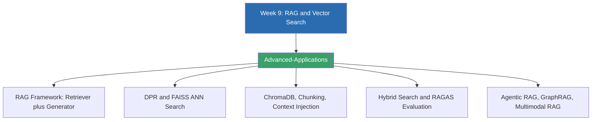

# Week 9 — Advanced Applications: RAG & Vector Search (MOC)

⬅️ สัปดาห์ก่อนหน้า: [[Week8-MOC|MOC สัปดาห์ 8]]

## ✅ เช็คลิสต์ก่อนเข้าเรียน

- [ ] ทบทวนว่าทำไม LLM ล้วน ๆ (parametric memory) ถึงเกิด hallucination ได้ง่าย — ดู [[Advanced-Applications]]
- [ ] เข้าใจแนวคิด embedding และ similarity search จาก Week 4 (Word Embeddings) มาก่อน — ดู [[Advanced-Applications]]
- [ ] รู้จักความแตกต่างระหว่าง dense retrieval กับ sparse (keyword) retrieval คร่าว ๆ — ดู [[Advanced-Applications]]
- [ ] ลองติดตั้ง ChromaDB หรือทดลอง embedding model บน Hugging Face ก่อนเข้า Lab — ดู [[Advanced-Applications]]

## 📋 ภาพรวมสัปดาห์ 9 (สรุปย่อ)

สัปดาห์นี้ต่อยอดจาก LLM ในสัปดาห์ที่แล้วสู่การประยุกต์ใช้ขั้นสูงด้วย **Retrieval-Augmented Generation (RAG)** ครึ่งแรก (Lecture A) ปูพื้นตั้งแต่ข้อจำกัดของ parametric memory ไปจนถึงกรอบ RAG ของ Lewis et al. (2020), สถาปัตยกรรม bi-encoder ของ Dense Passage Retrieval (DPR), การค้นหาแบบ approximate nearest neighbor ด้วย FAISS, และตัวชี้วัดสำหรับประเมินทั้ง retrieval กับ generation แยกกัน ครึ่งหลัง (Lecture B) ลงรายละเอียดเชิงปฏิบัติ: vector database อย่าง ChromaDB, กลยุทธ์ chunking เอกสาร, context injection, hybrid search, และเฟรมเวิร์กประเมินผลอย่าง RAGAS ปิดท้ายด้วยเนื้อหาโบนัสเรื่อง RAG ขั้นสูง เช่น Agentic RAG, GraphRAG, Multi-Hop Retrieval, Enterprise RAG และ Multimodal RAG

## 🗺️ แผนที่หัวข้อสัปดาห์ 9

## 📚 โน้ตรายหัวข้อ

| หัวข้อ | เนื้อหาหลัก | หน้าสไลด์ |
| --- | --- | --- |
| [[Advanced-Applications]] | สถาปัตยกรรม RAG, DPR, ANN search, vector database, chunking, hybrid search, การประเมินผล และ RAG ขั้นสูง | Lecture A slide 1-21, Lecture B slide 22-41, Bonus slide 42-47 |

> [!tip] เชื่อมโยงกับสัปดาห์ก่อน
> RAG กับ fine-tuning (Week 8) ไม่ใช่คู่แข่งกัน — ลองสังเกตระหว่างเรียนว่าสถานการณ์แบบไหนที่ควรใช้ RAG (ความรู้เปลี่ยนบ่อย ต้องอ้างอิงแหล่งที่มา) และแบบไหนที่ควรใช้ fine-tuning/PEFT (ต้องการเปลี่ยนพฤติกรรมหรือสไตล์การตอบ)

➡️ สัปดาห์ถัดไป: [[Week10-MOC|MOC สัปดาห์ 10]]
